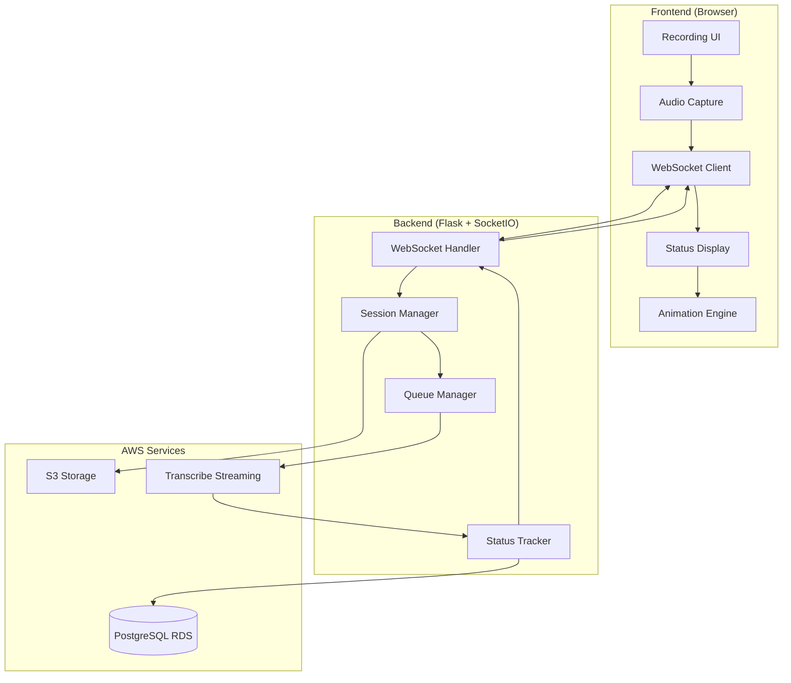
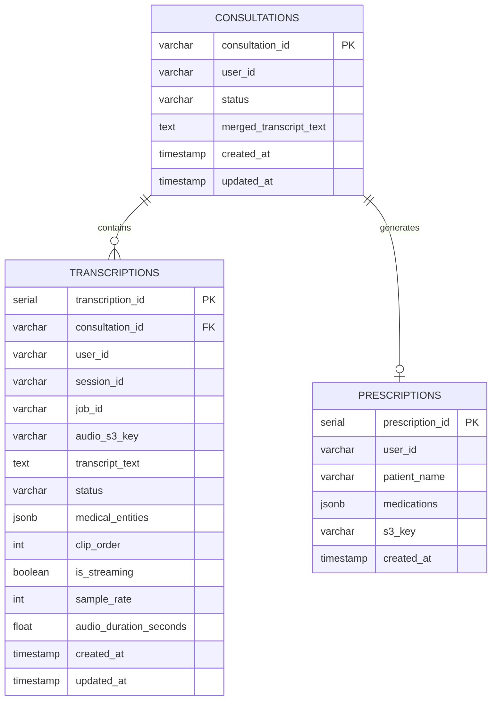
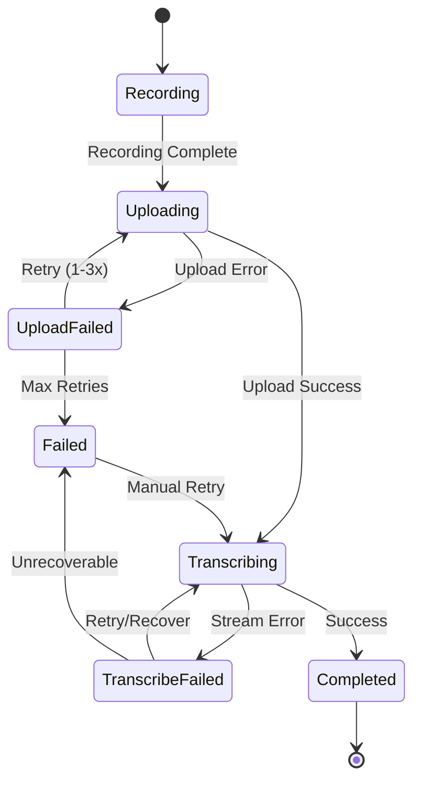

# Design Document: Async Push-to-Talk Transcription

## Overview

This design implements asynchronous push-to-talk audio recording and transcription for medical consultations. The current system blocks users from recording new audio clips while waiting for transcription to complete. This design decouples recording from transcription, enabling doctors to record multiple clips in rapid succession while transcription happens asynchronously in the background.

The system leverages AWS Transcribe Streaming for real-time chunked audio processing (5-10 second intervals), WebSocket connections for real-time status updates, and a queue-based architecture for managing concurrent transcription jobs. Visual feedback includes pulsing recording icons and word-by-word text reveal animations to create a responsive, professional user experience.

### Key Features

- Asynchronous recording: Record new clips without waiting for previous transcriptions
- Chunked streaming: Process audio in 5-10 second chunks for immediate partial results
- Real-time status tracking: WebSocket-based status updates for all recording/transcription states
- Visual feedback: Pulsing recording icon and background shifts during active recording
- Word-by-word reveal: Smooth text animation as transcription results arrive
- Error recovery: Automatic retry with exponential backoff for failed jobs
- Resource management: Configurable concurrency limits and automatic cleanup

## Architecture

### System Components



### Architecture Patterns

1. **Event-Driven Architecture**: WebSocket events drive state transitions and UI updates
2. **Producer-Consumer Pattern**: Audio recording produces chunks; transcription queue consumes them
3. **Observer Pattern**: Status tracker notifies clients of state changes via WebSocket
4. **Streaming Pattern**: Audio chunks stream to AWS Transcribe for incremental processing

### Technology Stack

- **Backend**: Python 3.9+, Flask, Flask-SocketIO (eventlet async mode)
- **WebSocket**: Socket.IO protocol for bidirectional real-time communication
- **Audio Processing**: AWS Transcribe Streaming API (Medical specialty)
- **Storage**: AWS S3 for audio files, PostgreSQL for metadata
- **Frontend**: JavaScript, Socket.IO client library, Web Audio API

## Components and Interfaces

### 1. Frontend Audio Recording Component

**Responsibility**: Capture audio, chunk it, and stream to backend via WebSocket

**Key Classes/Modules**:
- `AudioRecorder`: Manages MediaRecorder API and audio chunking
- `ChunkBuffer`: Buffers audio chunks for 5-10 second intervals
- `WebSocketClient`: Handles Socket.IO connection and message routing

**Interfaces**:

```javascript
class AudioRecorder {
  constructor(socketClient, chunkIntervalMs = 7000) {}
  
  async startRecording(sessionId) {
    // Initialize MediaRecorder with PCM audio
    // Start chunking timer
    // Emit 'session_start' event
  }
  
  stopRecording() {
    // Stop MediaRecorder
    // Send final chunk
    // Emit 'session_end' event
  }
  
  onChunkReady(audioBlob) {
    // Convert to PCM bytes
    // Emit 'audio_chunk' event with base64 data
  }
}
```

**Audio Format**:
- Sample Rate: 16000 Hz (required by AWS Transcribe Medical)
- Encoding: PCM 16-bit signed little-endian
- Channels: Mono
- Chunk Size: 5-10 seconds of audio data

### 2. Backend WebSocket Handler

**Responsibility**: Handle WebSocket connections, route events, manage sessions

**Existing Implementation**: `socketio_handlers.py` (extends existing handlers)

**New Event Handlers**:

```python
@socketio.on('session_start')
def handle_session_start(data):
    """
    Initialize new recording session
    - Create session in SessionManager
    - Start AWS Transcribe stream
    - Create transcription record in DB
    - Emit 'session_ack' with session_id
    """
    pass

@socketio.on('audio_chunk')
def handle_audio_chunk(data):
    """
    Process incoming audio chunk
    - Validate session exists
    - Buffer audio for S3 upload
    - Forward to AWS Transcribe stream
    - Update session activity timestamp
    """
    pass

@socketio.on('session_end')
def handle_session_end(data):
    """
    Finalize recording session
    - End AWS Transcribe stream
    - Finalize audio buffer to MP3
    - Upload to S3
    - Update transcription record
    - Emit 'session_complete'
    """
    pass
```

**Status Events Emitted to Client**:
- `session_ack`: Session initialized, ready to receive audio
- `transcription_result`: Partial or final transcription text
- `session_complete`: Recording and transcription finalized
- `error`: Error occurred with error_code and message

### 3. Session Manager

**Responsibility**: Track active recording sessions, manage lifecycle

**Existing Implementation**: `aws_services/session_manager.py`

**Key Methods**:

```python
class SessionManager:
    def create_session(self, session_id, user_id, request_sid, quality='medium'):
        """Create new streaming session with audio buffer"""
        
    def get_session(self, session_id):
        """Retrieve active session by ID"""
        
    def remove_session(self, session_id):
        """Remove session and cleanup resources"""
        
    def update_activity(self, session_id):
        """Update last activity timestamp"""
        
    def cleanup_idle_sessions(self):
        """Remove sessions idle beyond timeout threshold"""
```

**Session State**:
- `session_id`: UUID for session identification
- `user_id`: Authenticated user identifier
- `request_sid`: Socket.IO request SID for routing messages
- `audio_buffer`: AudioBuffer instance for accumulating chunks
- `transcribe_stream`: AWS Transcribe stream handle
- `sample_rate`: Audio sample rate (16000 Hz)
- `created_at`: Session creation timestamp
- `last_activity`: Last activity timestamp for idle detection

### 4. Queue Manager (Transcription Queue)

**Responsibility**: Manage concurrent transcription jobs, handle retries

**Implementation Strategy**: 
The existing `TranscribeStreamingManager` already handles streaming transcription. For this feature, we extend it to support multiple concurrent streams with resource limits.

**Key Enhancements**:

```python
class TranscribeStreamingManager:
    def __init__(self, region, max_concurrent_streams=10):
        self.max_concurrent_streams = max_concurrent_streams
        self._active_streams = {}  # session_id -> stream_info
        self._stream_semaphore = threading.Semaphore(max_concurrent_streams)
    
    def start_stream(self, session_id, sample_rate, result_callback, ...):
        """
        Start streaming transcription with concurrency control
        - Acquire semaphore (blocks if at capacity)
        - Initialize AWS Transcribe stream
        - Register result callback
        - Return stream info
        """
        
    def end_stream(self, session_id):
        """
        End streaming transcription
        - Close AWS Transcribe stream
        - Release semaphore
        - Cleanup resources
        """
```

**Concurrency Control**:
- Use `threading.Semaphore` to limit concurrent streams
- Default limit: 10 concurrent transcription streams
- Configurable via environment variable: `MAX_CONCURRENT_TRANSCRIPTIONS`

**Retry Logic**:
AWS Transcribe Streaming handles transient failures internally. For stream-level failures:
- Detect stream failure in result handler
- Emit error event to client
- Client can retry by starting new session

### 5. Status Tracker

**Responsibility**: Track transcription status, emit real-time updates

**Implementation**: Integrated into WebSocket handlers and result callbacks

**Status States**:
- `recording`: User is actively recording audio
- `uploading`: Audio is being uploaded to S3
- `queued`: Waiting for transcription stream to start
- `transcribing`: AWS Transcribe is processing audio
- `completed`: Transcription finished successfully
- `failed`: Transcription failed after retries

**Status Update Flow**:

```python
def result_callback(session_id, result_data):
    """
    Callback invoked by TranscribeStreamingManager
    - Receive partial/final transcription results
    - Persist final results to database
    - Emit 'transcription_result' event to client
    """
    active_session = session_manager.get_session(session_id)
    if active_session:
        # Persist final segments to avoid duplicates
        if not result_data.get('is_partial'):
            segment_id = result_data.get('segment_id')
            text = result_data.get('text', '').strip()
            if text and segment_id not in active_session.persisted_segments:
                database_manager.append_transcript_text(session_id, text)
                active_session.persisted_segments.add(segment_id)
        
        # Emit to client via WebSocket
        socketio.emit('transcription_result', result_data, 
                     room=active_session.request_sid)
```

### 6. Visual Feedback System

**Responsibility**: Provide visual indicators for recording state and transcription progress

**Recording Feedback**:

```javascript
class RecordingVisualFeedback {
  startRecording() {
    // Add 'recording' class to button
    // Start pulsing animation (CSS keyframes)
    // Apply background color shift
  }
  
  stopRecording() {
    // Remove 'recording' class
    // Stop pulsing animation
    // Restore original background
  }
}
```

**CSS Animation**:

```css
@keyframes pulse {
  0%, 100% { transform: scale(1); opacity: 1; }
  50% { transform: scale(1.1); opacity: 0.8; }
}

.recording-button.recording {
  animation: pulse 1s ease-in-out infinite;
  background-color: #ef4444; /* Red indicator */
}

.recording-active-background {
  background-color: rgba(239, 68, 68, 0.05);
  transition: background-color 0.3s ease;
}
```

**Word-by-Word Reveal Animation**:

```javascript
class TranscriptionAnimator {
  revealText(text, containerElement) {
    const words = text.split(' ');
    let delay = 0;
    
    words.forEach((word, index) => {
      setTimeout(() => {
        const span = document.createElement('span');
        span.textContent = word + ' ';
        span.style.opacity = '0';
        span.style.transition = 'opacity 0.1s ease-in';
        containerElement.appendChild(span);
        
        // Trigger animation
        requestAnimationFrame(() => {
          span.style.opacity = '1';
        });
      }, delay);
      
      delay += 75; // 75ms per word
    });
  }
}
```

## Data Models

### Database Schema Extensions

**Transcriptions Table** (extends existing schema):

```sql
ALTER TABLE transcriptions
ADD COLUMN IF NOT EXISTS consultation_id VARCHAR(64),
ADD COLUMN IF NOT EXISTS clip_order INTEGER DEFAULT 1,
ADD COLUMN IF NOT EXISTS session_id VARCHAR(64),
ADD COLUMN IF NOT EXISTS streaming_job_id VARCHAR(255),
ADD COLUMN IF NOT EXISTS is_streaming BOOLEAN DEFAULT FALSE,
ADD COLUMN IF NOT EXISTS sample_rate INTEGER,
ADD COLUMN IF NOT EXISTS quality VARCHAR(20),
ADD COLUMN IF NOT EXISTS audio_duration_seconds FLOAT;

CREATE INDEX IF NOT EXISTS idx_transcriptions_consultation_id 
ON transcriptions(consultation_id);

CREATE INDEX IF NOT EXISTS idx_transcriptions_session_id 
ON transcriptions(session_id);
```

**Consultations Table** (existing):

```sql
CREATE TABLE IF NOT EXISTS consultations (
    consultation_id VARCHAR(64) PRIMARY KEY,
    user_id VARCHAR(255) NOT NULL,
    status VARCHAR(50) NOT NULL DEFAULT 'IN_PROGRESS',
    merged_transcript_text TEXT,
    created_at TIMESTAMP DEFAULT CURRENT_TIMESTAMP,
    updated_at TIMESTAMP DEFAULT CURRENT_TIMESTAMP
);

CREATE INDEX IF NOT EXISTS idx_consultations_user_id 
ON consultations(user_id);

CREATE INDEX IF NOT EXISTS idx_consultations_created_at 
ON consultations(created_at DESC);
```

### Data Relationships



### Data Flow

1. **Recording Start**:
   - Create `consultations` record with status='IN_PROGRESS'
   - Create `transcriptions` record with status='IN_PROGRESS', is_streaming=TRUE

2. **Chunk Processing**:
   - Append partial transcription text to `transcriptions.transcript_text`
   - Update `transcriptions.updated_at` timestamp

3. **Recording End**:
   - Update `transcriptions.audio_s3_key` with final S3 location
   - Update `transcriptions.status` to 'COMPLETED'
   - Update `transcriptions.audio_duration_seconds`

4. **Consultation Completion**:
   - Aggregate all clip transcripts into `consultations.merged_transcript_text`
   - Update `consultations.status` to 'COMPLETED'

### Database Manager Extensions

```python
class DatabaseManager:
    def append_transcript_text(self, session_id, text):
        """
        Append text to existing transcription record
        - Find transcription by session_id
        - Append text with space separator
        - Update updated_at timestamp
        """
        query = """
        UPDATE transcriptions
        SET transcript_text = COALESCE(transcript_text || ' ', '') || %s,
            updated_at = CURRENT_TIMESTAMP
        WHERE session_id = %s
        """
        self.execute_with_retry(query, (text, session_id))
    
    def rebuild_consultation_transcript(self, consultation_id, user_id):
        """
        Rebuild merged transcript from all clips
        - Query all transcriptions for consultation
        - Order by clip_order, created_at
        - Concatenate transcript_text fields
        - Update consultations.merged_transcript_text
        """
        pass
```


## Correctness Properties

A property is a characteristic or behavior that should hold true across all valid executions of a system—essentially, a formal statement about what the system should do. Properties serve as the bridge between human-readable specifications and machine-verifiable correctness guarantees.

### Property 1: Non-blocking Recording Operations

For any recording session, completing a recording or uploading audio should not block the user from starting a new recording session or interacting with the UI.

**Validates: Requirements 1.1, 1.2, 1.5, 2.3**

### Property 2: Unique Session Identifiers

For any set of recording sessions, each session should be assigned a unique identifier that is distinct from all other session identifiers in the system.

**Validates: Requirements 1.3**

### Property 3: Upload Time Bounds

For any audio clip up to 60 seconds in duration, the upload to S3 storage should complete within 5 seconds of recording completion under normal network conditions.

**Validates: Requirements 1.4, 8.2**

### Property 4: Concurrent Job Acceptance

For any transcription queue, adding a new transcription job should succeed even while other jobs are actively processing, up to the configured concurrency limit.

**Validates: Requirements 2.1**

### Property 5: FIFO Queue Ordering

For any sequence of transcription jobs submitted to the queue, the jobs should be processed in the same order they were received (first-in, first-out).

**Validates: Requirements 2.2**

### Property 6: Concurrency Limit Enforcement

For any transcription queue with a configured maximum of N concurrent jobs, at most N jobs should be processing simultaneously, with additional jobs queued until capacity becomes available.

**Validates: Requirements 2.4, 6.1, 6.2**

### Property 7: Retry with Exponential Backoff

For any failed transcription job or audio upload, the system should retry the operation up to 3 times with exponentially increasing delays between attempts (e.g., 1s, 2s, 4s).

**Validates: Requirements 2.5, 5.1**

### Property 8: Database Update on Completion

For any successfully completed transcription job, the consultation context in the database should be updated with the transcribed text.

**Validates: Requirements 2.6**

### Property 9: Real-time Status Updates

For any status change event (recording, uploading, queued, transcribing, completed, failed), the client UI should receive a WebSocket notification and update within 500 milliseconds.

**Validates: Requirements 3.1, 3.8, 8.4**

### Property 10: Transcription Result Ordering

For any consultation with multiple audio clips, the transcribed text should appear in the UI in the same order the recordings were made, regardless of when individual transcriptions complete.

**Validates: Requirements 4.2, 4.5, 2.2**

### Property 11: Concurrent Display Preservation

For any user recording a new audio clip, all previously completed transcriptions should remain visible in the UI without being hidden or removed.

**Validates: Requirements 4.3**

### Property 12: Navigation Persistence

For any consultation context, if a user navigates away and returns, all transcribed text and audio clips should be preserved and displayed in their original state.

**Validates: Requirements 4.4, 7.4, 7.5**

### Property 13: Failure Isolation

For any transcription job that fails, other queued or processing jobs should continue to execute without being blocked or affected by the failure.

**Validates: Requirements 5.3**

### Property 14: WebSocket Reconnection and Sync

For any WebSocket connection that is lost and then re-established, the system should automatically reconnect and synchronize the current state of all pending and completed jobs.

**Validates: Requirements 5.5, 5.6**

### Property 15: Per-User Upload Limits

For any user, the system should enforce a maximum of 5 pending audio uploads, blocking new recordings with a warning message if the limit is exceeded until uploads complete.

**Validates: Requirements 6.3, 6.4**

### Property 16: Metadata Cleanup

For any completed transcription job, the associated metadata should be automatically cleaned up from the system after 24 hours to prevent unbounded storage growth.

**Validates: Requirements 6.5**

### Property 17: Audio Compression

For any recorded audio clip, the system should compress the audio before uploading to S3, resulting in a smaller file size than the raw PCM data.

**Validates: Requirements 6.6**

### Property 18: One-to-One Clip-Job Association

For any audio clip, there should be exactly one associated transcription job, and for any transcription job, there should be exactly one associated audio clip.

**Validates: Requirements 7.1**

### Property 19: Transcription Idempotency

For any audio clip, even if the transcription job is retried multiple times, the system should produce exactly one transcription result without duplicates.

**Validates: Requirements 7.2, 7.3**

### Property 20: Upload Deduplication

For any audio clip, attempting to upload the same clip multiple times should result in only one upload operation, with subsequent attempts being deduplicated.

**Validates: Requirements 7.6**

### Property 21: Recording Start Latency

For any user input to start recording, the recording session should begin within 100 milliseconds, providing immediate feedback to the user.

**Validates: Requirements 8.1**

### Property 22: Transcription Start Latency

For any transcription job added to the queue, processing should begin within 2 seconds of the job being queued, assuming capacity is available.

**Validates: Requirements 8.3**

### Property 23: Maximum Recording Duration

For any recording session, the system should support continuous recording for up to 5 minutes (300 seconds) without errors or data loss.

**Validates: Requirements 8.5**

### Property 24: Transcription Performance

For any 60-second audio clip under normal system load, the complete transcription should finish within 30 seconds of the audio being fully uploaded.

**Validates: Requirements 8.6**

### Property 25: Pulse Animation Frequency

For any active recording session, the recording icon should pulse at a frequency between 0.5 Hz and 1 Hz (one pulse every 1-2 seconds).

**Validates: Requirements 9.3**

### Property 26: Visual Feedback Latency

For any recording session start, visual feedback (pulsing animation and background shift) should appear within 100 milliseconds of the recording beginning.

**Validates: Requirements 9.6**

### Property 27: Word Reveal Animation Timing

For any transcribed text being displayed, each word should appear with an animation duration between 50-100 milliseconds, creating a smooth reveal effect.

**Validates: Requirements 10.3**

### Property 28: Non-blocking Text Animation

For any text reveal animation in progress, the user should be able to interact with other UI elements without the animation blocking or interfering with interactions.

**Validates: Requirements 10.4**

### Property 29: Audio Chunk Interval

For any active recording session, audio chunks should be sent to the server at intervals between 5-10 seconds, enabling streaming transcription.

**Validates: Requirements 11.1**

### Property 30: Immediate Chunk Processing

For any audio chunk received by the server, transcription processing should begin immediately without waiting for the complete recording to finish.

**Validates: Requirements 11.2, 11.3**

### Property 31: Incremental Text Append

For any sequence of audio chunks from a single recording, the transcribed text should be appended incrementally to the display as each chunk is processed, maintaining the order of chunks.

**Validates: Requirements 11.4**

### Property 32: Audio Continuity Across Chunks

For any recording session split into multiple chunks, words should not be truncated at chunk boundaries, maintaining audio continuity and transcription accuracy.

**Validates: Requirements 11.5**

### Property 33: Final Transcription Completion

For any recording session that ends, all remaining audio data should be processed and the transcription should be marked as complete (not partial) once all chunks are transcribed.

**Validates: Requirements 11.6**

## Error Handling

### Error Categories

1. **Network Errors**
   - WebSocket disconnection
   - S3 upload failures
   - AWS Transcribe API errors

2. **Resource Errors**
   - Concurrency limit exceeded
   - Storage quota exceeded
   - Memory exhaustion

3. **Data Errors**
   - Invalid audio format
   - Corrupted audio data
   - Database constraint violations

4. **User Errors**
   - Microphone permission denied
   - Unsupported browser
   - Invalid session state

### Error Handling Strategies

**WebSocket Disconnection**:
```javascript
socketClient.on('disconnect', () => {
  // Attempt automatic reconnection
  setTimeout(() => {
    socketClient.connect();
  }, 1000);
  
  // Show user notification
  showNotification('Connection lost. Reconnecting...', 'warning');
});

socketClient.on('connect', () => {
  // Sync session state
  syncSessionState();
  showNotification('Connection restored', 'success');
});
```

**Upload Retry Logic**:
```python
def upload_with_retry(audio_data, s3_key, max_retries=3):
    for attempt in range(max_retries):
        try:
            storage_manager.upload_audio_bytes(audio_data, s3_key)
            return True
        except Exception as e:
            if attempt < max_retries - 1:
                delay = 2 ** attempt  # Exponential backoff: 1s, 2s, 4s
                time.sleep(delay)
                logger.warning(f"Upload retry {attempt + 1}/{max_retries}: {str(e)}")
            else:
                logger.error(f"Upload failed after {max_retries} attempts: {str(e)}")
                return False
```

**Transcription Stream Failure**:
```python
def handle_stream_failure(session_id, error):
    """Handle AWS Transcribe stream failure"""
    try:
        # End broken stream
        transcribe_streaming_manager.end_stream(session_id)
        
        # Attempt recovery
        streaming_session = session_manager.get_session(session_id)
        if streaming_session:
            # Restart stream
            stream_info = transcribe_streaming_manager.start_stream(
                session_id=session_id,
                sample_rate=streaming_session.sample_rate,
                result_callback=streaming_session.result_callback
            )
            streaming_session.transcribe_stream = stream_info
            logger.info(f"Recovered transcription stream: {session_id}")
        else:
            raise RuntimeError("Session not found for recovery")
            
    except Exception as e:
        logger.error(f"Stream recovery failed: {str(e)}")
        # Emit error to client
        socketio.emit('error', {
            'type': 'error',
            'error_code': 'STREAM_RECOVERY_FAILED',
            'message': 'Transcription stream could not be recovered',
            'recoverable': False
        }, room=streaming_session.request_sid)
```

**Concurrency Limit Handling**:
```python
def start_stream(self, session_id, ...):
    """Start stream with concurrency control"""
    if not self._stream_semaphore.acquire(blocking=False):
        raise RuntimeError(
            f"Transcription capacity reached. "
            f"Maximum {self.max_concurrent_streams} concurrent streams allowed."
        )
    
    try:
        # Initialize stream
        stream_info = self._initialize_stream(session_id, ...)
        self._active_streams[session_id] = stream_info
        return stream_info
    except Exception as e:
        # Release semaphore on failure
        self._stream_semaphore.release()
        raise
```

**Database Error Handling**:
```python
def append_transcript_text(self, session_id, text):
    """Append text with error handling"""
    try:
        query = """
        UPDATE transcriptions
        SET transcript_text = COALESCE(transcript_text || ' ', '') || %s,
            updated_at = CURRENT_TIMESTAMP
        WHERE session_id = %s
        """
        self.execute_with_retry(query, (text, session_id))
    except Exception as e:
        logger.error(f"Failed to append transcript text: {str(e)}")
        # Don't fail the transcription - log and continue
        # Text can be recovered from audio file if needed
```

### Error Recovery Flows



## Testing Strategy

### Dual Testing Approach

This feature requires both unit tests and property-based tests for comprehensive coverage:

- **Unit tests**: Verify specific examples, edge cases, error conditions, and integration points
- **Property tests**: Verify universal properties across all inputs using randomized testing

### Unit Testing Focus Areas

1. **WebSocket Event Handlers**
   - Test each event handler with valid and invalid payloads
   - Test authentication and authorization
   - Test error responses

2. **Session Management**
   - Test session creation, retrieval, and cleanup
   - Test idle session timeout
   - Test concurrent session limits

3. **Audio Processing**
   - Test audio chunking with various chunk sizes
   - Test audio compression and format conversion
   - Test S3 upload with mock storage

4. **Database Operations**
   - Test transcript text appending
   - Test consultation merging
   - Test status updates

5. **Error Scenarios**
   - Test WebSocket disconnection and reconnection
   - Test upload failures and retries
   - Test transcription stream failures
   - Test concurrency limit enforcement

### Property-Based Testing Configuration

**Library**: Use `hypothesis` for Python property-based testing

**Configuration**:
- Minimum 100 iterations per property test
- Each test tagged with feature name and property number
- Tag format: `# Feature: async-push-to-talk-transcription, Property N: <property_text>`

**Example Property Test**:

```python
from hypothesis import given, strategies as st
import pytest

# Feature: async-push-to-talk-transcription, Property 2: Unique Session Identifiers
@given(st.lists(st.text(min_size=1), min_size=2, max_size=100))
@pytest.mark.property_test
def test_unique_session_identifiers(user_ids):
    """
    Property: For any set of recording sessions, each session should be 
    assigned a unique identifier.
    """
    session_ids = []
    
    for user_id in user_ids:
        session_id = session_manager.create_session(
            session_id=None,  # Auto-generate
            user_id=user_id,
            request_sid=f"req_{user_id}",
            quality='medium'
        ).session_id
        session_ids.append(session_id)
    
    # Verify all session IDs are unique
    assert len(session_ids) == len(set(session_ids)), \
        "Session IDs must be unique"
    
    # Cleanup
    for session_id in session_ids:
        session_manager.remove_session(session_id)
```

```python
from hypothesis import given, strategies as st
import pytest
import time

# Feature: async-push-to-talk-transcription, Property 5: FIFO Queue Ordering
@given(st.lists(st.text(min_size=1, max_size=50), min_size=2, max_size=20))
@pytest.mark.property_test
def test_fifo_queue_ordering(job_identifiers):
    """
    Property: For any sequence of transcription jobs submitted to the queue,
    the jobs should be processed in the same order they were received.
    """
    completion_order = []
    
    def completion_callback(job_id):
        completion_order.append(job_id)
    
    # Submit jobs in order
    for job_id in job_identifiers:
        queue_manager.enqueue_job(job_id, completion_callback)
    
    # Wait for all jobs to complete
    timeout = time.time() + 30
    while len(completion_order) < len(job_identifiers) and time.time() < timeout:
        time.sleep(0.1)
    
    # Verify completion order matches submission order
    assert completion_order == job_identifiers, \
        f"Jobs completed out of order: expected {job_identifiers}, got {completion_order}"
```

```python
from hypothesis import given, strategies as st
import pytest

# Feature: async-push-to-talk-transcription, Property 19: Transcription Idempotency
@given(st.text(min_size=10, max_size=1000))
@pytest.mark.property_test
def test_transcription_idempotency(audio_content):
    """
    Property: For any audio clip, even if the transcription job is retried
    multiple times, the system should produce exactly one transcription result.
    """
    session_id = str(uuid.uuid4())
    
    # Simulate multiple retry attempts
    for attempt in range(3):
        transcription_manager.process_audio(session_id, audio_content)
    
    # Query database for transcriptions
    query = """
    SELECT COUNT(*) FROM transcriptions WHERE session_id = %s
    """
    result = database_manager.execute_with_retry(query, (session_id,))
    transcription_count = result[0][0]
    
    # Verify exactly one transcription exists
    assert transcription_count == 1, \
        f"Expected 1 transcription, found {transcription_count}"
    
    # Cleanup
    database_manager.execute_with_retry(
        "DELETE FROM transcriptions WHERE session_id = %s",
        (session_id,)
    )
```

### Integration Testing

**End-to-End Recording Flow**:
```python
def test_complete_recording_flow():
    """Test complete flow from recording start to transcription completion"""
    # 1. Connect WebSocket
    client = socketio.test_client(app)
    assert client.is_connected()
    
    # 2. Start recording session
    session_id = str(uuid.uuid4())
    client.emit('session_start', {'session_id': session_id, 'quality': 'medium'})
    
    # 3. Wait for session acknowledgment
    received = client.get_received()
    assert any(msg['name'] == 'session_ack' for msg in received)
    
    # 4. Send audio chunks
    for i in range(3):
        audio_chunk = generate_test_audio_chunk(duration_seconds=7)
        client.emit('audio_chunk', {
            'session_id': session_id,
            'audio_data': base64.b64encode(audio_chunk).decode(),
            'chunk_id': i
        })
        time.sleep(0.5)
    
    # 5. End recording session
    client.emit('session_end', {'session_id': session_id})
    
    # 6. Wait for transcription results
    timeout = time.time() + 30
    transcription_received = False
    while time.time() < timeout:
        received = client.get_received()
        if any(msg['name'] == 'transcription_result' for msg in received):
            transcription_received = True
            break
        time.sleep(0.5)
    
    assert transcription_received, "No transcription result received"
    
    # 7. Verify database state
    query = "SELECT status, transcript_text FROM transcriptions WHERE session_id = %s"
    result = database_manager.execute_with_retry(query, (session_id,))
    assert result[0][0] == 'COMPLETED'
    assert result[0][1] is not None and len(result[0][1]) > 0
    
    # Cleanup
    client.disconnect()
```

### Performance Testing

**Load Testing Scenarios**:

1. **Concurrent Users**: Test 50 concurrent users recording simultaneously
2. **Rapid Recording**: Test single user recording 10 clips in rapid succession
3. **Long Duration**: Test 5-minute recording sessions
4. **Network Latency**: Test with simulated network delays (100ms, 500ms, 1000ms)

**Performance Metrics**:
- Recording start latency (target: <100ms)
- Upload completion time (target: <5s for 60s clip)
- Transcription start latency (target: <2s)
- UI update latency (target: <500ms)
- WebSocket message throughput (target: >100 messages/second)

### Test Coverage Goals

- Unit test coverage: >85% for backend code
- Integration test coverage: All critical user flows
- Property test coverage: All 33 correctness properties
- Error scenario coverage: All error handling paths
- Performance test coverage: All performance requirements (8.1-8.6)

