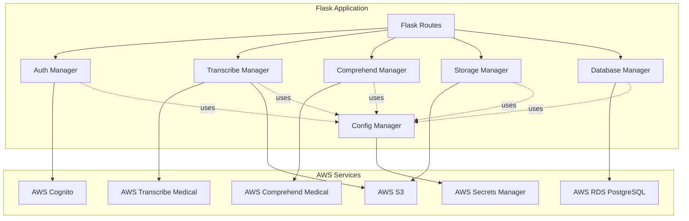
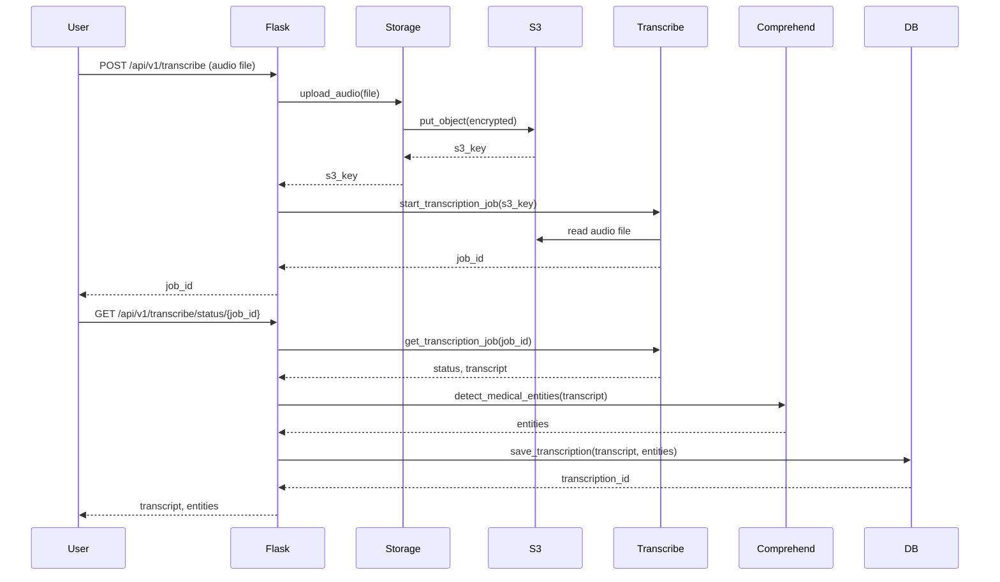
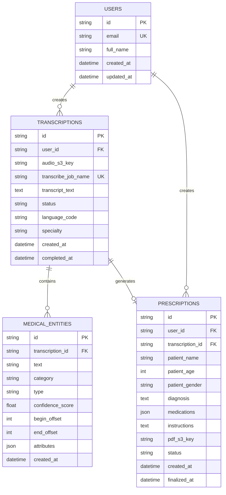
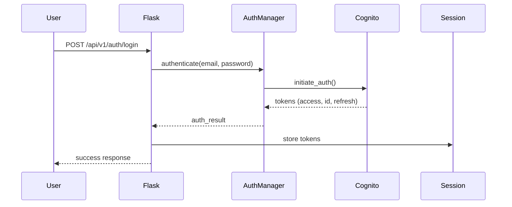
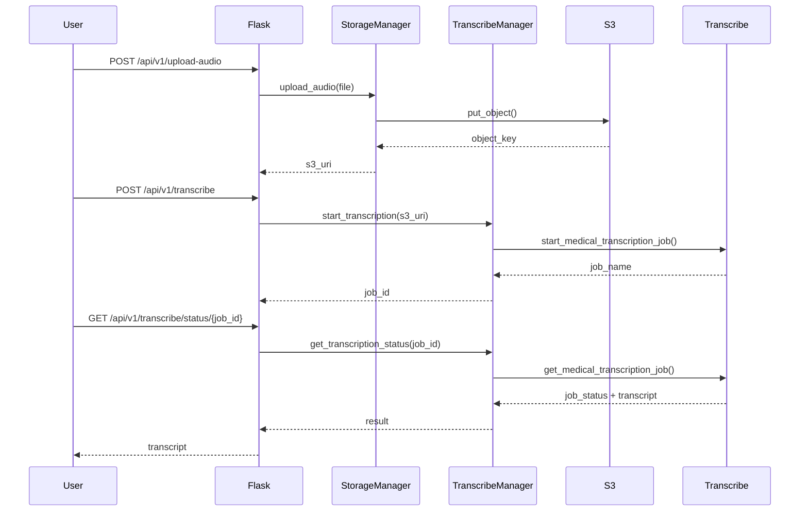

# Design Document: AWS Services Flask Integration

## Overview

This design document specifies the architecture and implementation approach for integrating AWS services into the SEVA Arogya Flask application. The integration leverages existing Terraform-provisioned infrastructure including AWS Cognito for authentication, Transcribe Medical for audio transcription, Comprehend Medical for medical entity extraction, Secrets Manager for configuration management, S3 for file storage, and RDS PostgreSQL for data persistence.

The design follows a layered architecture pattern with clear separation between AWS service clients, business logic, and Flask route handlers. The implementation uses the boto3 SDK for all AWS service interactions and maintains compatibility with existing Flask routes and HTML templates.

### Key Design Goals

1. **Modularity**: AWS service clients are encapsulated in dedicated manager classes for testability and maintainability
2. **Security**: Sensitive credentials are retrieved from Secrets Manager; all S3 uploads use server-side encryption
3. **Resilience**: Comprehensive error handling with retry logic for transient failures
4. **Observability**: Structured logging with AWS request IDs for traceability
5. **Configuration**: Environment-based configuration supporting local development and ECS deployment

## Architecture

### High-Level Architecture



### Request Flow Example: Audio Transcription



### Layered Architecture

The application follows a three-tier architecture:

1. **Presentation Layer**: Flask routes and templates
2. **Business Logic Layer**: Manager classes encapsulating AWS service interactions
3. **Data Layer**: RDS PostgreSQL database with SQLAlchemy ORM

### Component Responsibilities

- **Config Manager**: Loads configuration from environment variables and Secrets Manager
- **Auth Manager**: Handles Cognito authentication, registration, and session management
- **Storage Manager**: Manages S3 operations for audio files and PDF prescriptions
- **Transcribe Manager**: Orchestrates Transcribe Medical jobs and retrieves results
- **Comprehend Manager**: Extracts medical entities from transcribed text
- **Database Manager**: Manages database connections, pooling, and ORM operations

## Components and Interfaces

### 1. Config Manager

**Purpose**: Centralized configuration management with Secrets Manager integration

**Module**: `aws_services/config.py`

**Class**: `ConfigManager`

**Responsibilities**:
- Load environment variables from .env file (local development)
- Retrieve secrets from AWS Secrets Manager
- Validate required configuration values
- Provide configuration access to other managers

**Interface**:

```python
class ConfigManager:
    def __init__(self):
        """Initialize config manager and load environment variables"""
        
    def load_secrets(self) -> None:
        """Retrieve secrets from AWS Secrets Manager"""
        
    def get(self, key: str, default: Any = None) -> Any:
        """Get configuration value by key"""
        
    def get_required(self, key: str) -> Any:
        """Get required configuration value, raise error if missing"""
        
    def get_db_config(self) -> Dict[str, str]:
        """Get database connection configuration"""
        
    def validate(self) -> None:
        """Validate all required configuration values are present"""
```

**Configuration Keys**:
- `AWS_REGION`: AWS region (default: us-east-1)
- `COGNITO_USER_POOL_ID`: Cognito user pool ID
- `COGNITO_CLIENT_ID`: Cognito app client ID
- `S3_PDF_BUCKET`: S3 bucket name for PDFs
- `S3_AUDIO_BUCKET`: S3 bucket name for audio files
- `DB_HOST`, `DB_PORT`, `DB_NAME`, `DB_USERNAME`, `DB_PASSWORD`: Database credentials
- `FLASK_SECRET_KEY`: Flask session secret
- `JWT_SECRET`: JWT signing secret
- `CORS_ORIGINS`: Comma-separated list of allowed origins

**Error Handling**:
- Raises `ConfigurationError` if required values are missing
- Logs warning if Secrets Manager retrieval fails, falls back to environment variables
- Raises `ConfigurationError` if both Secrets Manager and environment variables fail

### 2. Auth Manager

**Purpose**: AWS Cognito authentication and session management

**Module**: `aws_services/auth.py`

**Class**: `CognitoAuthManager`

**Responsibilities**:
- Authenticate users via Cognito USER_PASSWORD_AUTH flow
- Register new users and handle email verification
- Manage Cognito tokens (access, ID, refresh)
- Refresh expired tokens
- Validate token expiration
- Sign out users and revoke tokens

**Interface**:

```python
class CognitoAuthManager:
    def __init__(self, config: ConfigManager):
        """Initialize Cognito client with configuration"""
        
    def authenticate(self, email: str, password: str) -> Dict[str, Any]:
        """
        Authenticate user with Cognito
        Returns: {
            'access_token': str,
            'id_token': str,
            'refresh_token': str,
            'expires_in': int,
            'user_id': str
        }
        """
        
    def register(self, email: str, password: str, attributes: Dict[str, str]) -> Dict[str, Any]:
        """
        Register new user in Cognito
        Returns: {'user_id': str, 'confirmation_required': bool}
        """
        
    def confirm_registration(self, email: str, confirmation_code: str) -> bool:
        """Confirm user registration with verification code"""
        
    def refresh_token(self, refresh_token: str) -> Dict[str, str]:
        """
        Refresh access token using refresh token
        Returns: {'access_token': str, 'id_token': str, 'expires_in': int}
        """
        
    def sign_out(self, access_token: str) -> None:
        """Sign out user and revoke tokens"""
        
    def validate_token(self, access_token: str) -> bool:
        """Validate token is not expired"""
        
    def get_user_info(self, access_token: str) -> Dict[str, Any]:
        """Get user information from Cognito"""
```

**Error Handling**:
- Catches `NotAuthorizedException` for invalid credentials
- Catches `UserNotFoundException` for non-existent users
- Catches `CodeMismatchException` for invalid verification codes
- Catches `ExpiredCodeException` for expired verification codes
- Returns user-friendly error messages without exposing internal details

### 3. Storage Manager

**Purpose**: S3 operations for audio files and PDF prescriptions

**Module**: `aws_services/storage.py`

**Class**: `S3StorageManager`

**Responsibilities**:
- Upload audio files with server-side encryption
- Upload PDF prescriptions with structured key format
- Generate presigned URLs for secure downloads
- Validate file formats and sizes
- Delete objects when needed

**Interface**:

```python
class S3StorageManager:
    def __init__(self, config: ConfigManager):
        """Initialize S3 client with configuration"""
        
    def upload_audio(self, file_obj: BinaryIO, user_id: str, 
                     file_extension: str) -> str:
        """
        Upload audio file to S3
        Returns: S3 object key
        """
        
    def upload_pdf(self, pdf_bytes: bytes, user_id: str, 
                   prescription_id: str) -> str:
        """
        Upload prescription PDF to S3
        Returns: S3 object key
        """
        
    def generate_presigned_url(self, object_key: str, 
                               expiration: int = 3600) -> str:
        """Generate presigned URL for secure download"""
        
    def delete_object(self, object_key: str) -> None:
        """Delete object from S3"""
        
    def validate_audio_file(self, filename: str, file_size: int) -> None:
        """Validate audio file format and size"""
```

**File Naming Convention**:
- Audio files: `audio/{user_id}/{timestamp}_{uuid}.{ext}`
- PDF files: `prescriptions/{user_id}/{prescription_id}.pdf`

**Supported Audio Formats**: wav, mp3, flac, mp4, m4a

**Maximum File Size**: 16MB

**Error Handling**:
- Raises `ValidationError` for invalid file formats or sizes
- Catches `ClientError` for S3 operation failures
- Implements retry logic with exponential backoff for transient failures

### 4. Transcribe Manager

**Purpose**: AWS Transcribe Medical job orchestration

**Module**: `aws_services/transcribe.py`

**Class**: `TranscribeMedicalManager`

**Responsibilities**:
- Start medical transcription jobs
- Poll job status
- Retrieve completed transcripts
- Handle job failures and retries

**Interface**:

```python
class TranscribeMedicalManager:
    def __init__(self, config: ConfigManager):
        """Initialize Transcribe Medical client"""
        
    def start_transcription_job(self, audio_s3_uri: str, 
                                job_name: str,
                                language_code: str = 'en-US',
                                specialty: str = 'PRIMARYCARE') -> str:
        """
        Start medical transcription job
        Returns: job_name
        """
        
    def get_transcription_status(self, job_name: str) -> Dict[str, Any]:
        """
        Get transcription job status
        Returns: {
            'status': str,  # IN_PROGRESS, COMPLETED, FAILED
            'transcript': str (if completed),
            'failure_reason': str (if failed)
        }
        """
        
    def get_transcript(self, job_name: str) -> str:
        """Get completed transcript text"""
        
    def delete_transcription_job(self, job_name: str) -> None:
        """Delete transcription job"""
```

**Transcription Configuration**:
- Language: en-US (English)
- Specialty: PRIMARYCARE (default), CARDIOLOGY, NEUROLOGY, ONCOLOGY, RADIOLOGY, UROLOGY
- Output format: JSON with timestamps
- Media format: Auto-detected from file extension

**Error Handling**:
- Catches `BadRequestException` for invalid parameters
- Catches `LimitExceededException` for quota limits
- Implements polling with exponential backoff
- Maximum poll attempts: 60 (5 minutes with 5-second intervals)

### 5. Comprehend Manager

**Purpose**: AWS Comprehend Medical entity extraction

**Module**: `aws_services/comprehend.py`

**Class**: `ComprehendMedicalManager`

**Responsibilities**:
- Extract medical entities from text
- Filter entities by confidence score
- Structure entity data for storage
- Handle text size limits

**Interface**:

```python
class ComprehendMedicalManager:
    def __init__(self, config: ConfigManager):
        """Initialize Comprehend Medical client"""
        
    def detect_entities(self, text: str, 
                       min_confidence: float = 0.5) -> List[Dict[str, Any]]:
        """
        Detect medical entities in text
        Returns: List of entities with structure:
        {
            'text': str,
            'category': str,  # MEDICATION, MEDICAL_CONDITION, etc.
            'type': str,
            'score': float,
            'begin_offset': int,
            'end_offset': int,
            'attributes': List[Dict]
        }
        """
        
    def extract_medications(self, entities: List[Dict]) -> List[Dict]:
        """Extract only medication entities"""
        
    def extract_conditions(self, entities: List[Dict]) -> List[Dict]:
        """Extract only medical condition entities"""
        
    def extract_dosages(self, entities: List[Dict]) -> List[Dict]:
        """Extract dosage information from medication attributes"""
```

**Entity Categories**:
- MEDICATION: Drug names and generic names
- MEDICAL_CONDITION: Diseases, symptoms, diagnoses
- PROTECTED_HEALTH_INFORMATION: Patient identifiers (filtered out)
- TEST_TREATMENT_PROCEDURE: Medical procedures and tests
- ANATOMY: Body parts and systems

**Text Limits**:
- Maximum text size: 20,000 bytes (UTF-8)
- Automatically chunks larger texts

**Error Handling**:
- Catches `TextSizeLimitExceededException` and implements chunking
- Catches `InvalidRequestException` for malformed input
- Returns empty list if detection fails

### 6. Database Manager

**Purpose**: PostgreSQL database connection and ORM management

**Module**: `aws_services/database.py`

**Class**: `DatabaseManager`

**Responsibilities**:
- Initialize SQLAlchemy engine with connection pooling
- Manage database sessions
- Implement retry logic for transient failures
- Validate connection health

**Interface**:

```python
class DatabaseManager:
    def __init__(self, config: ConfigManager):
        """Initialize database engine with connection pooling"""
        
    def get_session(self) -> Session:
        """Get database session"""
        
    def health_check(self) -> bool:
        """Check database connectivity"""
        
    def close(self) -> None:
        """Close all database connections"""
        
    @contextmanager
    def session_scope(self):
        """
        Context manager for database sessions with automatic commit/rollback
        Usage:
            with db_manager.session_scope() as session:
                session.add(obj)
        """
```

**Connection Pool Configuration**:
- Pool size: 5 connections
- Max overflow: 10 connections
- Pool recycle: 3600 seconds (1 hour)
- Pool pre-ping: True (validates connections before use)

**Retry Configuration**:
- Maximum retries: 3
- Backoff multiplier: 2
- Initial delay: 1 second

**Error Handling**:
- Catches `OperationalError` for connection failures
- Implements exponential backoff retry
- Logs all database errors with query context

## Data Models

### User Model

```python
class User(Base):
    __tablename__ = 'users'
    
    id = Column(String(255), primary_key=True)  # Cognito user ID
    email = Column(String(255), unique=True, nullable=False)
    full_name = Column(String(255))
    created_at = Column(DateTime, default=datetime.utcnow)
    updated_at = Column(DateTime, default=datetime.utcnow, onupdate=datetime.utcnow)
    
    # Relationships
    transcriptions = relationship('Transcription', back_populates='user')
    prescriptions = relationship('Prescription', back_populates='user')
```

### Transcription Model

```python
class Transcription(Base):
    __tablename__ = 'transcriptions'
    
    id = Column(String(36), primary_key=True, default=lambda: str(uuid.uuid4()))
    user_id = Column(String(255), ForeignKey('users.id'), nullable=False)
    audio_s3_key = Column(String(512), nullable=False)
    transcribe_job_name = Column(String(255), unique=True)
    transcript_text = Column(Text)
    status = Column(String(50))  # PENDING, IN_PROGRESS, COMPLETED, FAILED
    language_code = Column(String(10), default='en-US')
    specialty = Column(String(50), default='PRIMARYCARE')
    created_at = Column(DateTime, default=datetime.utcnow)
    completed_at = Column(DateTime)
    
    # Relationships
    user = relationship('User', back_populates='transcriptions')
    entities = relationship('MedicalEntity', back_populates='transcription')
    prescription = relationship('Prescription', back_populates='transcription', uselist=False)
```

### MedicalEntity Model

```python
class MedicalEntity(Base):
    __tablename__ = 'medical_entities'
    
    id = Column(String(36), primary_key=True, default=lambda: str(uuid.uuid4()))
    transcription_id = Column(String(36), ForeignKey('transcriptions.id'), nullable=False)
    text = Column(String(512), nullable=False)
    category = Column(String(100), nullable=False)  # MEDICATION, MEDICAL_CONDITION, etc.
    type = Column(String(100))
    confidence_score = Column(Float, nullable=False)
    begin_offset = Column(Integer)
    end_offset = Column(Integer)
    attributes = Column(JSON)  # Store dosage, frequency, etc.
    created_at = Column(DateTime, default=datetime.utcnow)
    
    # Relationships
    transcription = relationship('Transcription', back_populates='entities')
```

### Prescription Model

```python
class Prescription(Base):
    __tablename__ = 'prescriptions'
    
    id = Column(String(36), primary_key=True, default=lambda: str(uuid.uuid4()))
    user_id = Column(String(255), ForeignKey('users.id'), nullable=False)
    transcription_id = Column(String(36), ForeignKey('transcriptions.id'))
    patient_name = Column(String(255), nullable=False)
    patient_age = Column(Integer)
    patient_gender = Column(String(20))
    diagnosis = Column(Text)
    medications = Column(JSON)  # List of medication objects
    instructions = Column(Text)
    pdf_s3_key = Column(String(512))
    status = Column(String(50), default='DRAFT')  # DRAFT, FINALIZED
    created_at = Column(DateTime, default=datetime.utcnow)
    finalized_at = Column(DateTime)
    
    # Relationships
    user = relationship('User', back_populates='prescriptions')
    transcription = relationship('Transcription', back_populates='prescription')
```

### Database Schema Diagram



## API Endpoints

### Authentication Endpoints

#### POST /api/v1/auth/register
Register new user with Cognito

**Request**:
```json
{
  "email": "doctor@hospital.com",
  "password": "SecurePass123!",
  "full_name": "Dr. John Smith"
}
```

**Response** (201):
```json
{
  "success": true,
  "message": "Registration successful. Please check your email for verification code.",
  "user_id": "cognito-user-id"
}
```

#### POST /api/v1/auth/confirm
Confirm user registration with verification code

**Request**:
```json
{
  "email": "doctor@hospital.com",
  "confirmation_code": "123456"
}
```

**Response** (200):
```json
{
  "success": true,
  "message": "Email verified successfully"
}
```

#### POST /api/v1/auth/login
Authenticate user with Cognito

**Request**:
```json
{
  "email": "doctor@hospital.com",
  "password": "SecurePass123!"
}
```

**Response** (200):
```json
{
  "success": true,
  "message": "Login successful",
  "user": {
    "id": "cognito-user-id",
    "email": "doctor@hospital.com",
    "full_name": "Dr. John Smith"
  }
}
```

#### POST /api/v1/auth/logout
Sign out user and revoke tokens

**Response** (200):
```json
{
  "success": true,
  "message": "Logout successful"
}
```

### Transcription Endpoints

#### POST /api/v1/transcriptions
Upload audio and start transcription

**Request**: multipart/form-data
- `audio_file`: Audio file (wav, mp3, flac, mp4)
- `specialty`: Medical specialty (optional, default: PRIMARYCARE)

**Response** (202):
```json
{
  "success": true,
  "transcription_id": "uuid",
  "job_name": "transcribe-job-name",
  "status": "IN_PROGRESS"
}
```

#### GET /api/v1/transcriptions/{transcription_id}
Get transcription status and results

**Response** (200):
```json
{
  "success": true,
  "transcription": {
    "id": "uuid",
    "status": "COMPLETED",
    "transcript": "Patient presents with...",
    "entities": [
      {
        "text": "hypertension",
        "category": "MEDICAL_CONDITION",
        "type": "DX_NAME",
        "confidence_score": 0.95
      }
    ],
    "created_at": "2024-01-15T10:30:00Z",
    "completed_at": "2024-01-15T10:32:00Z"
  }
}
```

### Prescription Endpoints

#### POST /api/v1/prescriptions
Create new prescription

**Request**:
```json
{
  "transcription_id": "uuid",
  "patient_name": "Jane Doe",
  "patient_age": 45,
  "patient_gender": "Female",
  "diagnosis": "Hypertension",
  "medications": [
    {
      "name": "Lisinopril",
      "dosage": "10mg",
      "frequency": "Once daily",
      "duration": "30 days"
    }
  ],
  "instructions": "Take with food. Monitor blood pressure daily."
}
```

**Response** (201):
```json
{
  "success": true,
  "prescription_id": "uuid",
  "pdf_url": "https://presigned-url..."
}
```

#### GET /api/v1/prescriptions/{prescription_id}
Get prescription details

**Response** (200):
```json
{
  "success": true,
  "prescription": {
    "id": "uuid",
    "patient_name": "Jane Doe",
    "diagnosis": "Hypertension",
    "medications": [...],
    "pdf_url": "https://presigned-url...",
    "created_at": "2024-01-15T10:35:00Z"
  }
}
```

### Health Check Endpoint

#### GET /health
Application health check

**Response** (200):
```json
{
  "status": "healthy",
  "timestamp": "2024-01-15T10:00:00Z",
  "checks": {
    "database": "ok",
    "secrets_manager": "ok"
  }
}
```

**Response** (503) - Unhealthy:
```json
{
  "status": "unhealthy",
  "timestamp": "2024-01-15T10:00:00Z",
  "checks": {
    "database": "failed",
    "secrets_manager": "ok"
  }
}
```
```

### Request Flow Examples

#### Authentication Flow


#### Transcription Flow


### Deployment Architecture

The application runs on AWS ECS Fargate with the following infrastructure:

- **ECS Task**: Flask application container with IAM task role for AWS service access
- **ALB**: Application Load Balancer for HTTP/HTTPS traffic routing
- **VPC**: Private subnets for ECS tasks and RDS, public subnets for ALB
- **Security Groups**: Restrict traffic between ALB, ECS, and RDS
- **IAM Roles**: Task execution role for ECR/CloudWatch, task role for AWS service APIs

## Components and Interfaces

### 1. Configuration Manager (`config.py`)

Manages application configuration from environment variables an

## Correctness Properties

A property is a characteristic or behavior that should hold true across all valid executions of a system—essentially, a formal statement about what the system should do. Properties serve as the bridge between human-readable specifications and machine-verifiable correctness guarantees.

### Property Reflection

After analyzing all acceptance criteria, I identified several areas where properties can be consolidated:

1. **Secret Retrieval**: Requirements 2.1, 2.2, 2.3 all test the same behavior (retrieving secrets from Secrets Manager) with different secret types. These can be combined into a single property about secret retrieval.

2. **S3 Encryption**: Requirements 6.3 and 9.3 both test that S3 uploads use server-side encryption. These can be combined into one property about S3 encryption.

3. **Error Logging**: Requirements 6.5, 7.7, 8.6, 10.4, 11.1 all test that errors are logged. These can be consolidated into properties about consistent error logging patterns.

4. **Token Management**: Requirements 3.3, 3.5, 3.6, 5.1, 5.3, 5.5 overlap in testing token storage and validation. These can be consolidated into fewer comprehensive properties.

5. **AWS Client Initialization**: Requirements 1.1 and 1.2 can be combined into a single property about proper client initialization.

6. **Health Check Components**: Requirements 13.2 and 13.3 test individual health checks, which can be combined with 13.4 and 13.5 into comprehensive health check properties.

### Property 1: AWS Client Initialization

For any required AWS service (Cognito, Transcribe, Comprehend, Secrets Manager, S3), when the Flask application starts, the corresponding boto3 client should be initialized with the AWS region from configuration and be ready to accept requests.

**Validates: Requirements 1.1, 1.2**

### Property 2: Initialization Failure Prevention

For any AWS client initialization failure, the application should log the specific error details and raise an exception that prevents the application from starting.

**Validates: Requirements 1.5**

### Property 3: Secret Retrieval and Caching

For any secret name (database credentials, Flask secret key, JWT secret), when retrieved from Secrets Manager, the secret should be cached and subsequent retrievals should return the cached value without additional API calls.

**Validates: Requirements 2.1, 2.2, 2.3, 2.4**

### Property 4: Configuration Fallback Chain

For any required configuration value, if Secrets Manager retrieval fails, the system should fall back to environment variables; if both fail, the system should log the specific missing configuration and prevent startup.

**Validates: Requirements 2.5, 2.6**

### Property 5: Cognito Authentication Flow

For any valid email and password combination, when authentication is attempted, the system should use the USER_PASSWORD_AUTH flow and return all three token types (access, ID, refresh) with expiration information.

**Validates: Requirements 3.1, 3.2**

### Property 6: Session Token Storage

For any successful authentication, the access token, ID token, and refresh token should be stored in server-side session storage and be retrievable for subsequent authenticated requests.

**Validates: Requirements 3.3, 5.1**

### Property 7: Error Message Sanitization

For any authentication failure or AWS service error, the error message returned to the client should be user-friendly and must not contain sensitive information such as internal error details, stack traces, or AWS request IDs.

**Validates: Requirements 3.4, 11.4**

### Property 8: Token Expiration Validation

For any authenticated request, if the access token is expired, the system should attempt to refresh it using the refresh token; if refresh fails, the user should be redirected to the login page.

**Validates: Requirements 3.5, 3.6, 3.7, 5.3, 5.4**

### Property 9: Protected Route Authorization

For any protected route, the system should validate the access token before processing the request; requests without valid tokens should be rejected with appropriate HTTP status codes.

**Validates: Requirements 5.5**

### Property 10: User Registration with Email Username

For any valid registration request with email and password, the system should create a Cognito user with the email as the username and return the user ID.

**Validates: Requirements 4.1**

### Property 11: Registration Verification Flow

For any user registration that requires verification, when a valid confirmation code is provided, the user account should be marked as verified in Cognito.

**Validates: Requirements 4.4**

### Property 12: Session Invalidation on Logout

For any logout request, the system should clear the server-side session, revoke the Cognito tokens, and ensure subsequent requests with the old tokens are rejected.

**Validates: Requirements 5.2**

### Property 13: Audio File Format Validation

For any uploaded file, the system should accept only files with extensions wav, mp3, flac, mp4, or m4a; files with other extensions should be rejected with a validation error.

**Validates: Requirements 6.1**

### Property 14: Unique S3 Object Key Generation

For any audio file upload, the generated S3 object key should be unique (using user ID, timestamp, and UUID) and follow the format: audio/{user_id}/{timestamp}_{uuid}.{extension}

**Validates: Requirements 6.2**

### Property 15: S3 Server-Side Encryption

For any file uploaded to S3 (audio files or PDF prescriptions), the upload should use server-side encryption with AES256 algorithm.

**Validates: Requirements 6.3, 9.3**

### Property 16: Upload Success Response

For any successful S3 upload, the system should return the S3 object key to the client in the response.

**Validates: Requirements 6.4**

### Property 17: File Size Limit Enforcement

For any audio file upload, if the file size exceeds 16MB, the system should reject the upload with a validation error before attempting to upload to S3.

**Validates: Requirements 6.6**

### Property 18: Transcription Job Configuration

For any transcription request, the system should invoke AWS Transcribe Medical with medical transcription mode enabled and the specified medical specialty vocabulary.

**Validates: Requirements 7.2, 7.3**

### Property 19: Transcription Job Identifier Return

For any submitted transcription job, the system should return a unique job identifier to the client that can be used to poll for status and results.

**Validates: Requirements 7.4**

### Property 20: Transcript Retrieval on Completion

For any completed transcription job, when the status is polled, the system should retrieve and return the full transcript text from Transcribe Medical.

**Validates: Requirements 7.6**

### Property 21: Entity Detection Trigger

For any completed transcription, the system should automatically send the transcript text to AWS Comprehend Medical for entity detection.

**Validates: Requirements 8.1**

### Property 22: Entity Data Structuring

For any entity detection result, the system should structure the extracted entities as JSON with fields for text, category, type, confidence score, and offsets.

**Validates: Requirements 8.3, 8.4**

### Property 23: Entity Confidence Filtering

For any set of detected medical entities, the system should filter out entities with confidence scores below 0.5 before returning results to the client.

**Validates: Requirements 8.5**

### Property 24: Graceful Entity Extraction Failure

For any entity extraction failure, the system should log the error and return the transcript without entity data rather than failing the entire request.

**Validates: Requirements 8.6**

### Property 25: PDF Object Key Format

For any prescription PDF upload, the S3 object key should follow the structured format: prescriptions/{user_id}/{prescription_id}.pdf

**Validates: Requirements 9.2**

### Property 26: PDF Upload Database Persistence

For any successful PDF upload to S3, the S3 object key should be stored in the RDS database as part of the prescription record.

**Validates: Requirements 9.4**

### Property 27: Presigned URL Expiration

For any generated presigned URL for PDF download, the URL should have an expiration time of exactly 1 hour (3600 seconds).

**Validates: Requirements 9.6**

### Property 28: Transactional PDF Upload

For any PDF upload failure, the system should not create a prescription record in the database, ensuring atomicity of the operation.

**Validates: Requirements 9.7**

### Property 29: Database Credential Source

For any database connection, the system should use credentials retrieved from AWS Secrets Manager rather than hardcoded or plaintext environment variables.

**Validates: Requirements 10.1**

### Property 30: Connection Pool Configuration

For any database connection pool, the pool should be configured with a minimum of 2 connections and a maximum of 10 connections.

**Validates: Requirements 10.2**

### Property 31: Database Query Retry with Backoff

For any failed database query, the system should retry up to 3 times with exponential backoff before returning an error.

**Validates: Requirements 10.3**

### Property 32: Database Connection Health Check

For any application startup, the system should validate database connectivity by executing a health check query before accepting requests.

**Validates: Requirements 10.5**

### Property 33: Graceful Connection Cleanup

For any application shutdown, the system should close all database connections gracefully, ensuring no connections are left open.

**Validates: Requirements 10.6**

### Property 34: AWS Error Logging Structure

For any AWS service call failure, the system should log the error with structured data including service name, operation name, error code, error message, and AWS request ID.

**Validates: Requirements 11.1, 11.3**

### Property 35: JSON Structured Logging

For any log entry, the system should format the log as JSON with consistent fields for timestamp, level, message, and context, enabling CloudWatch Logs Insights queries.

**Validates: Requirements 11.2**

### Property 36: Operation Duration Logging

For any successful AWS operation, the system should log the operation at INFO level with the duration in milliseconds.

**Validates: Requirements 11.5**

### Property 37: Authentication Attempt Logging

For any authentication attempt (successful or failed), the system should log the attempt with user identifier (email) and outcome without logging passwords.

**Validates: Requirements 11.6**

### Property 38: Required Configuration Validation

For any application startup, the system should validate that all required configuration values (AWS region, Cognito pool ID, Cognito client ID, S3 bucket names) are present and non-empty.

**Validates: Requirements 12.1, 12.2**

### Property 39: Missing Configuration Error Reporting

For any missing required configuration value, the system should log the specific variable name and prevent application startup with a clear error message.

**Validates: Requirements 12.3**

### Property 40: Environment Variable Precedence

For any configuration value present in both environment variables and .env file, the environment variable value should take precedence.

**Validates: Requirements 12.5**

### Property 41: Sensitive Configuration Redaction

For any log entry containing configuration values, sensitive values (secrets, passwords, tokens) should be redacted or omitted from the log output.

**Validates: Requirements 12.6**

### Property 42: Health Check Response Format

For any health check request, when all checks pass, the system should return HTTP 200 with a JSON response containing status "healthy", timestamp, and individual check results.

**Validates: Requirements 13.4**

### Property 43: Health Check Failure Response

For any health check request, if any check fails, the system should return HTTP 503 with details of which specific checks failed.

**Validates: Requirements 13.5**

### Property 44: Health Check Timeout

For any health check request, the system should complete all checks within 5 seconds or return a timeout error.

**Validates: Requirements 13.6**

### Property 45: CORS Origin Configuration

For any CORS request, the system should validate the request origin against the configured allowed origins from environment configuration and reject requests from unauthorized origins.

**Validates: Requirements 14.1, 14.4, 14.5**

### Property 46: CORS Credentials Support

For any authenticated endpoint, the CORS configuration should allow credentials (cookies, authorization headers) in cross-origin requests.

**Validates: Requirements 14.3**

### Property 47: Boto3 Error Parsing

For any boto3 ClientError exception, the system should extract and log both the error code and error message from the exception structure.

**Validates: Requirements 15.1**

### Property 48: AWS Error Type Handling

For any AWS service error, the system should handle the error appropriately based on error type: throttling errors should trigger exponential backoff retry, access denied errors should return HTTP 500, and resource not found errors should return HTTP 404.

**Validates: Requirements 15.2, 15.3, 15.4, 15.5**

### Property 49: Network Timeout Retry

For any network timeout when calling AWS services, the system should retry the operation up to 3 times before returning an error to the client.

**Validates: Requirements 15.6**

## Error Handling

### Error Handling Strategy

The application implements a layered error handling approach:

1. **AWS Service Layer**: Catch boto3 exceptions and convert to application-specific exceptions
2. **Business Logic Layer**: Handle application exceptions and implement retry logic
3. **API Layer**: Convert exceptions to appropriate HTTP responses with user-friendly messages

### Exception Hierarchy

```python
class AWSServiceError(Exception):
    """Base exception for AWS service errors"""
    def __init__(self, service: str, operation: str, message: str, 
                 error_code: str = None, request_id: str = None):
        self.service = service
        self.operation = operation
        self.message = message
        self.error_code = error_code
        self.request_id = request_id

class ConfigurationError(Exception):
    """Configuration validation or loading error"""
    pass

class AuthenticationError(AWSServiceError):
    """Cognito authentication error"""
    pass

class ValidationError(Exception):
    """Input validation error"""
    pass

class StorageError(AWSServiceError):
    """S3 storage operation error"""
    pass

class TranscriptionError(AWSServiceError):
    """Transcribe Medical operation error"""
    pass

class EntityExtractionError(AWSServiceError):
    """Comprehend Medical operation error"""
    pass

class DatabaseError(Exception):
    """Database operation error"""
    pass
```

### Retry Logic

**Exponential Backoff Configuration**:
- Initial delay: 1 second
- Maximum delay: 32 seconds
- Backoff multiplier: 2
- Maximum retries: 3

**Retryable Errors**:
- Throttling errors (ThrottlingException, ProvisionedThroughputExceededException)
- Network timeouts (ConnectTimeoutError, ReadTimeoutError)
- Service unavailable (ServiceUnavailable, InternalServerError)
- Database connection errors (OperationalError)

**Non-Retryable Errors**:
- Authentication failures (NotAuthorizedException, InvalidParameterException)
- Validation errors (ValidationException, InvalidRequestException)
- Access denied (AccessDeniedException)
- Resource not found (ResourceNotFoundException)

### Error Response Format

All API error responses follow a consistent JSON structure:

```json
{
  "success": false,
  "error": {
    "code": "AUTHENTICATION_FAILED",
    "message": "Invalid email or password",
    "timestamp": "2024-01-15T10:30:00Z"
  }
}
```

### Logging Strategy

**Log Levels**:
- DEBUG: Detailed diagnostic information for development
- INFO: Successful operations with duration metrics
- WARNING: Recoverable errors, fallback usage, retry attempts
- ERROR: Operation failures that require attention
- CRITICAL: System failures that prevent startup

**Structured Log Format**:
```json
{
  "timestamp": "2024-01-15T10:30:00Z",
  "level": "ERROR",
  "service": "transcribe",
  "operation": "start_transcription_job",
  "message": "Failed to start transcription job",
  "error_code": "ThrottlingException",
  "request_id": "abc-123-def",
  "user_id": "user-123",
  "duration_ms": 1250
}
```

## Testing Strategy

### Dual Testing Approach

The testing strategy employs both unit tests and property-based tests to ensure comprehensive coverage:

**Unit Tests**: Focus on specific examples, edge cases, and integration points
- Specific authentication scenarios (valid credentials, invalid credentials, expired tokens)
- Edge cases (empty files, maximum file sizes, special characters)
- Error conditions (network failures, service unavailable, invalid input)
- Integration between components (auth flow, transcription workflow)

**Property-Based Tests**: Verify universal properties across all inputs
- Use Hypothesis library for Python property-based testing
- Generate random valid inputs to test properties
- Each property test runs minimum 100 iterations
- Tests reference design document properties with tags

### Property-Based Testing Configuration

**Library**: Hypothesis (Python)

**Test Configuration**:
```python
from hypothesis import given, settings, strategies as st

@settings(max_examples=100, deadline=None)
@given(
    user_id=st.text(min_size=1, max_size=255),
    timestamp=st.integers(min_value=0),
    extension=st.sampled_from(['wav', 'mp3', 'flac', 'mp4', 'm4a'])
)
def test_property_14_unique_s3_key_generation(user_id, timestamp, extension):
    """
    Feature: aws-services-flask-integration
    Property 14: For any audio file upload, the generated S3 object key 
    should be unique and follow the format: audio/{user_id}/{timestamp}_{uuid}.{extension}
    """
    # Test implementation
    pass
```

**Property Test Tags**: Each property test includes a docstring comment with:
- Feature name: aws-services-flask-integration
- Property number and description from design document

### Test Organization

```
tests/
├── unit/
│   ├── test_config_manager.py
│   ├── test_auth_manager.py
│   ├── test_storage_manager.py
│   ├── test_transcribe_manager.py
│   ├── test_comprehend_manager.py
│   └── test_database_manager.py
├── property/
│   ├── test_properties_config.py
│   ├── test_properties_auth.py
│   ├── test_properties_storage.py
│   ├── test_properties_transcription.py
│   ├── test_properties_entity_extraction.py
│   └── test_properties_error_handling.py
├── integration/
│   ├── test_auth_flow.py
│   ├── test_transcription_workflow.py
│   └── test_prescription_workflow.py
└── conftest.py
```

### Test Fixtures and Mocking

**AWS Service Mocking**: Use moto library for mocking AWS services
```python
import boto3
from moto import mock_s3, mock_secretsmanager, mock_cognito_idp

@mock_s3
def test_audio_upload():
    # S3 operations are mocked
    pass
```

**Database Mocking**: Use SQLAlchemy in-memory SQLite for unit tests
```python
from sqlalchemy import create_engine
from sqlalchemy.orm import sessionmaker

@pytest.fixture
def db_session():
    engine = create_engine('sqlite:///:memory:')
    Base.metadata.create_all(engine)
    Session = sessionmaker(bind=engine)
    session = Session()
    yield session
    session.close()
```

### Coverage Goals

- Unit test coverage: Minimum 80% line coverage
- Property test coverage: All 49 correctness properties implemented
- Integration test coverage: All major workflows (auth, transcription, prescription)
- Edge case coverage: All validation boundaries and error conditions

### Continuous Integration

Tests run automatically on:
- Pull request creation
- Commits to main branch
- Nightly builds for extended property test runs (1000 iterations)

**CI Pipeline**:
1. Lint code (flake8, black, mypy)
2. Run unit tests with coverage report
3. Run property tests (100 iterations)
4. Run integration tests
5. Generate coverage report
6. Fail build if coverage below 80%
