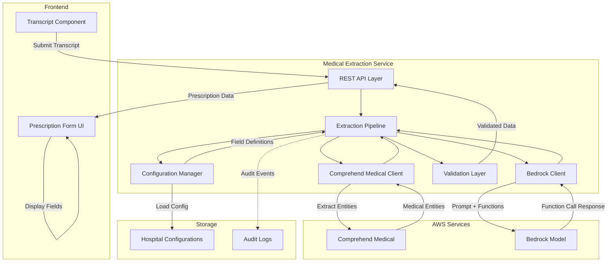

# Design Document: Bedrock Medical Extraction

## Overview

The Bedrock Medical Extraction system automates the extraction of medical information from consultation transcripts and populates prescription forms with minimal manual intervention. The system combines AWS Comprehend Medical for entity extraction with AWS Bedrock's function-calling capabilities to intelligently map medical information to structured prescription data.

### System Goals

- Reduce manual data entry time for healthcare providers by 80%+
- Improve prescription accuracy through automated extraction
- Support hospital-specific form configurations without code changes
- Provide confidence indicators to guide provider review
- Maintain HIPAA compliance and secure data handling

### Key Design Principles

1. **Separation of Concerns**: Clear boundaries between entity extraction, AI processing, and form rendering
2. **Configuration-Driven**: Hospital-specific forms defined through JSON configuration
3. **Fail-Safe**: Graceful degradation when AWS services are unavailable
4. **Transparency**: Confidence scores and original context available for provider review
5. **Security-First**: TLS encryption, IAM least-privilege, no PHI in logs

## Architecture

### High-Level Architecture



### Component Responsibilities

**Frontend Components:**
- **Prescription Form UI**: Renders dynamic form fields, displays confidence indicators, allows editing
- **Transcript Component**: Captures and submits transcript text, displays extraction status

**Backend Components:**
- **REST API Layer**: Handles HTTP requests, authentication, rate limiting
- **Extraction Pipeline**: Orchestrates the complete extraction workflow
- **Comprehend Medical Client**: Manages API calls to Comprehend Medical, handles retries
- **Bedrock Client**: Manages API calls to Bedrock, constructs prompts and function definitions
- **Configuration Manager**: Loads and validates hospital configurations, caches in memory
- **Validation Layer**: Validates function call responses, normalizes data formats

**External Services:**
- **AWS Comprehend Medical**: Extracts medical entities from unstructured text
- **AWS Bedrock**: Generates structured prescription data using function calling

### Data Flow

1. **Transcript Submission**: Frontend sends transcript text + hospital_id to backend API
2. **Entity Extraction**: Backend sends transcript to Comprehend Medical, receives medical entities with confidence scores
3. **Configuration Loading**: Backend retrieves hospital configuration for dynamic field definitions
4. **Function Definition Generation**: Backend generates Bedrock function schema from hospital config
5. **AI Processing**: Backend constructs prompt with entities + transcript, sends to Bedrock with function definitions
6. **Function Call Parsing**: Backend parses Bedrock's function call response, validates structure
7. **Data Normalization**: Backend normalizes dosage units, formats fields per configuration
8. **Response Assembly**: Backend combines extracted data with confidence scores, returns to frontend
9. **Form Population**: Frontend populates form fields, displays confidence indicators

### Technology Stack

**Backend:**
- Language: Python 3.11+
- Framework: FastAPI (async support for AWS SDK calls)
- AWS SDK: boto3 (Comprehend Medical, Bedrock Runtime)
- Configuration: Pydantic models for validation
- Logging: structlog (JSON structured logging)

**Frontend:**
- Framework: React 18+
- State Management: React Context + hooks
- Form Library: React Hook Form
- UI Components: Custom components with accessibility support

**Infrastructure:**
- AWS IAM: Role-based access with least privilege
- AWS Secrets Manager: API credentials and configuration
- TLS 1.3: All data in transit encryption

## Components and Interfaces

### Medical Extraction Service API

**Endpoint: POST /api/v1/extract**

Request:
```json
{
  "transcript": "string (max 10000 chars)",
  "hospital_id": "string",
  "request_id": "string (optional, for idempotency)"
}
```

Response (Success):
```json
{
  "status": "success",
  "prescription_data": {
    "sections": [
      {
        "section_id": "medications",
        "fields": [
          {
            "field_name": "medicine_name",
            "value": "Amoxicillin",
            "confidence": 0.95,
            "source_text": "I'm prescribing Amoxicillin"
          }
        ]
      }
    ]
  },
  "processing_time_ms": 3500,
  "request_id": "req_abc123"
}
```

Response (Error):
```json
{
  "status": "error",
  "error_code": "COMPREHEND_UNAVAILABLE",
  "error_message": "Medical extraction service temporarily unavailable",
  "request_id": "req_abc123"
}
```

**Endpoint: GET /api/v1/config/{hospital_id}**

Response:
```json
{
  "hospital_id": "hosp_12345",
  "hospital_name": "City General Hospital",
  "version": "1.0",
  "sections": [...]
}
```

### Extraction Pipeline Interface

```python
class ExtractionPipeline:
    """Orchestrates the complete extraction workflow"""
    
    async def extract_prescription_data(
        self,
        transcript: str,
        hospital_id: str
    ) -> PrescriptionData:
        """
        Main extraction method that coordinates all steps.
        
        Args:
            transcript: Raw transcript text
            hospital_id: Hospital identifier for configuration lookup
            
        Returns:
            PrescriptionData with extracted fields and confidence scores
            
        Raises:
            ComprehendUnavailableError: When Comprehend Medical fails
            BedrockUnavailableError: When Bedrock fails
            ConfigurationError: When hospital config is invalid
        """
        pass
```

### Comprehend Medical Client Interface

```python
class ComprehendMedicalClient:
    """Handles AWS Comprehend Medical API interactions"""
    
    async def extract_entities(
        self,
        text: str
    ) -> List[MedicalEntity]:
        """
        Extract medical entities from text.
        
        Args:
            text: Medical transcript text
            
        Returns:
            List of MedicalEntity objects with type, text, confidence
            
        Raises:
            ComprehendUnavailableError: Service unavailable
            ComprehendRateLimitError: Rate limit exceeded
        """
        pass
    
    def _parse_entity_response(
        self,
        response: dict
    ) -> List[MedicalEntity]:
        """Parse Comprehend Medical API response into structured entities"""
        pass
```

### Bedrock Client Interface

```python
class BedrockClient:
    """Handles AWS Bedrock API interactions"""
    
    async def generate_prescription_data(
        self,
        transcript: str,
        entities: List[MedicalEntity],
        function_definitions: List[FunctionDefinition]
    ) -> FunctionCallResponse:
        """
        Generate structured prescription data using function calling.
        
        Args:
            transcript: Original transcript for context
            entities: Extracted medical entities
            function_definitions: Dynamic function schema from hospital config
            
        Returns:
            FunctionCallResponse with structured field data
            
        Raises:
            BedrockUnavailableError: Service unavailable
            BedrockRateLimitError: Rate limit exceeded
        """
        pass
    
    def _construct_prompt(
        self,
        transcript: str,
        entities: List[MedicalEntity]
    ) -> str:
        """Build prompt with transcript and entity context"""
        pass
    
    def _build_function_schema(
        self,
        field_definitions: List[FieldDefinition]
    ) -> List[dict]:
        """Convert hospital config fields to Bedrock function schema"""
        pass
```

### Configuration Manager Interface

```python
class ConfigurationManager:
    """Manages hospital-specific form configurations"""
    
    def load_configuration(
        self,
        hospital_id: str
    ) -> HospitalConfiguration:
        """
        Load and validate hospital configuration.
        
        Args:
            hospital_id: Hospital identifier
            
        Returns:
            Validated HospitalConfiguration object
            
        Raises:
            ConfigurationNotFoundError: Hospital config doesn't exist
            ConfigurationValidationError: Config JSON is invalid
        """
        pass
    
    def get_default_configuration(self) -> HospitalConfiguration:
        """Return default configuration for hospitals without custom config"""
        pass
    
    def validate_configuration(
        self,
        config_dict: dict
    ) -> HospitalConfiguration:
        """Validate configuration structure and field definitions"""
        pass
```

### Validation Layer Interface

```python
class ValidationLayer:
    """Validates and normalizes extracted prescription data"""
    
    def validate_function_call(
        self,
        function_call: dict,
        expected_fields: List[FieldDefinition]
    ) -> ValidationResult:
        """
        Validate function call structure matches expected fields.
        
        Args:
            function_call: Raw function call from Bedrock
            expected_fields: Field definitions from hospital config
            
        Returns:
            ValidationResult with valid/invalid fields
        """
        pass
    
    def normalize_dosage(
        self,
        dosage_str: str
    ) -> str:
        """
        Normalize dosage to standard format.
        
        Examples:
            "500 milligrams" -> "500mg"
            "2 tablets" -> "2 tablets"
            "10 milliliters" -> "10ml"
        """
        pass
```

## Data Models

### Core Domain Models

```python
from pydantic import BaseModel, Field, validator
from typing import List, Optional, Literal
from enum import Enum

class EntityType(str, Enum):
    """Medical entity types from Comprehend Medical"""
    MEDICATION = "MEDICATION"
    DOSAGE = "DOSAGE"
    FREQUENCY = "FREQUENCY"
    DURATION = "DURATION"
    CONDITION = "CONDITION"
    PROCEDURE = "PROCEDURE"
    ANATOMY = "ANATOMY"

class MedicalEntity(BaseModel):
    """Structured medical entity from Comprehend Medical"""
    entity_type: EntityType
    text: str
    confidence: float = Field(ge=0.0, le=1.0)
    begin_offset: int
    end_offset: int
    attributes: Optional[List[dict]] = None

class FieldType(str, Enum):
    """Supported form field types"""
    TEXT = "text"
    NUMBER = "number"
    DROPDOWN = "dropdown"
    MULTILINE = "multiline"

class FieldDefinition(BaseModel):
    """Definition of a single form field"""
    field_name: str
    display_label: str
    field_type: FieldType
    required: bool
    display_order: int
    description: str  # LLM extraction guidance
    max_length: Optional[int] = None
    min_value: Optional[float] = None
    max_value: Optional[float] = None
    options: Optional[List[str]] = None  # For dropdown
    placeholder: Optional[str] = None
    unit: Optional[str] = None
    rows: Optional[int] = None  # For multiline

class SectionDefinition(BaseModel):
    """Definition of a form section"""
    section_id: str
    section_label: str
    display_order: int
    repeatable: bool = False
    fields: List[FieldDefinition]

class HospitalConfiguration(BaseModel):
    """Complete hospital form configuration"""
    hospital_id: str
    hospital_name: str
    version: str
    sections: List[SectionDefinition]
    
    @validator('sections')
    def validate_sections(cls, sections):
        """Ensure sections have unique IDs and valid ordering"""
        section_ids = [s.section_id for s in sections]
        if len(section_ids) != len(set(section_ids)):
            raise ValueError("Duplicate section IDs found")
        return sections

class ExtractedField(BaseModel):
    """Single extracted field with confidence"""
    field_name: str
    value: str
    confidence: float = Field(ge=0.0, le=1.0)
    source_text: Optional[str] = None  # Original transcript snippet

class ExtractedSection(BaseModel):
    """Extracted data for a form section"""
    section_id: str
    fields: List[ExtractedField]

class PrescriptionData(BaseModel):
    """Complete prescription extraction result"""
    sections: List[ExtractedSection]
    processing_time_ms: int
    
class FunctionDefinition(BaseModel):
    """Bedrock function definition"""
    name: str
    description: str
    parameters: dict  # JSON Schema format

class FunctionCallResponse(BaseModel):
    """Parsed Bedrock function call response"""
    function_name: str
    arguments: dict

class ValidationResult(BaseModel):
    """Result of function call validation"""
    is_valid: bool
    valid_fields: List[str]
    invalid_fields: List[str]
    errors: List[str]
```

### Error Models

```python
class ErrorCode(str, Enum):
    """Standardized error codes"""
    COMPREHEND_UNAVAILABLE = "COMPREHEND_UNAVAILABLE"
    BEDROCK_UNAVAILABLE = "BEDROCK_UNAVAILABLE"
    RATE_LIMIT_EXCEEDED = "RATE_LIMIT_EXCEEDED"
    INVALID_CONFIGURATION = "INVALID_CONFIGURATION"
    AUTHENTICATION_ERROR = "AUTHENTICATION_ERROR"
    VALIDATION_ERROR = "VALIDATION_ERROR"
    MALFORMED_RESPONSE = "MALFORMED_RESPONSE"

class ExtractionError(BaseModel):
    """Standardized error response"""
    status: Literal["error"]
    error_code: ErrorCode
    error_message: str
    request_id: str
    timestamp: str
```

### Configuration Storage Format

Hospital configurations are stored as JSON files in the following structure:

```
/config/hospitals/
  ├── hosp_12345.json
  ├── hosp_67890.json
  └── default.json
```

Each file contains a complete `HospitalConfiguration` object serialized to JSON.


## Correctness Properties

*A property is a characteristic or behavior that should hold true across all valid executions of a system—essentially, a formal statement about what the system should do. Properties serve as the bridge between human-readable specifications and machine-verifiable correctness guarantees.*

### Property Reflection

After analyzing all acceptance criteria, I identified several areas of redundancy:

- **Confidence Score Preservation**: Criteria 1.4 and 7.1 both test that confidence scores are preserved through the pipeline. These can be combined into a single property.
- **Configuration Retrieval**: Criteria 9.1 and 9.3 both test configuration storage and retrieval. These can be combined.
- **Function Definition Generation**: Criteria 2.2, 9.4, and 9.11 all relate to generating function definitions from hospital configs. These can be combined into a comprehensive property.
- **Field Mapping**: Criteria 3.1 and 3.2 both test mapping function call outputs to form fields. These can be combined.

The following properties represent the unique, non-redundant validation requirements:

### Property 1: Comprehend Medical Integration

*For any* transcript text, when submitted to the Medical_Extraction_Service, the service should invoke Comprehend_Medical with that exact transcript text.

**Validates: Requirements 1.1**

### Property 2: Entity Categorization

*For any* Comprehend_Medical response containing medical entities, the Medical_Extraction_Service should correctly categorize each entity by its type (medication, dosage, condition, procedure, anatomy).

**Validates: Requirements 1.2**

### Property 3: Entity Extraction Error Handling

*For any* error response from Comprehend_Medical, the Medical_Extraction_Service should log the error details and return a descriptive error message to the caller.

**Validates: Requirements 1.3**

### Property 4: Confidence Score Preservation

*For any* medical entities extracted with confidence scores, those confidence scores should be preserved unchanged through the entire extraction pipeline and appear in the final prescription data response.

**Validates: Requirements 1.4, 7.1**

### Property 5: Prompt Construction

*For any* set of extracted medical entities and transcript text, the Medical_Extraction_Service should construct a Bedrock prompt that includes both the complete transcript context and all extracted entity information.

**Validates: Requirements 2.1**

### Property 6: Dynamic Function Definition Generation

*For any* valid Hospital_Configuration, the Medical_Extraction_Service should generate Bedrock function definitions that include all configured fields with their names, types, descriptions, and validation constraints.

**Validates: Requirements 2.2, 9.4, 9.11**

### Property 7: Bedrock Function Calling Invocation

*For any* Bedrock API call made by the Medical_Extraction_Service, the request should include function definitions and request function calling mode.

**Validates: Requirements 2.3**

### Property 8: Function Call Validation

*For any* function call response from Bedrock, the Medical_Extraction_Service should validate that the structure matches the expected field definitions from the hospital configuration.

**Validates: Requirements 2.4**

### Property 9: Partial Result Handling

*For any* invalid or incomplete function call response from Bedrock, the Medical_Extraction_Service should return a partial result containing only the valid fields and log the validation errors.

**Validates: Requirements 2.5**

### Property 10: Prescription Data Formatting

*For any* validated function call data, the Medical_Extraction_Service should format it into a PrescriptionData structure with sections and fields matching the hospital configuration.

**Validates: Requirements 3.1, 3.2**

### Property 11: Form Field Population

*For any* PrescriptionData returned from the backend, the Prescription_Form component should populate all available fields with the extracted values.

**Validates: Requirements 3.3**

### Property 12: Auto-Fill Visual Indication

*For any* field populated by extraction, the Prescription_Form should apply a visual indicator (CSS class or attribute) distinguishing it from manually entered fields.

**Validates: Requirements 3.4**

### Property 13: Field Editability

*For any* auto-filled field in the Prescription_Form, the field should remain editable and accept user input modifications.

**Validates: Requirements 3.5**

### Property 14: Exponential Backoff Retry

*For any* AWS service rate limit error, the Medical_Extraction_Service should retry the request with exponential backoff delays, attempting up to 3 times before failing.

**Validates: Requirements 4.4**

### Property 15: Error Logging with Request IDs

*For any* AWS service error, the Medical_Extraction_Service should log the error with the associated request identifier for debugging traceability.

**Validates: Requirements 4.5**

### Property 16: Error Resilience

*For any* AWS service error, the Medical_Extraction_Service should handle the error gracefully without crashing and remain responsive to subsequent requests.

**Validates: Requirements 4.6**

### Property 17: Transcript Content Exclusion from Logs

*For any* log message generated by the Medical_Extraction_Service, the log content should not contain raw transcript text or patient-identifiable information.

**Validates: Requirements 5.3**

### Property 18: Error Message Sanitization

*For any* error returned to the frontend, the error message should be sanitized to exclude patient-identifiable information from the original transcript or entities.

**Validates: Requirements 5.4**

### Property 19: Audit Log Format

*For any* extraction request when audit logging is enabled, the audit log entry should contain timestamp and user identifier but should not contain medical content from the transcript.

**Validates: Requirements 5.5**

### Property 20: Model Configuration Usage

*For any* configured Bedrock model identifier provided via environment variables or configuration files, the Medical_Extraction_Service should use that specific model for all Bedrock API calls.

**Validates: Requirements 6.1, 6.4**

### Property 21: Function Calling Capability Validation

*For any* configured Bedrock model, the Medical_Extraction_Service should validate at startup that the model supports function calling capability.

**Validates: Requirements 6.2**

### Property 22: Confidence Level Visual Classification

*For any* auto-filled field with a confidence score, the Prescription_Form should apply the correct visual cue based on confidence thresholds: high (>0.8), medium (0.5-0.8), or low (<0.5).

**Validates: Requirements 7.3**

### Property 23: Low Confidence Field Highlighting

*For any* field with confidence below 0.5, the Prescription_Form should apply highlighting styles to draw provider attention for review.

**Validates: Requirements 7.4**

### Property 24: Source Context Availability

*For any* auto-filled field, the Prescription_Form should provide access to the original transcript context (source_text) that was used for extraction.

**Validates: Requirements 7.5, 7.2**

### Property 25: Function Call JSON Parsing

*For any* valid JSON function call response from Bedrock, the Medical_Extraction_Service should successfully parse the JSON structure into a FunctionCallResponse object.

**Validates: Requirements 8.1**

### Property 26: Required Field Validation

*For any* function call response, the Medical_Extraction_Service should validate that required fields (medication_name, dosage) are present before accepting the response as valid.

**Validates: Requirements 8.2**

### Property 27: Optional Field Extraction

*For any* function call response containing optional fields (frequency, duration, special_instructions), the Medical_Extraction_Service should extract and include those fields in the prescription data.

**Validates: Requirements 8.3**

### Property 28: Dosage Normalization

*For any* dosage string in various formats (e.g., "500 milligrams", "2 tablets", "10 milliliters"), the Medical_Extraction_Service should normalize it to standard units (e.g., "500mg", "2 tablets", "10ml").

**Validates: Requirements 8.5**

### Property 29: Prescription Data Serialization Round-Trip

*For any* valid PrescriptionData object, serializing it to JSON and then deserializing back should produce an equivalent PrescriptionData object with identical field values.

**Validates: Requirements 8.6**

### Property 30: Hospital Configuration Storage and Retrieval

*For any* hospital_id, when a Hospital_Configuration is stored and then retrieved using that hospital_id, the retrieved configuration should match the stored configuration.

**Validates: Requirements 9.1, 9.3**

### Property 31: Configuration JSON Structure

*For any* Hospital_Configuration stored as JSON, the JSON should include all required fields: hospital_id, hospital_name, version, sections, and each section should contain field definitions with name, type, required status, display_order, and description.

**Validates: Requirements 9.2**

### Property 32: Configuration Hot-Reload

*For any* Hospital_Configuration update, subsequent extraction requests for that hospital should use the updated configuration without requiring application restart.

**Validates: Requirements 9.5**

### Property 33: Dynamic Form Rendering

*For any* Hospital_Configuration retrieved from the backend, the Prescription_Form should render fields matching the configuration's field definitions in the specified display order.

**Validates: Requirements 9.6**

### Property 34: Configuration Validation

*For any* invalid Hospital_Configuration JSON (missing required fields, invalid field types, duplicate section IDs), the Medical_Extraction_Service should reject the configuration and return a descriptive validation error message.

**Validates: Requirements 9.8**

### Property 35: Configuration Serialization Round-Trip

*For any* valid Hospital_Configuration object, serializing it to JSON and then deserializing back should produce an equivalent Hospital_Configuration object with identical structure and field definitions.

**Validates: Requirements 9.9**

### Property 36: Field Type Support

*For any* Hospital_Configuration containing fields of types text, number, dropdown, or multiline, the Medical_Extraction_Service should successfully generate function definitions and the Prescription_Form should correctly render all field types.

**Validates: Requirements 9.10**

## Error Handling

### Error Categories

The system handles four primary error categories:

1. **AWS Service Errors**: Comprehend Medical or Bedrock unavailable, rate limits, timeouts
2. **Configuration Errors**: Invalid hospital configuration, missing configuration, unsupported model
3. **Validation Errors**: Malformed function calls, missing required fields, invalid data formats
4. **Authentication Errors**: Invalid IAM credentials, expired tokens, insufficient permissions

### Error Handling Strategy

**AWS Service Errors:**
- Implement exponential backoff retry for transient failures (rate limits, timeouts)
- Maximum 3 retry attempts with delays: 1s, 2s, 4s
- Return user-friendly error messages without exposing internal details
- Log full error details with request IDs for debugging
- Maintain circuit breaker pattern to prevent cascading failures

**Configuration Errors:**
- Validate configurations at load time before accepting
- Fail fast on startup for critical configuration issues (invalid model, missing default config)
- Return descriptive validation errors for invalid hospital configurations
- Fall back to default configuration when hospital-specific config is missing
- Cache validated configurations in memory to avoid repeated validation

**Validation Errors:**
- Accept partial results when some fields are valid
- Log validation failures with details of which fields failed
- Return available data to frontend with indicators of missing fields
- Never crash on malformed Bedrock responses - return empty result instead

**Authentication Errors:**
- Log authentication failures with error codes but not credentials
- Return generic "service unavailable" message to users (don't expose auth details)
- Alert operations team for credential expiration
- Use AWS SDK automatic credential refresh when possible

### Error Response Format

All errors follow a consistent structure:

```json
{
  "status": "error",
  "error_code": "COMPREHEND_UNAVAILABLE",
  "error_message": "Medical extraction service temporarily unavailable. Please try again.",
  "request_id": "req_abc123",
  "timestamp": "2024-01-15T10:30:00Z"
}
```

### Logging Strategy

**What to Log:**
- All AWS API calls with request/response IDs
- Configuration load events and validation results
- Extraction pipeline stages (entity extraction, AI processing, validation)
- All errors with full context and stack traces
- Performance metrics (processing times, retry counts)

**What NOT to Log:**
- Raw transcript content (PHI)
- Patient-identifiable information
- Complete entity text (may contain PHI)
- AWS credentials or tokens

**Log Format:**
- Structured JSON logs using structlog
- Include correlation IDs for request tracing
- Log levels: DEBUG (development), INFO (production), ERROR (always)

### Edge Cases

**Empty Transcript:**
- Return empty prescription data with informational message
- Don't call Comprehend Medical for empty input (validation at API layer)

**No Entities Extracted:**
- Continue to Bedrock with transcript only (no entity context)
- Return empty prescription data if Bedrock also finds nothing

**Malformed JSON from Bedrock:**
- Log parsing error with raw response (sanitized)
- Return empty prescription data
- Don't retry (malformed response won't fix itself)

**Missing Hospital Configuration:**
- Fall back to default configuration automatically
- Log warning about missing custom config
- Continue processing normally

**Model Doesn't Support Function Calling:**
- Fail at startup with clear error message
- Don't allow service to start in broken state
- Require configuration fix before restart

## Testing Strategy

### Dual Testing Approach

This feature requires both unit tests and property-based tests for comprehensive coverage:

**Unit Tests** focus on:
- Specific examples of entity extraction and parsing
- Edge cases (empty transcripts, missing configurations, malformed responses)
- Error conditions (service unavailable, authentication failures)
- Integration points between components
- UI component rendering with specific data

**Property-Based Tests** focus on:
- Universal properties that hold for all inputs
- Round-trip properties (serialization/deserialization)
- Invariants (confidence score preservation, field mapping correctness)
- Comprehensive input coverage through randomization
- Validation logic across diverse data

Together, unit tests catch concrete bugs in specific scenarios while property tests verify general correctness across the input space.

### Property-Based Testing Configuration

**Framework Selection:**
- **Python Backend**: Hypothesis (mature, excellent Python integration)
- **JavaScript Frontend**: fast-check (TypeScript support, React integration)

**Test Configuration:**
- Minimum 100 iterations per property test (due to randomization)
- Deterministic seed for reproducibility in CI/CD
- Shrinking enabled to find minimal failing examples
- Timeout: 30 seconds per property test

**Property Test Tagging:**

Each property-based test must reference its design document property using this format:

```python
# Feature: bedrock-medical-extraction, Property 4: Confidence Score Preservation
@given(medical_entities=st.lists(st.builds(MedicalEntity)))
def test_confidence_scores_preserved(medical_entities):
    # Test implementation
    pass
```

### Test Coverage Requirements

**Backend (Python):**

1. **Comprehend Medical Client** (Unit + Property)
   - Unit: Test specific entity types and error responses
   - Property 1: Verify all transcripts are sent to Comprehend Medical
   - Property 2: Verify entity categorization for all response types
   - Property 3: Verify error handling for all error types
   - Property 4: Verify confidence scores are preserved

2. **Bedrock Client** (Unit + Property)
   - Unit: Test specific prompt formats and function definitions
   - Property 5: Verify prompts contain transcript and entities
   - Property 6: Verify function definitions match all config variations
   - Property 7: Verify function calling is always requested
   - Property 28: Verify dosage normalization for all formats

3. **Configuration Manager** (Unit + Property)
   - Unit: Test default configuration, specific hospital configs
   - Property 30: Verify storage/retrieval round-trip
   - Property 31: Verify JSON structure for all configs
   - Property 32: Verify hot-reload behavior
   - Property 34: Verify validation rejects all invalid configs
   - Property 35: Verify serialization round-trip
   - Property 36: Verify all field types are supported

4. **Validation Layer** (Unit + Property)
   - Unit: Test specific validation scenarios
   - Property 8: Verify validation for all function call structures
   - Property 9: Verify partial results for all invalid responses
   - Property 26: Verify required field validation
   - Property 27: Verify optional field extraction

5. **Extraction Pipeline** (Unit + Property)
   - Unit: Test complete extraction flow with mocked services
   - Property 10: Verify data formatting for all valid inputs
   - Property 14: Verify exponential backoff for rate limits
   - Property 15: Verify error logging with request IDs
   - Property 16: Verify error resilience
   - Property 17: Verify transcript exclusion from logs
   - Property 18: Verify error message sanitization
   - Property 19: Verify audit log format
   - Property 20: Verify model configuration usage
   - Property 21: Verify function calling capability validation
   - Property 29: Verify prescription data serialization round-trip

**Frontend (React/TypeScript):**

1. **Prescription Form Component** (Unit + Property)
   - Unit: Test specific form states and user interactions
   - Property 11: Verify field population for all prescription data
   - Property 12: Verify auto-fill indicators for all fields
   - Property 13: Verify editability for all auto-filled fields
   - Property 22: Verify confidence visual classification
   - Property 23: Verify low confidence highlighting
   - Property 24: Verify source context availability
   - Property 33: Verify dynamic rendering for all configs

2. **Transcript Component** (Unit)
   - Unit: Test transcript submission, loading states, error display

### Integration Testing

**API Integration Tests:**
- Test complete extraction flow from API endpoint to response
- Mock AWS services to avoid external dependencies
- Verify request/response formats
- Test authentication and authorization

**AWS Service Integration Tests:**
- Separate test suite with real AWS service calls
- Run in staging environment only
- Verify actual Comprehend Medical and Bedrock integration
- Test IAM permissions and error handling

### Performance Testing

**Load Testing:**
- Simulate concurrent extraction requests
- Measure response times under load
- Verify rate limit handling and backoff behavior
- Target: 95th percentile < 5 seconds for entity extraction

**Stress Testing:**
- Test with maximum transcript length (10,000 characters)
- Test with complex medical terminology
- Verify memory usage remains stable
- Verify no memory leaks in long-running service

### Security Testing

**Penetration Testing:**
- Test for PHI leakage in logs and error messages
- Verify TLS configuration
- Test authentication bypass attempts
- Verify input sanitization

**Compliance Testing:**
- Verify HIPAA compliance requirements
- Audit log completeness
- Data retention policies
- Access control verification

### Test Data Management

**Synthetic Medical Data:**
- Generate realistic but fake medical transcripts
- Use medical terminology from public datasets
- Avoid using real patient data in tests
- Create diverse scenarios (different conditions, medications, formats)

**Configuration Test Data:**
- Create hospital configurations for various specialties
- Test with minimal and maximal field counts
- Include all field types and validation rules
- Test with international formats and units

### Continuous Integration

**CI Pipeline:**
1. Run unit tests on every commit
2. Run property-based tests on every PR
3. Run integration tests on merge to main
4. Run AWS integration tests nightly in staging
5. Generate coverage reports (target: 85%+ coverage)
6. Fail build on any test failure

**Test Execution Time:**
- Unit tests: < 2 minutes
- Property tests: < 5 minutes
- Integration tests: < 10 minutes
- Full suite: < 20 minutes
