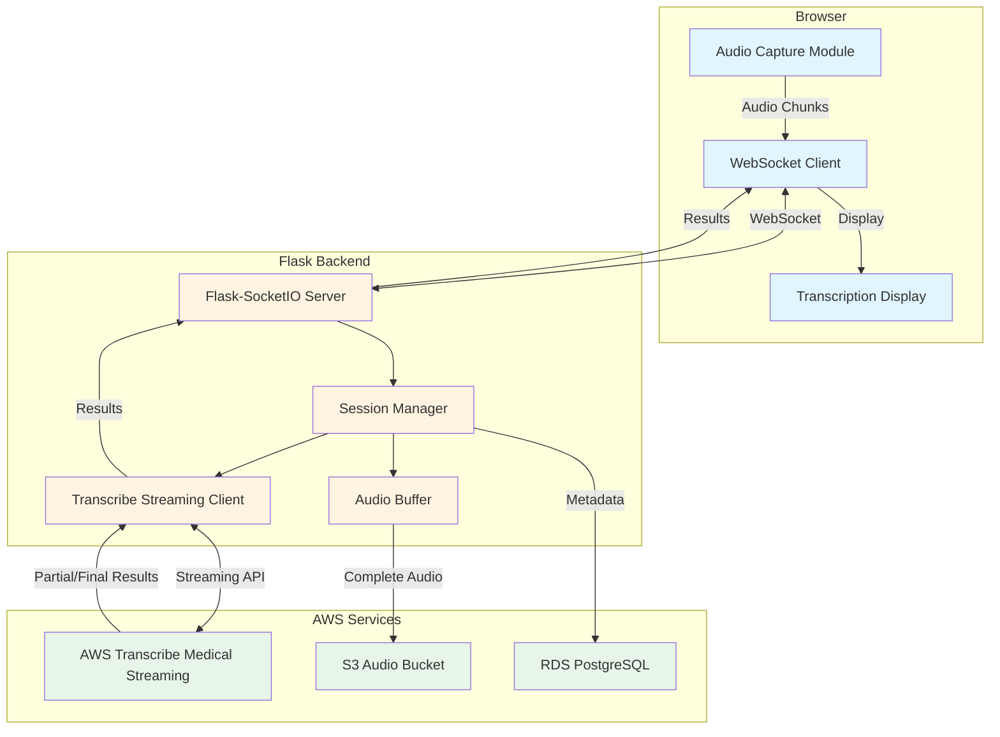

# Design Document: Live Audio Transcription Streaming

## Overview

This design document specifies the technical architecture for implementing real-time audio transcription streaming in the SEVA Arogya medical transcription application. The feature enables medical professionals to dictate patient notes with live transcription feedback, leveraging AWS Transcribe Medical's streaming capabilities.

The system architecture follows a bidirectional streaming model where audio flows from the browser to the Flask backend via WebSocket, then to AWS Transcribe Medical via streaming API, with transcription results flowing back through the same channels in real-time. This design maintains the existing Flask/AWS architecture while adding WebSocket support through Flask-SocketIO and integrating AWS Transcribe's streaming transcription API.

Key design decisions:
- **WebSocket over HTTP/2**: WebSocket provides lower latency and simpler implementation than HTTP/2 streaming for bidirectional communication
- **Flask-SocketIO**: Extends existing Flask architecture with minimal changes, supports both WebSocket and fallback transports
- **AWS Transcribe Streaming API**: Provides lower latency than batch transcription jobs (2-3 seconds vs 30+ seconds)
- **In-memory buffering**: Audio chunks buffered in memory during streaming, then persisted to S3 after session completion
- **Eventlet async worker**: Enables concurrent WebSocket connections without blocking Flask request handlers

## Architecture

### System Components



### Data Flow

1. **Audio Capture**: Browser captures microphone audio at 16kHz using Web Audio API, chunks into 200-500ms segments
2. **WebSocket Transmission**: Audio chunks transmitted to Flask backend via WebSocket with session metadata
3. **Streaming Transcription**: Flask backend forwards chunks to AWS Transcribe Medical streaming API
4. **Result Streaming**: Transcribe returns partial and final results, Flask forwards to browser via WebSocket
5. **Display Update**: Browser updates UI with latest transcription text
6. **Persistence**: On session end, complete audio file uploaded to S3, transcription record saved to RDS

### Technology Stack

- **Frontend**: Vanilla JavaScript with Web Audio API, native WebSocket API
- **Backend**: Flask 2.x with Flask-SocketIO 5.x, Eventlet async worker
- **AWS SDK**: boto3 with transcribe streaming support (amazon-transcribe package)
- **WebSocket Protocol**: Socket.IO protocol (supports WebSocket with fallback to long-polling)
- **Audio Format**: PCM 16-bit, 16kHz sample rate, mono channel
- **Serialization**: Binary for audio data, JSON for control messages and results

## Components and Interfaces

### Frontend Components

#### Audio Capture Module (`static/js/audio-capture.js`)

Responsibilities:
- Request microphone permissions
- Initialize Web Audio API with AudioContext
- Capture audio at specified sample rate (8kHz, 16kHz, or 48kHz)
- Convert audio to PCM format using ScriptProcessorNode or AudioWorklet
- Chunk audio into 200-500ms segments
- Emit audio chunks to WebSocket client

Interface:
```javascript
class AudioCapture {
  constructor(sampleRate = 16000, chunkDurationMs = 250)
  async initialize(): Promise<void>
  start(): void
  stop(): void
  on(event: 'chunk' | 'error', callback: Function): void
}
```

Key implementation details:
- Use `navigator.mediaDevices.getUserMedia()` for microphone access
- Create AudioContext with target sample rate
- Use ScriptProcessorNode (deprecated but widely supported) or AudioWorklet (modern)
- Downsample to target rate if browser doesn't support exact rate
- Convert Float32Array to Int16Array PCM format
- Buffer size: 4096 samples (256ms at 16kHz)

#### WebSocket Client (`static/js/websocket-client.js`)

Responsibilities:
- Establish WebSocket connection to Flask backend
- Send session initialization with user_id and quality settings
- Transmit audio chunks with message type identifier
- Receive transcription results (partial and final)
- Handle connection errors and implement reconnection logic
- Emit events for connection status and transcription results

Interface:
```javascript
class TranscriptionWebSocket {
  constructor(url: string, userId: string, quality: string)
  connect(): Promise<void>
  sendAudioChunk(audioData: ArrayBuffer): void
  endSession(): void
  on(event: 'connected' | 'result' | 'error' | 'closed', callback: Function): void
  disconnect(): void
}
```

Message formats:
```javascript
// Session start (JSON)
{
  type: 'session_start',
  user_id: string,
  quality: 'low' | 'medium' | 'high',
  session_id: string
}

// Audio chunk (Binary)
// Byte 0: Message type (0x01 for audio)
// Bytes 1-N: PCM audio data (Int16Array)

// Session end (JSON)
{
  type: 'session_end',
  session_id: string
}
```

#### Transcription Display (`static/js/transcription-display.js`)

Responsibilities:
- Render transcription text in real-time
- Update partial results (replace in-place)
- Append final results with proper spacing
- Auto-scroll to show latest text
- Highlight current segment being transcribed
- Display connection status and errors

Interface:
```javascript
class TranscriptionDisplay {
  constructor(containerElement: HTMLElement)
  updatePartial(text: string, segmentId: string): void
  appendFinal(text: string, segmentId: string): void
  showError(message: string): void
  showStatus(status: string): void
  clear(): void
}
```

### Backend Components

#### Flask-SocketIO Server (`app.py` extension)

Responsibilities:
- Handle WebSocket connections with Socket.IO protocol
- Authenticate connections using Flask session
- Route messages to appropriate handlers
- Emit transcription results to connected clients
- Manage connection lifecycle

Configuration:
```python
from flask_socketio import SocketIO, emit, disconnect
import eventlet

# Patch standard library for async support
eventlet.monkey_patch()

socketio = SocketIO(
    app,
    cors_allowed_origins=config_manager.get('cors_allowed_origins', []),
    async_mode='eventlet',
    ping_timeout=60,
    ping_interval=25,
    max_http_buffer_size=1024 * 1024  # 1MB max message size
)
```

Event handlers:
```python
@socketio.on('connect')
def handle_connect():
    # Authenticate using Flask session
    # Register connection in session manager
    
@socketio.on('session_start')
def handle_session_start(data):
    # Initialize transcription session
    # Start AWS Transcribe streaming
    
@socketio.on('audio_chunk')
def handle_audio_chunk(data):
    # Forward to transcribe streaming client
    # Buffer for later S3 upload
    
@socketio.on('session_end')
def handle_session_end(data):
    # Stop transcribe streaming
    # Upload audio to S3
    # Save transcription to database
    
@socketio.on('disconnect')
def handle_disconnect():
    # Clean up session resources
```

#### Session Manager (`aws_services/session_manager.py`)

Responsibilities:
- Track active WebSocket connections
- Manage session state (user_id, session_id, job_id, start_time)
- Associate connections with transcription jobs
- Implement session timeout (5 minutes idle)
- Clean up resources on session end
- Limit concurrent sessions per server (100 max)

Interface:
```python
class SessionManager:
    def __init__(self, max_sessions: int = 100, idle_timeout: int = 300):
        self._sessions: Dict[str, Session] = {}
        self._lock = threading.Lock()
    
    def create_session(self, session_id: str, user_id: str, 
                      request_sid: str) -> Session:
        """Create new session, raise error if limit reached"""
    
    def get_session(self, session_id: str) -> Optional[Session]:
        """Retrieve session by ID"""
    
    def update_activity(self, session_id: str) -> None:
        """Update last activity timestamp"""
    
    def remove_session(self, session_id: str) -> None:
        """Remove session and clean up resources"""
    
    def cleanup_idle_sessions(self) -> int:
        """Remove sessions idle beyond timeout, return count"""
    
    def get_active_count(self) -> int:
        """Get count of active sessions"""
```

Session data structure:
```python
@dataclass
class Session:
    session_id: str
    user_id: str
    request_sid: str  # Socket.IO session ID
    job_id: Optional[str]
    audio_buffer: AudioBuffer
    transcribe_stream: Optional[TranscribeStream]
    created_at: datetime
    last_activity: datetime
    quality: str
    sample_rate: int
```

#### Audio Buffer (`aws_services/audio_buffer.py`)

Responsibilities:
- Accumulate audio chunks in memory during streaming
- Maintain chunk order and timing information
- Provide complete audio data for S3 upload
- Convert PCM chunks to MP3 format on finalization
- Limit buffer size to prevent memory exhaustion (max 30 minutes at 16kHz = ~60MB)

Interface:
```python
class AudioBuffer:
    def __init__(self, sample_rate: int = 16000, max_duration_seconds: int = 1800):
        self._chunks: List[bytes] = []
        self._sample_rate = sample_rate
        self._max_size_bytes = self._calculate_max_size(max_duration_seconds)
    
    def append(self, chunk: bytes) -> None:
        """Add audio chunk, raise error if exceeds max size"""
    
    def get_total_duration(self) -> float:
        """Calculate total duration in seconds"""
    
    def finalize_to_mp3(self, bitrate: int = 64) -> bytes:
        """Convert accumulated PCM to MP3, return bytes"""
    
    def clear(self) -> None:
        """Clear buffer and free memory"""
```

#### Transcribe Streaming Client (`aws_services/transcribe_streaming_manager.py`)

Responsibilities:
- Initialize AWS Transcribe Medical streaming session
- Send audio chunks to Transcribe via streaming API
- Receive partial and final transcription results
- Handle Transcribe errors and reconnection
- Signal stream completion
- Emit results to Flask-SocketIO for client delivery

Interface:
```python
class TranscribeStreamingManager:
    def __init__(self, region: str):
        self.client = boto3.client('transcribe-streaming', region_name=region)
    
    async def start_stream(self, session_id: str, sample_rate: int,
                          language_code: str = 'en-US',
                          specialty: str = 'PRIMARYCARE') -> TranscribeStream:
        """Initialize streaming transcription session"""
    
    async def send_audio_chunk(self, stream: TranscribeStream, 
                              chunk: bytes) -> None:
        """Send audio chunk to active stream"""
    
    async def end_stream(self, stream: TranscribeStream) -> None:
        """Signal stream completion and close"""
    
    def _handle_result_stream(self, stream: TranscribeStream, 
                             session_id: str) -> None:
        """Background task to receive and emit results"""
```

AWS Transcribe streaming uses the `amazon-transcribe` package:
```python
from amazon_transcribe.client import TranscribeStreamingClient
from amazon_transcribe.handlers import TranscriptResultStreamHandler
from amazon_transcribe.model import TranscriptEvent

class ResultHandler(TranscriptResultStreamHandler):
    def __init__(self, session_id: str, socketio: SocketIO):
        super().__init__(output_stream)
        self.session_id = session_id
        self.socketio = socketio
    
    async def handle_transcript_event(self, transcript_event: TranscriptEvent):
        results = transcript_event.transcript.results
        for result in results:
            if result.alternatives:
                transcript = result.alternatives[0].transcript
                is_partial = result.is_partial
                
                # Emit to client via SocketIO
                self.socketio.emit('transcription_result', {
                    'type': 'partial' if is_partial else 'final',
                    'text': transcript,
                    'is_partial': is_partial,
                    'timestamp': time.time()
                }, room=self.session_id)
```

### Integration Points

#### Flask-SocketIO Integration

Flask-SocketIO extends Flask with WebSocket support while maintaining compatibility with existing routes and middleware. Key integration points:

1. **Authentication**: Use Flask session in SocketIO event handlers
```python
from flask import session
from flask_socketio import disconnect

@socketio.on('connect')
def handle_connect():
    if 'user_id' not in session:
        disconnect()
        return False
    return True
```

2. **Error Handling**: Reuse existing error handler utilities
```python
from utils.error_handler import handle_aws_error

@socketio.on('session_start')
def handle_session_start(data):
    try:
        # ... session logic
    except Exception as e:
        error_info = handle_aws_error(e)
        emit('error', {'message': error_info['message']})
```

3. **Logging**: Use existing logger configuration
```python
import logging
logger = logging.getLogger(__name__)

@socketio.on('audio_chunk')
def handle_audio_chunk(data):
    logger.debug(f"Received audio chunk: {len(data)} bytes")
```

#### AWS Transcribe Streaming Integration

AWS Transcribe Medical provides a streaming API that differs from the batch job API currently used. Key differences:

| Aspect | Batch API (Current) | Streaming API (New) |
|--------|-------------------|-------------------|
| Latency | 30+ seconds | 2-3 seconds |
| Input | S3 URI | Audio stream |
| Output | S3 JSON file | Event stream |
| Session | Stateless job | Stateful connection |
| Max Duration | Hours | 4 hours |

Streaming API setup:
```python
import asyncio
from amazon_transcribe.client import TranscribeStreamingClient
from amazon_transcribe.handlers import TranscriptResultStreamHandler
from amazon_transcribe.model import TranscriptEvent, AudioStream

async def start_transcription_stream(audio_queue: asyncio.Queue, 
                                     session_id: str,
                                     sample_rate: int = 16000):
    client = TranscribeStreamingClient(region='us-east-1')
    
    # Audio stream generator
    async def audio_generator():
        while True:
            chunk = await audio_queue.get()
            if chunk is None:  # End signal
                break
            yield AudioEvent(audio_chunk=chunk)
    
    stream = await client.start_stream_transcription(
        language_code='en-US',
        media_sample_rate_hz=sample_rate,
        media_encoding='pcm',
        vocabulary_name=None,  # Optional custom vocabulary
        session_id=session_id,
        audio_stream=audio_generator()
    )
    
    # Handle results in background
    async for event in stream.output_stream:
        if isinstance(event, TranscriptEvent):
            # Process and emit results
            pass
```

## Data Models

### Database Schema Extensions

#### Transcriptions Table Updates

Add streaming-specific fields to existing `transcriptions` table:

```sql
ALTER TABLE transcriptions
ADD COLUMN session_id VARCHAR(255),
ADD COLUMN streaming_job_id VARCHAR(255),
ADD COLUMN is_streaming BOOLEAN DEFAULT FALSE,
ADD COLUMN partial_transcript TEXT,
ADD COLUMN audio_duration_seconds FLOAT,
ADD COLUMN sample_rate INTEGER DEFAULT 16000,
ADD COLUMN quality VARCHAR(20) DEFAULT 'medium';

CREATE INDEX idx_transcriptions_session_id ON transcriptions(session_id);
CREATE INDEX idx_transcriptions_streaming_job_id ON transcriptions(streaming_job_id);
```

Field descriptions:
- `session_id`: Unique identifier for WebSocket session
- `streaming_job_id`: AWS Transcribe streaming session ID
- `is_streaming`: Flag to distinguish streaming vs batch transcriptions
- `partial_transcript`: Last partial result (for recovery/debugging)
- `audio_duration_seconds`: Total duration of audio captured
- `sample_rate`: Audio sample rate used (8000, 16000, or 48000)
- `quality`: Quality setting ('low', 'medium', 'high')

### WebSocket Message Schemas

#### Client to Server Messages

**Session Start**
```json
{
  "type": "session_start",
  "user_id": "user@example.com",
  "session_id": "uuid-v4",
  "quality": "medium",
  "timestamp": 1234567890.123
}
```

**Audio Chunk (Binary)**
- Byte 0: Message type (0x01)
- Bytes 1-N: PCM audio data (Int16Array, little-endian)

**Session End**
```json
{
  "type": "session_end",
  "session_id": "uuid-v4",
  "timestamp": 1234567890.123
}
```

#### Server to Client Messages

**Session Acknowledgment**
```json
{
  "type": "session_ack",
  "session_id": "uuid-v4",
  "job_id": "transcribe-job-id",
  "status": "ready",
  "timestamp": 1234567890.123
}
```

**Transcription Result**
```json
{
  "type": "transcription_result",
  "is_partial": true,
  "text": "The patient presents with",
  "segment_id": "segment-uuid",
  "timestamp": 1234567890.123,
  "confidence": 0.95
}
```

**Session Complete**
```json
{
  "type": "session_complete",
  "session_id": "uuid-v4",
  "transcription_id": "db-record-id",
  "audio_s3_key": "audio/user/timestamp_uuid.mp3",
  "total_duration": 125.5,
  "word_count": 342,
  "timestamp": 1234567890.123
}
```

**Error Message**
```json
{
  "type": "error",
  "error_code": "TRANSCRIBE_FAILED",
  "message": "Transcription service unavailable. Please try again.",
  "recoverable": true,
  "timestamp": 1234567890.123
}
```

**Heartbeat**
```json
{
  "type": "heartbeat",
  "timestamp": 1234567890.123
}
```

### Audio Format Specifications

#### PCM Format (Streaming)
- Encoding: Linear PCM (Pulse Code Modulation)
- Bit depth: 16-bit signed integer
- Byte order: Little-endian
- Channels: 1 (mono)
- Sample rate: 8000, 16000, or 48000 Hz
- Frame size: 2 bytes per sample

#### MP3 Format (Storage)
- Encoding: MPEG-1 Audio Layer 3
- Bitrate: 64 kbps (constant bitrate)
- Sample rate: Matches source (8000, 16000, or 48000 Hz)
- Channels: 1 (mono)
- Quality: Sufficient for speech, optimized for storage

Conversion using pydub:
```python
from pydub import AudioSegment
import io

def pcm_to_mp3(pcm_data: bytes, sample_rate: int, bitrate: int = 64) -> bytes:
    # Create AudioSegment from PCM
    audio = AudioSegment(
        data=pcm_data,
        sample_width=2,  # 16-bit = 2 bytes
        frame_rate=sample_rate,
        channels=1
    )
    
    # Export as MP3
    mp3_buffer = io.BytesIO()
    audio.export(
        mp3_buffer,
        format='mp3',
        bitrate=f'{bitrate}k',
        parameters=['-ac', '1']  # Force mono
    )
    
    return mp3_buffer.getvalue()
```


## Correctness Properties

A property is a characteristic or behavior that should hold true across all valid executions of a system—essentially, a formal statement about what the system should do. Properties serve as the bridge between human-readable specifications and machine-verifiable correctness guarantees.

### Property 1: Audio Chunk Duration Bounds

For any audio chunk produced by the Audio_Capture_Module during active capture, the chunk duration shall be between 200ms and 500ms.

**Validates: Requirements 1.3**

### Property 2: PCM Format Compliance

For any audio chunk encoded by the Audio_Capture_Module, the chunk shall be in PCM format with 16-bit signed integers, little-endian byte order, and mono channel configuration.

**Validates: Requirements 1.4**

### Property 3: Audio Transmission Latency

For any audio chunk captured while the WebSocket connection is active, the time between chunk capture and transmission shall be less than 100ms.

**Validates: Requirements 2.2**

### Property 4: Chunk Metadata Completeness

For any audio chunk transmitted by the Streaming_Client, the transmission shall include session metadata containing user_id and timestamp fields.

**Validates: Requirements 2.3**

### Property 5: Client Buffer Capacity

For any temporary connection interruption, the Streaming_Client buffer shall hold up to 5 seconds of audio data without data loss.

**Validates: Requirements 2.6**

### Property 6: Backend Forwarding Latency

For any audio chunk received by the Flask_Backend while a Transcription_Job is active, the chunk shall be forwarded to AWS Transcribe within 50ms.

**Validates: Requirements 3.2**

### Property 7: Partial Result Transmission Latency

For any Partial_Result received by the Flask_Backend from AWS Transcribe, the result shall be transmitted to the client via WebSocket within 100ms.

**Validates: Requirements 4.1**

### Property 8: Transcription Display Update Consistency

For any transcription result received by the Transcription_Display, if the result is partial, it shall update the current segment in-place; if the result is final, it shall replace the corresponding partial result and append to the transcript.

**Validates: Requirements 4.2, 4.3**

### Property 9: Final Result Formatting

For any Final_Result appended to the transcription text, the Transcription_Display shall ensure proper spacing (single space between words, appropriate punctuation spacing) is maintained.

**Validates: Requirements 4.4**

### Property 10: Auto-scroll Behavior

For any new transcription text added to the Transcription_Display, the display shall automatically scroll to show the most recent text within 100ms.

**Validates: Requirements 4.5**

### Property 11: Current Segment Highlighting

For any segment currently being transcribed, the Transcription_Display shall apply a visual highlight indicator that is removed when the segment becomes final.

**Validates: Requirements 4.6**

### Property 12: Audio Chunk Accumulation

For any audio chunk received by the Flask_Backend during an active session, the chunk shall be stored in the session's AudioBuffer without data loss.

**Validates: Requirements 5.1**

### Property 13: S3 Key Pattern Compliance

For any audio file uploaded to S3, the generated S3 key shall match the pattern `audio/{user_id}/{timestamp}_{uuid}.mp3` where timestamp is in YYYYMMDD_HHMMSS format and uuid is a valid UUID v4.

**Validates: Requirements 5.4**

### Property 14: Upload Completion Latency

For any completed audio recording, the upload to S3 shall complete within 5 seconds of recording completion.

**Validates: Requirements 5.5**

### Property 15: S3 Key Persistence

For any successful S3 upload, the S3 key shall be stored in the Transcription_Database transcription record.

**Validates: Requirements 5.6**

### Property 16: Transcription Record Initialization

For any initiated Transcription_Job, a transcription record shall be created in the Transcription_Database with status='IN_PROGRESS', containing job_id, user_id, audio_s3_key, and creation timestamp.

**Validates: Requirements 6.1, 6.2**

### Property 17: Final Result Accumulation

For any Final_Result received during an active transcription session, the result text shall be appended to the transcript_text field in the database record.

**Validates: Requirements 6.3**

### Property 18: Transcription Status Lifecycle

For any transcription record, status transitions shall follow the pattern: IN_PROGRESS → COMPLETED (on success) or IN_PROGRESS → FAILED (on error), and the updated_at timestamp shall be updated with each status change.

**Validates: Requirements 6.4, 6.6**

### Property 19: Session Registration Lifecycle

For any WebSocket connection, the connection shall be registered in the active sessions registry upon establishment and removed upon normal closure with all associated resources released.

**Validates: Requirements 8.1, 8.2**

### Property 20: Session Event Logging

For any session lifecycle event (start, end, error), the Flask_Backend shall create a log entry containing session_id, user_id, event_type, and timestamp.

**Validates: Requirements 8.6**

### Property 21: Error Logging Context

For any error that occurs in the Flask_Backend, the error log entry shall contain user_id, job_id (if applicable), error_code, error_message, and stack_trace.

**Validates: Requirements 9.6**

### Property 22: Audio Capture Buffering Delay

For any audio sample captured by the Audio_Capture_Module, the buffering delay introduced before the sample is available for transmission shall be less than 50ms.

**Validates: Requirements 10.3**

### Property 23: Backend Processing Overhead

For any audio chunk received by the Flask_Backend, the processing overhead (time from receipt to forwarding) shall be less than 100ms.

**Validates: Requirements 10.4**

### Property 24: Display Render Latency

For any transcription result received by the Transcription_Display, the time from receipt to DOM update shall be less than 50ms.

**Validates: Requirements 10.5**

### Property 25: Audio Message Format

For any audio data message sent by the Streaming_Client, the message shall be in binary format with byte 0 containing the message type identifier (0x01) and bytes 1-N containing PCM audio data.

**Validates: Requirements 11.1**

### Property 26: Result Message Format

For any transcription result message sent by the Flask_Backend, the message shall be in JSON format containing fields: type, is_partial, text, and timestamp.

**Validates: Requirements 11.2**

### Property 27: Heartbeat Interval

For any active WebSocket connection, the Flask_Backend shall send heartbeat messages at 30-second intervals (±5 seconds tolerance).

**Validates: Requirements 11.7**

### Property 28: Sample Rate Configuration Consistency

For any transcription session with a specified quality parameter, the Audio_Capture_Module sample rate, WebSocket transmission metadata, and AWS Transcribe job configuration shall all use the same sample rate value (8kHz for 'low', 16kHz for 'medium', 48kHz for 'high').

**Validates: Requirements 12.6**

## Error Handling

### Error Categories

The system handles four categories of errors:

1. **Client-side errors**: Microphone access denied, browser compatibility issues, audio capture failures
2. **Network errors**: WebSocket connection failures, transmission timeouts, reconnection failures
3. **Service errors**: AWS Transcribe failures, S3 upload failures, database errors
4. **Resource errors**: Session limit exceeded, buffer overflow, timeout

### Error Handling Strategy

#### Client-Side Error Handling

**Microphone Access Errors**
- Error: `getUserMedia()` fails or permission denied
- Detection: Promise rejection from `navigator.mediaDevices.getUserMedia()`
- Response: Display error message "Unable to access microphone. Please check permissions."
- Recovery: Provide retry button, link to browser permission settings
- Logging: Log to browser console with error details

**Audio Capture Errors**
- Error: AudioContext initialization fails, buffer overflow
- Detection: Exception during AudioContext creation or audio processing
- Response: Display error message "Audio capture failed. Please refresh and try again."
- Recovery: Automatic cleanup of partial resources, retry button
- Logging: Log error with browser info and AudioContext state

**Browser Compatibility Errors**
- Error: Web Audio API not supported, WebSocket not supported
- Detection: Feature detection on page load
- Response: Display message "Your browser doesn't support audio transcription. Please use Chrome, Firefox, or Edge."
- Recovery: None (requires browser upgrade)
- Logging: Log browser user agent

#### Network Error Handling

**WebSocket Connection Failures**
- Error: Connection refused, timeout, network unavailable
- Detection: WebSocket `onerror` and `onclose` events
- Response: Automatic reconnection with exponential backoff (1s, 2s, 4s)
- Recovery: After 3 failed attempts, display "Connection lost. Please check your internet connection."
- Fallback: HTTP chunked upload mode (not implemented in MVP)
- Logging: Log connection attempts, failure reasons, network state

**Transmission Timeouts**
- Error: Audio chunk transmission takes >5 seconds
- Detection: Timeout on send operation
- Response: Buffer chunk locally, attempt retransmission
- Recovery: If buffer exceeds 5 seconds, stop capture and display error
- Logging: Log timeout duration, buffer size

**Mid-Session Disconnection**
- Error: WebSocket closes during active transcription
- Detection: `onclose` event with code !== 1000 (normal closure)
- Response: Pause audio capture, attempt reconnection
- Recovery: Resume from last acknowledged chunk if reconnection succeeds within 30 seconds
- Logging: Log disconnection reason, session state, recovery outcome

#### Service Error Handling

**AWS Transcribe Errors**
- Error: Stream initialization fails, transcription error, quota exceeded
- Detection: Exception from `start_stream_transcription()` or error event in result stream
- Response: Stop audio capture, display "Transcription service unavailable. Please try again."
- Recovery: Retry button initiates new session
- Logging: Log AWS error code, request ID, session details to CloudWatch

**S3 Upload Errors**
- Error: Upload fails due to permissions, network, or service error
- Detection: ClientError from `put_object()`
- Response: Retry up to 2 times with exponential backoff (2s, 4s)
- Recovery: If all retries fail, return error "Failed to save audio file. Please try again."
- Logging: Log S3 error code, bucket, key, retry attempts

**Database Errors**
- Error: Connection failure, query timeout, constraint violation
- Detection: Exception from database operations
- Response: Retry with exponential backoff (built into DatabaseManager)
- Recovery: If retries fail, log error but allow transcription to continue (eventual consistency)
- Logging: Log SQL error, query, connection state

#### Resource Error Handling

**Session Limit Exceeded**
- Error: Server has 100 active sessions (max capacity)
- Detection: Check in `create_session()`
- Response: Reject new connection with error "Server is at capacity. Please try again in a few minutes."
- Recovery: Client can retry after delay
- Logging: Log rejection, current session count, server metrics

**Buffer Overflow**
- Error: AudioBuffer exceeds 30-minute limit (~60MB)
- Detection: Size check in `AudioBuffer.append()`
- Response: Stop accepting chunks, finalize current recording, display "Maximum recording duration reached (30 minutes)."
- Recovery: User can start new session
- Logging: Log buffer size, duration, session details

**Session Timeout**
- Error: No activity for 5 minutes
- Detection: Background task checks `last_activity` timestamp
- Response: Close WebSocket, clean up resources, send timeout message to client
- Recovery: User must start new session
- Logging: Log timeout, session duration, last activity time

### Error Response Format

All error responses follow a consistent JSON format:

```json
{
  "type": "error",
  "error_code": "MICROPHONE_ACCESS_DENIED",
  "message": "Unable to access microphone. Please check permissions.",
  "recoverable": true,
  "retry_after": 0,
  "timestamp": 1234567890.123,
  "context": {
    "session_id": "uuid",
    "user_id": "user@example.com"
  }
}
```

Error codes:
- `MICROPHONE_ACCESS_DENIED`: User denied microphone permission
- `AUDIO_CAPTURE_FAILED`: Audio capture initialization or processing failed
- `WEBSOCKET_CONNECTION_FAILED`: WebSocket connection could not be established
- `TRANSCRIBE_SERVICE_ERROR`: AWS Transcribe returned an error
- `S3_UPLOAD_FAILED`: S3 upload failed after retries
- `DATABASE_ERROR`: Database operation failed
- `SESSION_LIMIT_EXCEEDED`: Server at maximum capacity
- `BUFFER_OVERFLOW`: Recording exceeded maximum duration
- `SESSION_TIMEOUT`: Session idle timeout
- `INVALID_AUDIO_FORMAT`: Audio format validation failed
- `INVALID_SESSION_STATE`: Operation not valid for current session state

### Graceful Degradation

When errors occur, the system degrades gracefully:

1. **Transcription continues without storage**: If S3 upload fails, transcription results are still displayed and stored in database
2. **Partial transcripts saved**: If session terminates unexpectedly, partial transcript is saved to database with status='FAILED'
3. **Client-side buffering**: If backend is temporarily unavailable, client buffers audio for up to 5 seconds
4. **Fallback to batch mode**: If streaming fails repeatedly, user can fall back to upload-then-transcribe workflow (existing functionality)

## Testing Strategy

### Dual Testing Approach

The feature will be validated using both unit tests and property-based tests:

- **Unit tests**: Verify specific examples, edge cases, error conditions, and integration points
- **Property-based tests**: Verify universal properties across randomized inputs

This dual approach ensures comprehensive coverage: unit tests catch concrete bugs in specific scenarios, while property tests verify general correctness across a wide input space.

### Unit Testing

#### Frontend Unit Tests (Jest + Testing Library)

**Audio Capture Module Tests**
- Test microphone permission request on initialization
- Test AudioContext initialization with correct sample rate
- Test audio chunk generation and format
- Test stop() cleanup and resource release
- Test error handling for permission denial
- Test error handling for AudioContext failures
- Mock `navigator.mediaDevices.getUserMedia()` and `AudioContext`

**WebSocket Client Tests**
- Test connection establishment on audio capture start
- Test session_start message format and content
- Test audio chunk transmission format (binary with type byte)
- Test session_end message on stop
- Test reconnection logic with exponential backoff
- Test fallback behavior after retry exhaustion
- Test buffer behavior during connection interruption
- Mock WebSocket API

**Transcription Display Tests**
- Test partial result updates (in-place replacement)
- Test final result appending with spacing
- Test auto-scroll behavior on new text
- Test current segment highlighting
- Test error message display
- Test status indicator updates
- Use DOM testing utilities

#### Backend Unit Tests (pytest)

**Flask-SocketIO Handler Tests**
- Test connection authentication using Flask session
- Test session_start handler creates session and starts transcription
- Test audio_chunk handler forwards to transcribe and buffers
- Test session_end handler stops transcription, uploads to S3, saves to database
- Test disconnect handler cleans up resources
- Test error handling in each handler
- Mock SocketIO emit, AWS services, database

**Session Manager Tests**
- Test session creation and registration
- Test session retrieval by ID
- Test activity timestamp updates
- Test session removal and cleanup
- Test idle session cleanup (5-minute timeout)
- Test concurrent session limit (100 max)
- Test thread safety of session operations

**Audio Buffer Tests**
- Test chunk appending maintains order
- Test duration calculation
- Test PCM to MP3 conversion with correct bitrate
- Test buffer size limit enforcement (30 minutes)
- Test clear() releases memory
- Mock pydub for MP3 conversion

**Transcribe Streaming Manager Tests**
- Test stream initialization with correct parameters
- Test audio chunk forwarding
- Test result handler emits to SocketIO
- Test stream completion signaling
- Test error handling and reconnection
- Mock AWS Transcribe streaming client

**Storage Manager Tests** (extend existing)
- Test S3 key generation follows pattern
- Test MP3 upload with correct metadata
- Test upload retry logic (2 retries)
- Test upload latency measurement
- Mock boto3 S3 client

**Database Tests** (extend existing)
- Test transcription record creation with streaming fields
- Test status updates (IN_PROGRESS → COMPLETED/FAILED)
- Test transcript text appending
- Test updated_at timestamp updates
- Test query by session_id
- Use test database or mock

#### Integration Tests

**End-to-End WebSocket Flow**
- Test complete flow: connect → session_start → audio_chunks → results → session_end
- Test partial and final result delivery
- Test session cleanup on normal closure
- Test session cleanup on abnormal closure
- Use real Flask-SocketIO test client

**AWS Integration Tests**
- Test real AWS Transcribe streaming with sample audio
- Test S3 upload with real bucket (test environment)
- Test database persistence with real RDS (test environment)
- Run in CI/CD pipeline with AWS credentials

**Error Scenario Tests**
- Test behavior when AWS Transcribe is unavailable
- Test behavior when S3 upload fails
- Test behavior when database is unavailable
- Test behavior when session limit is reached
- Use fault injection and mocking

### Property-Based Testing

Property-based tests will use **Hypothesis** (Python) and **fast-check** (JavaScript) to generate randomized inputs and verify properties hold across all inputs. Each test will run a minimum of 100 iterations.

#### Python Property Tests (Hypothesis)

**Property 1: Audio Chunk Duration Bounds**
```python
@given(sample_rate=st.integers(min_value=8000, max_value=48000),
       buffer_size=st.integers(min_value=1024, max_value=8192))
def test_chunk_duration_bounds(sample_rate, buffer_size):
    """Feature: live-audio-transcription-streaming, Property 1: 
    Audio chunk duration shall be between 200ms and 500ms"""
    duration_ms = (buffer_size / sample_rate) * 1000
    assert 200 <= duration_ms <= 500
```

**Property 2: PCM Format Compliance**
```python
@given(audio_data=st.binary(min_size=100, max_size=10000))
def test_pcm_format_compliance(audio_data):
    """Feature: live-audio-transcription-streaming, Property 2:
    Audio chunks shall be in PCM format with 16-bit signed integers"""
    chunk = encode_pcm(audio_data)
    assert len(chunk) % 2 == 0  # 16-bit = 2 bytes per sample
    assert all(-32768 <= int.from_bytes(chunk[i:i+2], 'little', signed=True) <= 32767 
               for i in range(0, len(chunk), 2))
```

**Property 13: S3 Key Pattern Compliance**
```python
@given(user_id=st.text(min_size=1, max_size=100),
       timestamp=st.datetimes(),
       uuid_val=st.uuids())
def test_s3_key_pattern(user_id, timestamp, uuid_val):
    """Feature: live-audio-transcription-streaming, Property 13:
    S3 keys shall match pattern audio/{user_id}/{timestamp}_{uuid}.mp3"""
    s3_key = generate_s3_key(user_id, timestamp, uuid_val)
    pattern = r'^audio/[^/]+/\d{8}_\d{6}_[0-9a-f-]{36}\.mp3$'
    assert re.match(pattern, s3_key)
```

**Property 16: Transcription Record Initialization**
```python
@given(user_id=st.text(min_size=1),
       job_id=st.text(min_size=1),
       s3_key=st.text(min_size=1))
def test_transcription_record_init(user_id, job_id, s3_key):
    """Feature: live-audio-transcription-streaming, Property 16:
    Transcription records shall contain required fields with correct initial status"""
    record = create_transcription_record(user_id, job_id, s3_key)
    assert record.status == 'IN_PROGRESS'
    assert record.user_id == user_id
    assert record.job_id == job_id
    assert record.audio_s3_key == s3_key
    assert record.created_at is not None
```

**Property 18: Transcription Status Lifecycle**
```python
@given(initial_status=st.sampled_from(['IN_PROGRESS']),
       final_status=st.sampled_from(['COMPLETED', 'FAILED']))
def test_status_lifecycle(initial_status, final_status):
    """Feature: live-audio-transcription-streaming, Property 18:
    Status transitions shall follow valid lifecycle and update timestamp"""
    record = Transcription(status=initial_status)
    initial_updated_at = record.updated_at
    
    time.sleep(0.01)  # Ensure timestamp changes
    record.update_status(final_status)
    
    assert record.status == final_status
    assert record.updated_at > initial_updated_at
```

**Property 28: Sample Rate Configuration Consistency**
```python
@given(quality=st.sampled_from(['low', 'medium', 'high']))
def test_sample_rate_consistency(quality):
    """Feature: live-audio-transcription-streaming, Property 28:
    Sample rate shall be consistent across capture, transmission, and transcription"""
    expected_rate = {'low': 8000, 'medium': 16000, 'high': 48000}[quality]
    
    capture_rate = get_capture_sample_rate(quality)
    metadata_rate = get_transmission_metadata(quality)['sample_rate']
    transcribe_rate = get_transcribe_config(quality)['sample_rate']
    
    assert capture_rate == expected_rate
    assert metadata_rate == expected_rate
    assert transcribe_rate == expected_rate
```

#### JavaScript Property Tests (fast-check)

**Property 3: Audio Transmission Latency**
```javascript
fc.assert(
  fc.property(
    fc.uint8Array({ minLength: 100, maxLength: 10000 }),
    async (audioData) => {
      // Feature: live-audio-transcription-streaming, Property 3:
      // Audio transmission latency shall be less than 100ms
      const startTime = performance.now();
      await websocketClient.sendAudioChunk(audioData);
      const latency = performance.now() - startTime;
      return latency < 100;
    }
  ),
  { numRuns: 100 }
);
```

**Property 8: Transcription Display Update Consistency**
```javascript
fc.assert(
  fc.property(
    fc.record({
      text: fc.string(),
      isPartial: fc.boolean(),
      segmentId: fc.uuid()
    }),
    (result) => {
      // Feature: live-audio-transcription-streaming, Property 8:
      // Display shall update partials in-place and append finals
      const initialSegmentCount = display.getSegmentCount();
      
      if (result.isPartial) {
        display.updatePartial(result.text, result.segmentId);
        return display.getSegmentCount() === initialSegmentCount;
      } else {
        display.appendFinal(result.text, result.segmentId);
        return display.getSegmentCount() === initialSegmentCount + 1;
      }
    }
  ),
  { numRuns: 100 }
);
```

**Property 25: Audio Message Format**
```javascript
fc.assert(
  fc.property(
    fc.uint8Array({ minLength: 100, maxLength: 10000 }),
    (audioData) => {
      // Feature: live-audio-transcription-streaming, Property 25:
      // Audio messages shall have type byte 0x01 followed by PCM data
      const message = websocketClient.formatAudioMessage(audioData);
      return message[0] === 0x01 && 
             message.length === audioData.length + 1 &&
             message.slice(1).every((byte, i) => byte === audioData[i]);
    }
  ),
  { numRuns: 100 }
);
```

### Performance Testing

Performance tests verify latency requirements:

**Latency Measurement Tests**
- Measure audio capture buffering delay (target: <50ms)
- Measure backend processing overhead (target: <100ms)
- Measure display render latency (target: <50ms)
- Measure end-to-end latency (target: <3 seconds for 95th percentile)

**Load Testing**
- Test 100 concurrent sessions (maximum capacity)
- Test session creation/cleanup under load
- Test memory usage during 30-minute sessions
- Test graceful degradation when approaching limits

**Stress Testing**
- Test behavior beyond 100 concurrent sessions
- Test rapid connect/disconnect cycles
- Test large audio buffers (approaching 30-minute limit)
- Test network interruption and recovery

### Test Configuration

**Test Environment Variables**
```bash
# Unit tests
FLASK_ENV=testing
AWS_REGION=us-east-1
USE_MOCKS=true

# Integration tests
FLASK_ENV=testing
AWS_REGION=us-east-1
USE_MOCKS=false
TEST_S3_BUCKET=seva-arogya-test-audio
TEST_DB_HOST=test-db.example.com

# Property tests
HYPOTHESIS_PROFILE=dev  # 100 iterations
FAST_CHECK_NUM_RUNS=100
```

**Hypothesis Configuration**
```python
# conftest.py
from hypothesis import settings, Verbosity

settings.register_profile("dev", max_examples=100, verbosity=Verbosity.normal)
settings.register_profile("ci", max_examples=1000, verbosity=Verbosity.verbose)
settings.load_profile("dev")
```

**Test Execution**
```bash
# Run all tests
pytest tests/ --cov=aws_services --cov=models --cov-report=html

# Run property tests only
pytest tests/ -m property

# Run integration tests only
pytest tests/ -m integration

# Run frontend tests
npm test

# Run property tests with coverage
npm test -- --coverage --testMatch="**/*.property.test.js"
```

### Continuous Integration

Tests run automatically on:
- Every pull request
- Every commit to main branch
- Nightly builds (extended test suite with 1000 iterations)

CI pipeline stages:
1. Lint and format check
2. Unit tests (Python + JavaScript)
3. Property tests (100 iterations)
4. Integration tests (with test AWS resources)
5. Coverage report (minimum 80% coverage)
6. Performance tests (latency benchmarks)

