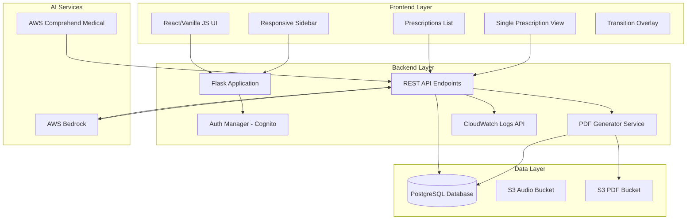
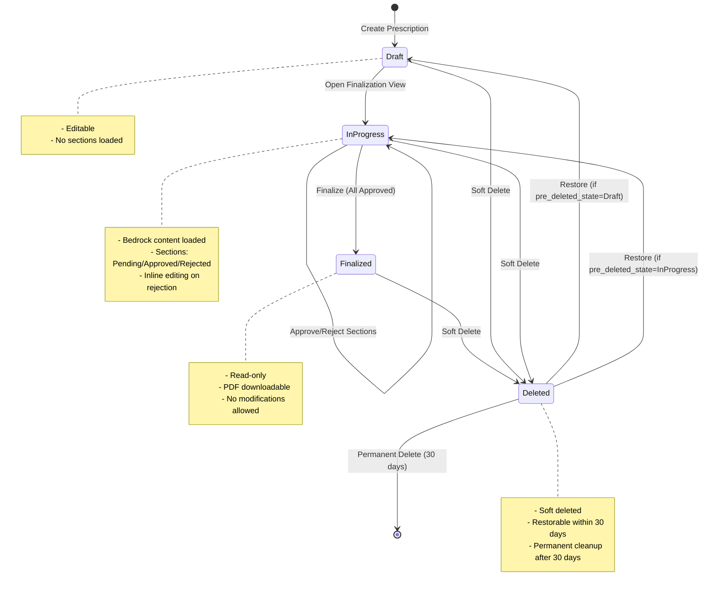
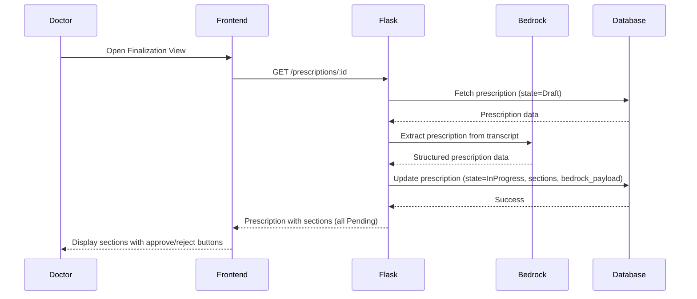
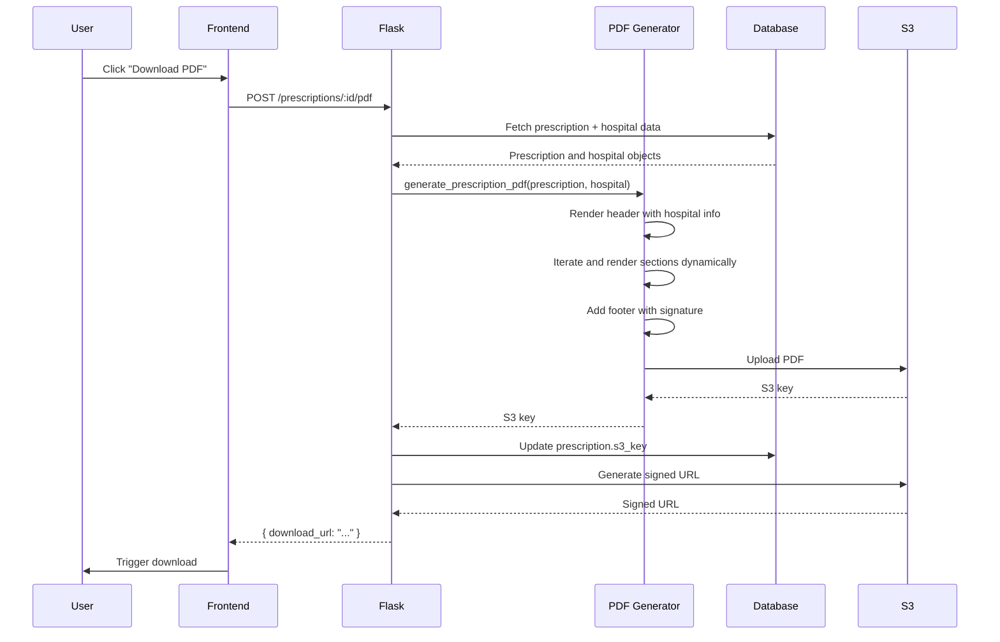
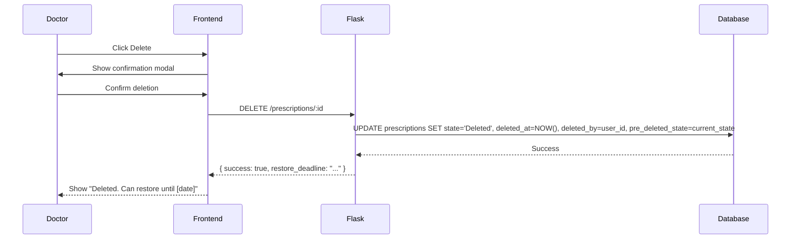
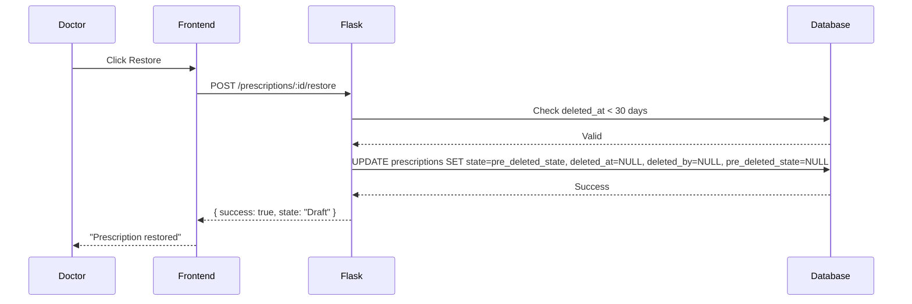

# Design Document: SEVA Arogya Prescription Enhancement

## Overview

This design extends the existing SEVA Arogya prescription management application with comprehensive workflow management, AI-powered content generation, section-by-section approval, role-based access control, audit logging, PDF generation, and soft delete capabilities. The enhancement follows a state machine approach for prescription lifecycle management while preserving existing application patterns and architecture.

### Design Principles

1. **Extend, Don't Rewrite**: Reuse existing patterns for authentication, database access, API endpoints, and UI components
2. **State-Driven Workflow**: Prescription lifecycle follows explicit state transitions (Draft → InProgress → Finalized → Deleted)
3. **Backend Security**: AWS credentials and CloudWatch API calls remain server-side only
4. **Dynamic Extensibility**: PDF generation and section rendering support future additions without code changes
5. **Mobile-First Responsive**: All UI components adapt seamlessly from mobile to desktop viewports

### Key Features

- Prescription state machine with four states (Draft, InProgress, Finalized, Deleted)
- Bedrock AI integration for automated prescription content population
- Section-by-section approval workflow with inline editing
- Role-based access control (Doctor, Hospital Admin, Developer Admin)
- On-demand PDF generation with dynamic section rendering
- Soft delete with 30-day restore window and automated cleanup
- CloudWatch logs viewer for Developer Admins
- Responsive sidebar navigation with mobile drawer
- Branded transition overlay for page navigation

## Architecture

### System Components




### Prescription State Machine




### Technology Stack

- **Backend**: Python 3.x, Flask, Flask-SocketIO
- **Database**: PostgreSQL with JSONB support
- **Authentication**: AWS Cognito
- **Storage**: AWS S3 (audio and PDF buckets)
- **AI Services**: AWS Bedrock (prescription generation), AWS Comprehend Medical (entity extraction)
- **Logging**: AWS CloudWatch
- **Frontend**: Vanilla JavaScript, Tailwind CSS
- **PDF Generation**: ReportLab or WeasyPrint (Python libraries)

## Components and Interfaces

### Backend Components

#### 1. Prescription Manager Service


**Location**: `services/prescription_service.py`

**Responsibilities**:
- Manage prescription state transitions
- Validate state change permissions
- Load Bedrock content into sections
- Handle section approval/rejection workflow
- Coordinate with PDF generator

**Key Methods**:
```python
class PrescriptionService:
    def create_prescription(user_id: str, consultation_id: str, hospital_id: str) -> str
    def transition_to_in_progress(prescription_id: str, bedrock_payload: dict) -> bool
    def approve_section(prescription_id: str, section_key: str, user_id: str) -> bool
    def reject_section(prescription_id: str, section_key: str, user_id: str) -> bool
    def update_section_content(prescription_id: str, section_key: str, content: str) -> bool
    def finalize_prescription(prescription_id: str, user_id: str) -> bool
    def soft_delete(prescription_id: str, user_id: str) -> bool
    def restore_prescription(prescription_id: str, user_id: str) -> bool
    def can_finalize(prescription_id: str) -> bool
    def get_prescription_with_permissions(prescription_id: str, user_id: str, user_role: str) -> dict
```

#### 2. PDF Generator Service

**Location**: `services/pdf_generator.py`

**Responsibilities**:
- Generate prescription PDFs on-demand
- Render sections dynamically based on prescription data
- Include hospital branding and information
- Upload generated PDFs to S3
- Return signed URLs for download

**Key Methods**:
```python
class PDFGenerator:
    def generate_prescription_pdf(prescription_id: str) -> str  # Returns S3 key
    def render_section(section: dict) -> bytes  # Renders individual section
    def add_hospital_header(pdf: object, hospital: dict) -> None
    def add_prescription_sections(pdf: object, sections: list) -> None
    def upload_to_s3(pdf_bytes: bytes, prescription_id: str) -> str
    def get_signed_url(s3_key: str, expiration: int = 3600) -> str
```

#### 3. Role-Based Access Control (RBAC) Service


**Location**: `services/rbac_service.py`

**Responsibilities**:
- Determine user roles from Cognito attributes
- Filter prescription lists based on role and hospital
- Validate permissions for prescription operations
- Provide role-specific menu items

**Key Methods**:
```python
class RBACService:
    def get_user_role(user_id: str) -> str  # Returns: Doctor, HospitalAdmin, DeveloperAdmin
    def get_user_hospital(user_id: str) -> str
    def can_view_prescription(user_id: str, prescription: dict) -> bool
    def can_edit_prescription(user_id: str, prescription: dict) -> bool
    def can_delete_prescription(user_id: str, prescription: dict) -> bool
    def can_restore_prescription(user_id: str, prescription: dict) -> bool
    def filter_prescriptions_by_role(prescriptions: list, user_id: str, role: str) -> list
    def get_sidebar_menu_items(role: str) -> list
```

#### 4. CloudWatch Logs Service

**Location**: `services/cloudwatch_service.py`

**Responsibilities**:
- Query CloudWatch logs with date range and filters
- Parse and format log entries for UI display
- Implement pagination for large log sets
- Ensure credentials never exposed to frontend

**Key Methods**:
```python
class CloudWatchService:
    def __init__(self, log_group_name: str, region: str)
    def query_logs(start_time: datetime, end_time: datetime, filter_pattern: str = None, limit: int = 100) -> list
    def get_log_events(next_token: str = None) -> dict  # Returns events and next_token
    def format_log_entry(log_event: dict) -> dict
```

#### 5. Cleanup Scheduler Service

**Location**: `services/cleanup_scheduler.py`

**Responsibilities**:
- Run daily cleanup of deleted prescriptions older than 30 days
- Permanently delete database records
- Remove associated S3 objects (audio, transcription, PDF)
- Log cleanup operations

**Key Methods**:
```python
class CleanupScheduler:
    def run_daily_cleanup() -> dict  # Returns cleanup stats
    def find_expired_prescriptions() -> list
    def permanently_delete_prescription(prescription_id: str) -> bool
    def delete_s3_objects(prescription: dict) -> bool
```

### Frontend Components

#### 1. Prescriptions List Component


**Location**: `templates/prescriptions_list.html`, `static/js/prescriptions_list.js`

**Features**:
- Debounced search box (300ms delay)
- Filter by doctor (dropdown populated based on role)
- Filter by date range (created_at)
- Table columns: Prescription ID, Patient, Doctor, Created Date/Time, State, Section Statuses
- Section statuses displayed as compact icons/pills
- Click row to navigate to single prescription view
- Responsive table with horizontal scroll on mobile

**State Management**:
```javascript
{
  prescriptions: [],
  searchQuery: '',
  selectedDoctor: null,
  dateRange: { start: null, end: null },
  loading: false,
  error: null
}
```

#### 2. Single Prescription View Component

**Location**: `templates/prescription_detail.html`, `static/js/prescription_detail.js`

**Features**:
- Audio playback controls for each audio file
- Transcription text display linked to audio
- Read-only prescription sections display
- Download PDF button (triggers on-demand generation)
- Delete button (with confirmation modal)
- Restore button (visible only if deleted and within 30 days)
- State-based UI rendering (Draft/InProgress/Finalized/Deleted)

**State Management**:
```javascript
{
  prescription: null,
  audioFiles: [],
  transcriptions: [],
  sections: [],
  loading: false,
  error: null,
  showDeleteModal: false,
  pdfGenerating: false
}
```

#### 3. Prescription Finalization Component

**Location**: `templates/prescription_finalize.html`, `static/js/prescription_finalize.js`

**Features**:
- Display all prescription sections with Bedrock-generated content
- Per-section approve/reject buttons
- Inline editing for rejected sections (reuses existing section edit UI)
- Finalize button (enabled only when all required sections approved)
- Section status indicators (Pending/Approved/Rejected)
- Auto-save edited content

**State Management**:
```javascript
{
  prescription: null,
  sections: [],
  editingSection: null,
  canFinalize: false,
  loading: false,
  error: null
}
```

#### 4. Responsive Sidebar Component


**Location**: `templates/components/sidebar.html`, `static/js/sidebar.js`

**Features**:
- Role-based menu items
- Mobile drawer (< 768px viewport)
- Fixed sidebar (≥ 768px viewport)
- Smooth open/close animations
- Active route highlighting
- User profile section at bottom

**Menu Structure by Role**:
```javascript
{
  Doctor: [
    { label: 'Home', icon: 'home', route: '/home' },
    { label: 'Create Prescription', icon: 'add_circle', route: '/transcription' },
    { label: 'Prescriptions', icon: 'description', route: '/prescriptions' },
    { label: 'Profile', icon: 'person', route: '/profile' },
    { label: 'Dashboard', icon: 'dashboard', route: '/dashboard' }
  ],
  HospitalAdmin: [
    // All Doctor items plus:
    { label: 'Hospital Settings', icon: 'settings', route: '/hospital-settings' }
  ],
  DeveloperAdmin: [
    { label: 'Prescriptions', icon: 'description', route: '/prescriptions' },
    { label: 'Hospitals CRUD', icon: 'business', route: '/hospitals' },
    { label: 'CloudWatch Logs', icon: 'bug_report', route: '/logs' }
  ]
}
```

#### 5. CloudWatch Logs Viewer Component

**Location**: `templates/logs_viewer.html`, `static/js/logs_viewer.js`

**Features**:
- Date range selector (default: last 24 hours)
- Text search filter
- Log entries table with timestamp and message
- Pagination or "Load More" button
- Auto-refresh toggle
- Export logs button

**State Management**:
```javascript
{
  logs: [],
  dateRange: { start: Date.now() - 86400000, end: Date.now() },
  searchFilter: '',
  nextToken: null,
  loading: false,
  autoRefresh: false,
  error: null
}
```

#### 6. Transition Overlay Component

**Location**: `templates/components/transition_overlay.html`, `static/js/transition_overlay.js`

**Features**:
- Displays "SEVA Arogya" text in login page font
- Animates login icon (fade/slide effect)
- Shows on route change
- Fades out within 500ms when new page ready
- Consistent with application theme

**Animation Sequence**:
1. Route change detected
2. Overlay fades in (100ms)
3. Icon animates (slide up + fade in)
4. Text fades in
5. New page loads
6. Overlay fades out (500ms)

## Data Models

### Extended Prescription Model


**Table**: `prescriptions`

**Schema Extensions**:
```sql
CREATE TABLE prescriptions (
    prescription_id SERIAL PRIMARY KEY,
    user_id VARCHAR(255) NOT NULL,
    consultation_id VARCHAR(64),
    hospital_id VARCHAR(64) NOT NULL,
    patient_name VARCHAR(255) NOT NULL,
    
    -- State management
    state VARCHAR(50) NOT NULL DEFAULT 'Draft',  -- Draft, InProgress, Finalized, Deleted
    created_by_doctor_id VARCHAR(255) NOT NULL,
    finalized_at TIMESTAMP,
    finalized_by VARCHAR(255),
    
    -- Soft delete
    deleted_at TIMESTAMP,
    deleted_by VARCHAR(255),
    pre_deleted_state VARCHAR(50),
    
    -- Content
    sections JSONB NOT NULL DEFAULT '[]',  -- Array of section objects
    bedrock_payload JSONB,  -- Raw Bedrock response for audit
    medications JSONB NOT NULL,  -- Legacy field, kept for compatibility
    
    -- Storage
    s3_key VARCHAR(512),  -- PDF S3 key (generated on-demand)
    
    -- Timestamps
    created_at TIMESTAMP DEFAULT CURRENT_TIMESTAMP,
    updated_at TIMESTAMP DEFAULT CURRENT_TIMESTAMP,
    
    CONSTRAINT valid_state CHECK (state IN ('Draft', 'InProgress', 'Finalized', 'Deleted'))
);

CREATE INDEX idx_prescriptions_user_id ON prescriptions(user_id);
CREATE INDEX idx_prescriptions_hospital_id ON prescriptions(hospital_id);
CREATE INDEX idx_prescriptions_state ON prescriptions(state);
CREATE INDEX idx_prescriptions_created_at ON prescriptions(created_at DESC);
CREATE INDEX idx_prescriptions_deleted_at ON prescriptions(deleted_at) WHERE deleted_at IS NOT NULL;
CREATE INDEX idx_prescriptions_consultation_id ON prescriptions(consultation_id);
```

**Section Object Structure**:
```json
{
  "key": "diagnosis",
  "title": "Diagnosis",
  "content": "Patient presents with acute bronchitis...",
  "status": "Approved",  // Pending, Approved, Rejected
  "order": 1
}
```

**Bedrock Payload Structure** (stored for audit):
```json
{
  "request_id": "uuid",
  "timestamp": "2024-01-15T10:30:00Z",
  "model": "anthropic.claude-v2",
  "sections": {
    "diagnosis": "...",
    "medications": [...],
    "instructions": "...",
    "follow_up": "..."
  }
}
```

### Hospital Model Extensions


**Table**: `hospitals`

**Schema**:
```sql
CREATE TABLE IF NOT EXISTS hospitals (
    hospital_id VARCHAR(64) PRIMARY KEY,
    name VARCHAR(255) NOT NULL,
    address TEXT,
    phone VARCHAR(50),
    email VARCHAR(255),
    registration_number VARCHAR(100),
    website VARCHAR(255),
    logo_url VARCHAR(512),
    created_at TIMESTAMP DEFAULT CURRENT_TIMESTAMP,
    updated_at TIMESTAMP DEFAULT CURRENT_TIMESTAMP
);
```

### Doctor Model Extensions

**Table**: `doctors`

**Schema**:
```sql
CREATE TABLE IF NOT EXISTS doctors (
    doctor_id VARCHAR(255) PRIMARY KEY,  -- Cognito user_id
    hospital_id VARCHAR(64) NOT NULL,
    name VARCHAR(255) NOT NULL,
    specialty VARCHAR(255),
    signature_url VARCHAR(512),
    availability TEXT,
    created_at TIMESTAMP DEFAULT CURRENT_TIMESTAMP,
    updated_at TIMESTAMP DEFAULT CURRENT_TIMESTAMP,
    FOREIGN KEY (hospital_id) REFERENCES hospitals(hospital_id)
);

CREATE INDEX idx_doctors_hospital_id ON doctors(hospital_id);
```

### User Roles Model

**Table**: `user_roles`

**Schema**:
```sql
CREATE TABLE IF NOT EXISTS user_roles (
    user_id VARCHAR(255) PRIMARY KEY,  -- Cognito user_id
    role VARCHAR(50) NOT NULL,  -- Doctor, HospitalAdmin, DeveloperAdmin
    hospital_id VARCHAR(64),  -- NULL for DeveloperAdmin
    created_at TIMESTAMP DEFAULT CURRENT_TIMESTAMP,
    updated_at TIMESTAMP DEFAULT CURRENT_TIMESTAMP,
    CONSTRAINT valid_role CHECK (role IN ('Doctor', 'HospitalAdmin', 'DeveloperAdmin'))
);

CREATE INDEX idx_user_roles_hospital_id ON user_roles(hospital_id);
CREATE INDEX idx_user_roles_role ON user_roles(role);
```

### Audio and Transcription Models (Existing)

These models remain unchanged but are referenced by prescriptions:

**Table**: `transcriptions`
- Links to `consultation_id`
- Contains `audio_s3_key`, `transcript_text`, `medical_entities`

**Table**: `consultations`
- Contains `consultation_id`, `merged_transcript_text`, `status`

## API Endpoints

### Prescription Management Endpoints


#### GET /api/v1/prescriptions

**Description**: List prescriptions with filtering and pagination

**Authentication**: Required (login_required decorator)

**Query Parameters**:
- `search` (string, optional): Search query for patient name or prescription ID
- `doctor_id` (string, optional): Filter by doctor (scoped by role)
- `start_date` (ISO 8601, optional): Filter by created_at >= start_date
- `end_date` (ISO 8601, optional): Filter by created_at <= end_date
- `state` (string, optional): Filter by state (Draft, InProgress, Finalized, Deleted)
- `limit` (int, optional, default=50, max=100): Number of results
- `offset` (int, optional, default=0): Pagination offset

**Response**:
```json
{
  "success": true,
  "prescriptions": [
    {
      "prescription_id": "123",
      "patient_name": "John Doe",
      "doctor_name": "Dr. Smith",
      "doctor_id": "user123",
      "state": "Finalized",
      "created_at": "2024-01-15T10:30:00Z",
      "section_statuses": {
        "diagnosis": "Approved",
        "medications": "Approved",
        "instructions": "Approved"
      }
    }
  ],
  "total": 150,
  "limit": 50,
  "offset": 0
}
```

**Authorization Logic**:
- Doctor: Only own prescriptions
- HospitalAdmin: All prescriptions in their hospital
- DeveloperAdmin: All prescriptions across all hospitals

#### GET /api/v1/prescriptions/:id

**Description**: Get single prescription with full details

**Authentication**: Required

**Response**:
```json
{
  "success": true,
  "prescription": {
    "prescription_id": "123",
    "patient_name": "John Doe",
    "state": "Finalized",
    "created_by_doctor_id": "user123",
    "doctor_name": "Dr. Smith",
    "hospital_id": "hosp1",
    "hospital_name": "City Hospital",
    "sections": [
      {
        "key": "diagnosis",
        "title": "Diagnosis",
        "content": "...",
        "status": "Approved",
        "order": 1
      }
    ],
    "audio_files": [
      {
        "audio_s3_key": "...",
        "transcription_text": "..."
      }
    ],
    "created_at": "2024-01-15T10:30:00Z",
    "finalized_at": "2024-01-15T11:00:00Z",
    "finalized_by": "user123",
    "permissions": {
      "can_edit": false,
      "can_delete": true,
      "can_restore": false,
      "can_download_pdf": true
    }
  }
}
```

#### POST /api/v1/prescriptions

**Description**: Create new prescription in Draft state

**Authentication**: Required

**Request Body**:
```json
{
  "consultation_id": "uuid",
  "patient_name": "John Doe",
  "hospital_id": "hosp1"
}
```

**Response**:
```json
{
  "success": true,
  "prescription_id": "123",
  "state": "Draft"
}
```

#### POST /api/v1/prescriptions/:id/transition-to-in-progress

**Description**: Transition prescription from Draft to InProgress and load Bedrock content

**Authentication**: Required

**Request Body**:
```json
{
  "bedrock_payload": {
    "sections": {
      "diagnosis": "...",
      "medications": [...],
      "instructions": "..."
    }
  }
}
```

**Response**:
```json
{
  "success": true,
  "state": "InProgress",
  "sections": [...]
}
```

#### POST /api/v1/prescriptions/:id/sections/:section_key/approve

**Description**: Approve a prescription section

**Authentication**: Required

**Response**:
```json
{
  "success": true,
  "section_key": "diagnosis",
  "status": "Approved",
  "can_finalize": false
}
```

#### POST /api/v1/prescriptions/:id/sections/:section_key/reject

**Description**: Reject a prescription section (enables editing)

**Authentication**: Required

**Response**:
```json
{
  "success": true,
  "section_key": "diagnosis",
  "status": "Rejected"
}
```

#### PUT /api/v1/prescriptions/:id/sections/:section_key

**Description**: Update section content (after rejection)

**Authentication**: Required

**Request Body**:
```json
{
  "content": "Updated diagnosis text..."
}
```

**Response**:
```json
{
  "success": true,
  "section_key": "diagnosis",
  "status": "Pending"
}
```

#### POST /api/v1/prescriptions/:id/finalize

**Description**: Finalize prescription (all sections must be approved)

**Authentication**: Required

**Validation**:
- All required sections must have status "Approved"
- User must be the creator doctor
- State must be "InProgress"

**Response**:
```json
{
  "success": true,
  "state": "Finalized",
  "finalized_at": "2024-01-15T11:00:00Z",
  "redirect_url": "/thank-you"
}
```

#### POST /api/v1/prescriptions/:id/pdf

**Description**: Generate PDF on-demand and return signed URL

**Authentication**: Required

**Response**:
```json
{
  "success": true,
  "download_url": "https://s3.amazonaws.com/...",
  "expires_in": 3600
}
```

**Process**:
1. Fetch prescription and hospital data from database
2. Generate PDF with dynamic section rendering
3. Upload to S3 PDF bucket
4. Update prescription.s3_key
5. Return signed URL

#### DELETE /api/v1/prescriptions/:id

**Description**: Soft delete prescription

**Authentication**: Required

**Authorization**: Creator doctor or DeveloperAdmin

**Response**:
```json
{
  "success": true,
  "state": "Deleted",
  "deleted_at": "2024-01-15T12:00:00Z",
  "restore_deadline": "2024-02-14T12:00:00Z"
}
```

#### POST /api/v1/prescriptions/:id/restore

**Description**: Restore soft-deleted prescription

**Authentication**: Required

**Authorization**: Creator doctor or DeveloperAdmin

**Validation**:
- State must be "Deleted"
- deleted_at must be within 30 days

**Response**:
```json
{
  "success": true,
  "state": "Draft",  // or "InProgress" based on pre_deleted_state
  "restored_at": "2024-01-16T10:00:00Z"
}
```

### Hospital Management Endpoints


#### GET /api/v1/hospitals

**Description**: List all hospitals (DeveloperAdmin only)

**Authentication**: Required

**Authorization**: DeveloperAdmin role

**Response**:
```json
{
  "success": true,
  "hospitals": [
    {
      "hospital_id": "hosp1",
      "name": "City Hospital",
      "address": "123 Main St",
      "phone": "+1234567890",
      "email": "info@cityhospital.com",
      "registration_number": "REG123",
      "website": "https://cityhospital.com",
      "logo_url": "https://s3.../logo.png"
    }
  ]
}
```

#### GET /api/v1/hospitals/:id

**Description**: Get hospital details

**Authentication**: Required

**Authorization**: HospitalAdmin (own hospital) or DeveloperAdmin

**Response**: Single hospital object

#### PUT /api/v1/hospitals/:id

**Description**: Update hospital information

**Authentication**: Required

**Authorization**: HospitalAdmin (own hospital) or DeveloperAdmin

**Request Body**:
```json
{
  "name": "City Hospital",
  "address": "123 Main St",
  "phone": "+1234567890",
  "email": "info@cityhospital.com",
  "registration_number": "REG123",
  "website": "https://cityhospital.com",
  "logo_url": "https://s3.../logo.png"
}
```

#### GET /api/v1/hospitals/:id/doctors

**Description**: List doctors in a hospital

**Authentication**: Required

**Authorization**: HospitalAdmin (own hospital) or DeveloperAdmin

**Response**:
```json
{
  "success": true,
  "doctors": [
    {
      "doctor_id": "user123",
      "name": "Dr. Smith",
      "specialty": "Cardiology",
      "signature_url": "https://s3.../signature.png",
      "availability": "Mon-Fri 9AM-5PM"
    }
  ]
}
```

#### POST /api/v1/hospitals/:id/doctors

**Description**: Add doctor to hospital

**Authentication**: Required

**Authorization**: HospitalAdmin (own hospital) or DeveloperAdmin

**Request Body**:
```json
{
  "doctor_id": "user123",
  "name": "Dr. Smith",
  "specialty": "Cardiology"
}
```

#### DELETE /api/v1/hospitals/:id/doctors/:doctor_id

**Description**: Remove doctor from hospital

**Authentication**: Required

**Authorization**: HospitalAdmin (own hospital) or DeveloperAdmin

### CloudWatch Logs Endpoints

#### GET /api/v1/logs

**Description**: Query CloudWatch logs

**Authentication**: Required

**Authorization**: DeveloperAdmin only

**Query Parameters**:
- `start_time` (ISO 8601, required): Start of time range
- `end_time` (ISO 8601, required): End of time range
- `filter_pattern` (string, optional): CloudWatch filter pattern
- `search` (string, optional): Text search within messages
- `limit` (int, optional, default=100, max=1000): Number of log entries
- `next_token` (string, optional): Pagination token

**Response**:
```json
{
  "success": true,
  "logs": [
    {
      "timestamp": "2024-01-15T10:30:00Z",
      "message": "User logged in successfully: user@example.com",
      "level": "INFO"
    }
  ],
  "next_token": "token123",
  "has_more": true
}
```

**Security**: AWS credentials stored in environment variables, never exposed to frontend

### User Profile Endpoints

#### GET /api/v1/profile

**Description**: Get current user profile

**Authentication**: Required

**Response**:
```json
{
  "success": true,
  "profile": {
    "user_id": "user123",
    "name": "Dr. Smith",
    "email": "smith@hospital.com",
    "role": "Doctor",
    "hospital_id": "hosp1",
    "hospital_name": "City Hospital",
    "specialty": "Cardiology",
    "signature_url": "https://s3.../signature.png",
    "availability": "Mon-Fri 9AM-5PM"
  }
}
```

### Thank You Page Endpoint

#### GET /thank-you

**Description**: Display post-finalization confirmation page

**Authentication**: Required

**Response**: Renders `thank_you.html` template with random message

**Messages** (randomly selected):
```python
THANK_YOU_MESSAGES = [
    "Prescription finalized successfully!",
    "Great work! Your prescription is ready.",
    "All set! Prescription has been finalized.",
    "Success! Your prescription is complete.",
    "Excellent! Prescription finalized and ready for download."
]
```

## Bedrock AI Integration

### Content Population Flow




### Bedrock Prompt Structure

The existing Bedrock integration (`aws_services/bedrock_client.py`) will be extended to support prescription section extraction:

**Prompt Template**:
```
You are a medical AI assistant. Extract structured prescription information from the following consultation transcript.

Transcript:
{transcript_text}

Extract the following sections:
1. Diagnosis: Primary and secondary diagnoses
2. Medications: List of medications with dosage, frequency, and duration
3. Instructions: Patient care instructions and precautions
4. Follow-up: Follow-up appointment recommendations
5. Lab Tests: Recommended laboratory tests (if any)
6. Referrals: Specialist referrals (if any)

Return the data in JSON format with keys matching the section names.
```

**Expected Bedrock Response**:
```json
{
  "diagnosis": "Acute bronchitis with mild fever",
  "medications": [
    {
      "name": "Amoxicillin",
      "dosage": "500mg",
      "frequency": "Three times daily",
      "duration": "7 days"
    }
  ],
  "instructions": "Rest, drink plenty of fluids, avoid cold exposure",
  "follow_up": "Return in 7 days if symptoms persist",
  "lab_tests": "Complete blood count if fever persists",
  "referrals": null
}
```

### Section Mapping

The Bedrock response is mapped to prescription sections:

```python
SECTION_DEFINITIONS = [
    {"key": "diagnosis", "title": "Diagnosis", "required": True, "order": 1},
    {"key": "medications", "title": "Medications", "required": True, "order": 2},
    {"key": "instructions", "title": "Patient Instructions", "required": True, "order": 3},
    {"key": "follow_up", "title": "Follow-up", "required": False, "order": 4},
    {"key": "lab_tests", "title": "Laboratory Tests", "required": False, "order": 5},
    {"key": "referrals", "title": "Referrals", "required": False, "order": 6}
]

def map_bedrock_to_sections(bedrock_response: dict) -> list:
    sections = []
    for section_def in SECTION_DEFINITIONS:
        key = section_def["key"]
        content = bedrock_response.get(key, "")
        
        # Convert list to formatted string for medications
        if key == "medications" and isinstance(content, list):
            content = format_medications(content)
        
        sections.append({
            "key": key,
            "title": section_def["title"],
            "content": content,
            "status": "Pending",
            "order": section_def["order"],
            "required": section_def["required"]
        })
    
    return sections
```

## PDF Generation Service

### Architecture




### PDF Layout Structure

**Page Structure**:
1. Header (hospital branding)
2. Patient and prescription metadata
3. Dynamic sections (iterated from prescription.sections)
4. Footer (doctor signature, date)

**Implementation** (using ReportLab):

```python
from reportlab.lib.pagesizes import A4
from reportlab.lib.styles import getSampleStyleSheet, ParagraphStyle
from reportlab.lib.units import inch
from reportlab.platypus import SimpleDocTemplate, Paragraph, Spacer, Image, Table
from reportlab.lib import colors

class PrescriptionPDFGenerator:
    def __init__(self):
        self.styles = getSampleStyleSheet()
        self.page_width, self.page_height = A4
        
    def generate_pdf(self, prescription: dict, hospital: dict) -> bytes:
        buffer = BytesIO()
        doc = SimpleDocTemplate(buffer, pagesize=A4)
        story = []
        
        # Header
        story.extend(self._render_header(hospital))
        story.append(Spacer(1, 0.3*inch))
        
        # Prescription metadata
        story.extend(self._render_metadata(prescription))
        story.append(Spacer(1, 0.3*inch))
        
        # Dynamic sections
        for section in sorted(prescription['sections'], key=lambda s: s['order']):
            story.extend(self._render_section(section))
            story.append(Spacer(1, 0.2*inch))
        
        # Footer
        story.extend(self._render_footer(prescription))
        
        doc.build(story)
        return buffer.getvalue()
    
    def _render_header(self, hospital: dict) -> list:
        elements = []
        
        # Hospital logo
        if hospital.get('logo_url'):
            logo = Image(hospital['logo_url'], width=1*inch, height=1*inch)
            elements.append(logo)
        
        # Hospital info
        hospital_info = f"""
        <b>{hospital['name']}</b><br/>
        {hospital.get('address', '')}<br/>
        Phone: {hospital.get('phone', 'N/A')} | Email: {hospital.get('email', 'N/A')}<br/>
        Reg. No: {hospital.get('registration_number', 'N/A')}
        """
        elements.append(Paragraph(hospital_info, self.styles['Normal']))
        
        return elements
    
    def _render_metadata(self, prescription: dict) -> list:
        elements = []
        
        metadata = f"""
        <b>Prescription ID:</b> {prescription['prescription_id']}<br/>
        <b>Patient:</b> {prescription['patient_name']}<br/>
        <b>Doctor:</b> {prescription['doctor_name']}<br/>
        <b>Date:</b> {prescription['finalized_at']}<br/>
        """
        elements.append(Paragraph(metadata, self.styles['Normal']))
        
        return elements
    
    def _render_section(self, section: dict) -> list:
        elements = []
        
        # Section title
        title_style = ParagraphStyle(
            'SectionTitle',
            parent=self.styles['Heading2'],
            textColor=colors.HexColor('#127ae2')
        )
        elements.append(Paragraph(section['title'], title_style))
        elements.append(Spacer(1, 0.1*inch))
        
        # Section content
        content = section['content']
        if isinstance(content, list):
            # Render as table (e.g., medications)
            content = self._format_list_as_table(content)
            elements.append(content)
        else:
            # Render as paragraph
            elements.append(Paragraph(content, self.styles['Normal']))
        
        return elements
    
    def _render_footer(self, prescription: dict) -> list:
        elements = []
        
        # Doctor signature
        if prescription.get('doctor_signature_url'):
            signature = Image(prescription['doctor_signature_url'], width=2*inch, height=0.5*inch)
            elements.append(signature)
        
        footer_text = f"""
        <b>Dr. {prescription['doctor_name']}</b><br/>
        {prescription.get('doctor_specialty', '')}<br/>
        Date: {prescription['finalized_at']}
        """
        elements.append(Paragraph(footer_text, self.styles['Normal']))
        
        return elements
```

### Dynamic Section Support

The PDF generator iterates through `prescription.sections` array and renders each section based on its structure. This allows adding new sections without modifying the PDF generation code:

**Adding a New Section**:
1. Update Bedrock prompt to extract new section
2. Add section definition to `SECTION_DEFINITIONS`
3. PDF generator automatically renders it

**Example**: Adding "Allergies" section:
```python
# In section definitions
{"key": "allergies", "title": "Known Allergies", "required": False, "order": 7}

# Bedrock will extract it
# PDF generator will render it automatically
```

## Role-Based Access Control

### Role Hierarchy


```
DeveloperAdmin (highest privileges)
    ├── Full cross-hospital access
    ├── View all prescriptions
    ├── Restore any deleted prescription
    ├── Manage hospitals CRUD
    └── Access CloudWatch logs

HospitalAdmin
    ├── All Doctor privileges
    ├── View all prescriptions in own hospital
    ├── Manage hospital settings
    └── Manage doctors in own hospital

Doctor (base role)
    ├── Create prescriptions
    ├── View own prescriptions
    ├── Edit own prescriptions (if not Finalized)
    ├── Finalize own prescriptions
    ├── Delete own prescriptions
    └── Restore own deleted prescriptions (within 30 days)
```

### Permission Matrix

| Operation | Doctor | HospitalAdmin | DeveloperAdmin |
|-----------|--------|---------------|----------------|
| Create prescription | Own only | Own only | No |
| View prescription | Own only | Hospital-wide | All |
| Edit prescription (Draft/InProgress) | Own only | Own only | No |
| Finalize prescription | Own only | Own only | No |
| Delete prescription | Own only | Own only | No |
| Restore prescription | Own only (30d) | Own only (30d) | All (30d) |
| Download PDF | Own only | Hospital-wide | All |
| View CloudWatch logs | No | No | Yes |
| Manage hospitals | No | Own only | All |
| Manage doctors | No | Own hospital | All |

### Implementation

**Decorator for Role-Based Authorization**:

```python
from functools import wraps
from flask import session, jsonify

def require_role(*allowed_roles):
    def decorator(f):
        @wraps(f)
        def decorated_function(*args, **kwargs):
            user_id = session.get('user_id')
            if not user_id:
                return jsonify({'success': False, 'message': 'Unauthorized'}), 401
            
            user_role = RBACService.get_user_role(user_id)
            if user_role not in allowed_roles:
                return jsonify({'success': False, 'message': 'Forbidden'}), 403
            
            return f(*args, **kwargs)
        return decorated_function
    return decorator

# Usage
@app.route('/api/v1/logs', methods=['GET'])
@login_required
@require_role('DeveloperAdmin')
def api_get_logs():
    # Only DeveloperAdmin can access
    pass
```

**Prescription Filtering by Role**:

```python
def filter_prescriptions_by_role(user_id: str, role: str, hospital_id: str = None) -> str:
    """Returns SQL WHERE clause based on role"""
    
    if role == 'DeveloperAdmin':
        return "1=1"  # No filtering
    
    elif role == 'HospitalAdmin':
        return f"hospital_id = '{hospital_id}'"
    
    elif role == 'Doctor':
        return f"created_by_doctor_id = '{user_id}'"
    
    else:
        return "1=0"  # No access
```

### Cognito Integration

User roles are stored in Cognito custom attributes and synchronized to the `user_roles` table:

**Cognito Custom Attributes**:
- `custom:role` (Doctor, HospitalAdmin, DeveloperAdmin)
- `custom:hospital_id` (hospital identifier)

**Synchronization on Login**:
```python
def sync_user_role_from_cognito(user_id: str, cognito_attributes: dict):
    role = cognito_attributes.get('custom:role', 'Doctor')
    hospital_id = cognito_attributes.get('custom:hospital_id')
    
    # Upsert to user_roles table
    query = """
    INSERT INTO user_roles (user_id, role, hospital_id)
    VALUES (%s, %s, %s)
    ON CONFLICT (user_id) DO UPDATE
    SET role = EXCLUDED.role, hospital_id = EXCLUDED.hospital_id, updated_at = CURRENT_TIMESTAMP
    """
    database_manager.execute_with_retry(query, (user_id, role, hospital_id))
```

## Soft Delete and Cleanup

### Soft Delete Flow




### Restore Flow



### Automated Cleanup Scheduler

**Implementation** (using APScheduler or cron):

```python
from apscheduler.schedulers.background import BackgroundScheduler
from datetime import datetime, timedelta

class CleanupScheduler:
    def __init__(self, database_manager, storage_manager):
        self.db = database_manager
        self.storage = storage_manager
        self.scheduler = BackgroundScheduler()
        
    def start(self):
        # Run daily at 2 AM
        self.scheduler.add_job(
            self.run_cleanup,
            'cron',
            hour=2,
            minute=0
        )
        self.scheduler.start()
    
    def run_cleanup(self):
        logger = logging.getLogger(__name__)
        logger.info("Starting daily prescription cleanup")
        
        # Find prescriptions deleted more than 30 days ago
        cutoff_date = datetime.now() - timedelta(days=30)
        query = """
        SELECT prescription_id, s3_key, consultation_id
        FROM prescriptions
        WHERE state = 'Deleted' AND deleted_at < %s
        """
        
        expired_prescriptions = self.db.execute_with_retry(query, (cutoff_date,))
        
        for prescription_id, s3_key, consultation_id in expired_prescriptions:
            try:
                # Delete S3 objects
                if s3_key:
                    self.storage.delete_pdf(s3_key)
                
                # Delete associated audio files
                audio_query = """
                SELECT audio_s3_key FROM transcriptions
                WHERE consultation_id = %s
                """
                audio_files = self.db.execute_with_retry(audio_query, (consultation_id,))
                for (audio_s3_key,) in audio_files:
                    if audio_s3_key:
                        self.storage.delete_audio(audio_s3_key)
                
                # Permanently delete database record
                delete_query = "DELETE FROM prescriptions WHERE prescription_id = %s"
                self.db.execute_with_retry(delete_query, (prescription_id,))
                
                logger.info(f"Permanently deleted prescription {prescription_id}")
                
            except Exception as e:
                logger.error(f"Failed to cleanup prescription {prescription_id}: {str(e)}")
        
        logger.info(f"Cleanup completed. Deleted {len(expired_prescriptions)} prescriptions")

# Initialize in app.py
cleanup_scheduler = CleanupScheduler(database_manager, storage_manager)
cleanup_scheduler.start()
```

## Frontend Implementation

### Responsive Sidebar

**Mobile Drawer** (< 768px):
```html
<!-- Hamburger menu button -->
<button id="menu-toggle" class="fixed top-4 left-4 z-50 md:hidden">
    <span class="material-symbols-outlined">menu</span>
</button>

<!-- Drawer overlay -->
<div id="sidebar-overlay" class="fixed inset-0 bg-black/50 z-40 hidden md:hidden"></div>

<!-- Drawer -->
<aside id="sidebar" class="fixed top-0 left-0 h-full w-64 bg-white dark:bg-slate-900 transform -translate-x-full transition-transform duration-300 z-50 md:translate-x-0 md:static">
    <!-- Sidebar content -->
</aside>
```

**Desktop Fixed Sidebar** (≥ 768px):
```css
@media (min-width: 768px) {
    #sidebar {
        position: static;
        transform: translateX(0);
    }
    
    #menu-toggle, #sidebar-overlay {
        display: none;
    }
}
```

### Transition Overlay

**HTML**:
```html
<div id="transition-overlay" class="fixed inset-0 bg-white dark:bg-slate-900 z-[9999] flex items-center justify-center opacity-0 pointer-events-none transition-opacity duration-300">
    <div class="text-center">
        <div class="size-20 bg-primary rounded-2xl flex items-center justify-center mb-6 shadow-lg shadow-primary/20 animate-slide-up">
            <span class="material-symbols-outlined text-white text-[48px]">medical_services</span>
        </div>
        <h1 class="text-2xl font-bold text-slate-900 dark:text-white animate-fade-in">SEVA Arogya</h1>
    </div>
</div>
```

**JavaScript**:
```javascript
class TransitionOverlay {
    constructor() {
        this.overlay = document.getElementById('transition-overlay');
        this.setupRouteInterception();
    }
    
    show() {
        this.overlay.classList.remove('pointer-events-none', 'opacity-0');
        this.overlay.classList.add('opacity-100');
    }
    
    hide() {
        setTimeout(() => {
            this.overlay.classList.remove('opacity-100');
            this.overlay.classList.add('opacity-0', 'pointer-events-none');
        }, 500);
    }
    
    setupRouteInterception() {
        // Intercept all navigation
        document.addEventListener('click', (e) => {
            const link = e.target.closest('a');
            if (link && link.href && !link.target) {
                e.preventDefault();
                this.show();
                setTimeout(() => {
                    window.location.href = link.href;
                }, 300);
            }
        });
    }
}

// Initialize
const transitionOverlay = new TransitionOverlay();
```

### Debounced Search

**Implementation**:
```javascript
class DebouncedSearch {
    constructor(inputElement, callback, delay = 300) {
        this.input = inputElement;
        this.callback = callback;
        this.delay = delay;
        this.timeoutId = null;
        
        this.input.addEventListener('input', (e) => {
            clearTimeout(this.timeoutId);
            this.timeoutId = setTimeout(() => {
                this.callback(e.target.value);
            }, this.delay);
        });
    }
}

// Usage
const searchInput = document.getElementById('search-input');
const search = new DebouncedSearch(searchInput, (query) => {
    fetchPrescriptions({ search: query });
}, 300);
```

Now I need to complete the design document with the Correctness Properties section. First, let me use the prework tool to analyze the acceptance criteria:


## Correctness Properties

A property is a characteristic or behavior that should hold true across all valid executions of a system—essentially, a formal statement about what the system should do. Properties serve as the bridge between human-readable specifications and machine-verifiable correctness guarantees.

### Property 1: Prescription State Validity

For any prescription in the system, the state field must be one of the four valid values: Draft, InProgress, Finalized, or Deleted.

**Validates: Requirements 1.1, 21.1**

### Property 2: Initial State is Draft

For any newly created prescription, the initial state must be Draft.

**Validates: Requirements 1.2**

### Property 3: Draft to InProgress Transition

For any prescription in Draft state, when the transition-to-in-progress operation is invoked, the resulting state must be InProgress.

**Validates: Requirements 1.3**

### Property 4: Finalization Requires All Approvals

For any prescription, the can_finalize flag is true if and only if all required sections have status Approved.

**Validates: Requirements 1.4, 3.6**

### Property 5: Finalization Sets Metadata

For any prescription that undergoes finalization, the state must transition to Finalized, and the finalized_at timestamp and finalized_by user identifier must be set.

**Validates: Requirements 1.5, 21.3**

### Property 6: Finalized Prescriptions are Immutable

For any prescription in Finalized state, all modification operations (section edits, approvals, rejections) must be rejected.

**Validates: Requirements 1.6, 4.3, 20.1**

### Property 7: Soft Delete Preserves Metadata

For any prescription that is soft deleted, the state must transition to Deleted, and deleted_at, deleted_by, and pre_deleted_state fields must be set correctly.

**Validates: Requirements 1.7, 10.2, 21.4**

### Property 8: Bedrock Content Mapping

For any Bedrock response payload, when mapped to prescription sections, each key in the Bedrock response must correspond to a section with the same key.

**Validates: Requirements 2.1, 2.3**

### Property 9: Bedrock Payload Preservation

For any prescription that loads Bedrock content, the original Bedrock payload must be stored in the bedrock_payload field for audit purposes.

**Validates: Requirements 2.2, 21.7**

### Property 10: Initial Section Status

For any prescription that loads Bedrock content, all sections must initially have status Pending.

**Validates: Requirements 2.4**

### Property 11: Section Status Validity

For any section in a prescription, the status field must be one of: Pending, Approved, or Rejected.

**Validates: Requirements 3.1, 21.6**

### Property 12: Section Approval Transition

For any section with status Pending or Rejected, when the approve operation is invoked, the resulting status must be Approved.

**Validates: Requirements 3.2**

### Property 13: Section Rejection Transition

For any section with status Pending or Approved, when the reject operation is invoked, the resulting status must be Rejected.

**Validates: Requirements 3.3**

### Property 14: Section Edit Resets Status

For any section with status Rejected, when the content is edited and saved, the resulting status must be Pending.

**Validates: Requirements 3.4**

### Property 15: Finalization Blocked by Pending Sections

For any prescription where at least one required section has status Pending or Rejected, the can_finalize flag must be false.

**Validates: Requirements 3.7**

### Property 16: Soft Delete Retains Record

For any prescription that is soft deleted, the database record must still exist (not permanently deleted).

**Validates: Requirements 10.3**

### Property 17: Restore Button Visibility for Creator

For any prescription in Deleted state where deleted_at is within 30 days, the creator doctor must have permission to see the restore button.

**Validates: Requirements 10.4**

### Property 18: Restore Button Visibility for Developer Admin

For any prescription in Deleted state where deleted_at is within 30 days, a Developer_Admin user must have permission to see the restore button.

**Validates: Requirements 10.5**

### Property 19: Restore Clears Deletion Metadata

For any prescription that is restored, the state must return to pre_deleted_state, and deleted_at, deleted_by, and pre_deleted_state fields must be cleared (set to NULL).

**Validates: Requirements 10.6**

### Property 20: Cleanup Identifies Expired Prescriptions

For any prescription with state Deleted and deleted_at older than 30 days, the cleanup process must identify it for permanent deletion.

**Validates: Requirements 10.8**

### Property 21: Permanent Deletion Removes Record

For any prescription identified by the cleanup process, the database record must be permanently deleted (no longer exists in the database).

**Validates: Requirements 10.9**

### Property 22: Cascading S3 Deletion

For any prescription that is permanently deleted, all associated S3 objects (audio files, transcription files, PDF files) must also be deleted from S3 storage.

**Validates: Requirements 10.10**

### Property 23: PDF Generation Produces Valid PDF

For any prescription with state Finalized, when PDF generation is invoked, a valid PDF file must be produced and uploaded to S3.

**Validates: Requirements 11.3, 11.4**

### Property 24: PDF Generation Returns Signed URL

For any successfully generated PDF, a signed URL with appropriate expiration must be returned to the client.

**Validates: Requirements 11.5**

### Property 25: PDF Sections Rendered in Order

For any prescription PDF, sections must appear in the order specified by their order field.

**Validates: Requirements 12.1**

### Property 26: PDF Renders Only Existing Sections

For any prescription PDF, only sections that exist in the prescription data (non-null, non-empty content) must be rendered.

**Validates: Requirements 12.2**

### Property 27: PDF Section Completeness

For any section rendered in a prescription PDF, both the section title and content block must be present.

**Validates: Requirements 12.3**

### Property 28: PDF Dynamic Section Support

For any prescription with a new section type (not previously defined), the PDF generator must render it without requiring code modifications.

**Validates: Requirements 12.4**

### Property 29: PDF Layout Adapts to Section Count

For any prescription with a variable number of sections, the PDF layout must adapt correctly without breaking or overlapping content.

**Validates: Requirements 12.5**

### Property 30: PDF Hospital Logo Inclusion

For any hospital with a logo_url, the generated prescription PDF must include the logo in the header.

**Validates: Requirements 13.1**

### Property 31: PDF Hospital Name Inclusion

For any hospital, the generated prescription PDF must include the hospital name in the header.

**Validates: Requirements 13.2**

### Property 32: PDF Hospital Address Inclusion

For any hospital, the generated prescription PDF must include the hospital address in the header.

**Validates: Requirements 13.3**

### Property 33: PDF Conditional Hospital Fields

For any hospital with optional fields (phone, email, registration_number, website), if the field is present, it must be included in the PDF header.

**Validates: Requirements 13.4, 13.5, 13.6, 13.7**

### Property 34: Search Filter Matches Query

For any search query on the prescriptions list, all returned prescriptions must match the query (patient name or prescription ID contains the search text).

**Validates: Requirements 6.5**

### Property 35: Doctor Filter Scopes Results

For any doctor filter selection, all returned prescriptions must have been created by the selected doctor.

**Validates: Requirements 6.6**

### Property 36: Date Range Filter Scopes Results

For any date range filter, all returned prescriptions must have created_at timestamps within the specified range (inclusive).

**Validates: Requirements 6.7**

### Property 37: Doctor Role Sees Own Prescriptions Only

For any user with Doctor role, the prescriptions list must contain only prescriptions where created_by_doctor_id matches the user's ID.

**Validates: Requirements 8.1, 20.6**

### Property 38: Hospital Admin Sees Hospital Prescriptions

For any user with HospitalAdmin role, the prescriptions list must contain only prescriptions where hospital_id matches the admin's hospital.

**Validates: Requirements 8.2, 20.6**

### Property 39: Developer Admin Sees All Prescriptions

For any user with DeveloperAdmin role, the prescriptions list must contain all prescriptions without filtering.

**Validates: Requirements 8.3, 20.7**

### Property 40: Restore Button Permissions

For any prescription, the restore button visibility must be true if and only if: (state is Deleted) AND (deleted_at is within 30 days) AND (user is creator OR user is DeveloperAdmin).

**Validates: Requirements 9.6**

### Property 41: Deleted Prescriptions are Immutable

For any prescription in Deleted state, all modification operations must be rejected.

**Validates: Requirements 20.2**

### Property 42: Finalization Authorization

For any finalization attempt, the operation must succeed if and only if the requesting user is the creator doctor.

**Validates: Requirements 20.3**

### Property 43: Deletion Authorization

For any deletion attempt, the operation must succeed if and only if the requesting user is the creator doctor.

**Validates: Requirements 20.4**

### Property 44: Restoration Authorization

For any restoration attempt, the operation must succeed if and only if the requesting user is the creator doctor OR the requesting user is a DeveloperAdmin.

**Validates: Requirements 20.5**

### Property 45: Hospital Settings Update

For any hospital update request by a HospitalAdmin, the hospital record in the database must be updated with the new values.

**Validates: Requirements 16.3**

### Property 46: CloudWatch Logs Date Range Filter

For any CloudWatch logs query with a date range, all returned log entries must have timestamps within the specified range.

**Validates: Requirements 17.4**

### Property 47: CloudWatch Logs Text Filter

For any CloudWatch logs query with a search text, all returned log entries must contain the search text in their message field.

**Validates: Requirements 17.5**

### Property 48: AWS Credentials Not Exposed

For any API response from the backend, AWS credentials must not be present in the response body or headers.

**Validates: Requirements 17.9**

### Property 49: CloudWatch Calls Backend Only

For any CloudWatch API call, it must originate from the backend server, never from the frontend/browser.

**Validates: Requirements 18.4**

### Property 50: Prescription Has Creator ID

For any prescription in the database, the created_by_doctor_id field must be populated (not NULL).

**Validates: Requirements 21.2**

### Property 51: Section Structure Completeness

For any section in a prescription, it must contain all required fields: key, title, content, and status.

**Validates: Requirements 21.5**

### Property 52: Prescription Has Hospital ID

For any prescription in the database, the hospital_id field must be populated (not NULL).

**Validates: Requirements 21.8**

### Property 53: Prescription Audio Associations

For any prescription linked to a consultation, there must exist associated audio and transcription records in the database.

**Validates: Requirements 21.9**

## Error Handling


### Error Categories

1. **Validation Errors** (400 Bad Request)
   - Invalid state transitions
   - Missing required fields
   - Invalid enum values
   - Malformed request data

2. **Authorization Errors** (403 Forbidden)
   - Insufficient permissions for operation
   - Role-based access violations
   - Cross-hospital access attempts

3. **Not Found Errors** (404 Not Found)
   - Prescription not found
   - Hospital not found
   - User not found

4. **Conflict Errors** (409 Conflict)
   - Attempting to finalize with unapproved sections
   - Attempting to restore expired deletion
   - State transition conflicts

5. **Server Errors** (500 Internal Server Error)
   - Database connection failures
   - S3 upload failures
   - PDF generation failures
   - Bedrock API failures
   - CloudWatch API failures

### Error Response Format

All API endpoints return errors in a consistent format:

```json
{
  "success": false,
  "error": {
    "code": "INVALID_STATE_TRANSITION",
    "message": "Cannot transition from Finalized to InProgress",
    "details": {
      "current_state": "Finalized",
      "requested_state": "InProgress"
    }
  }
}
```

### Error Handling Strategies

**State Transition Errors**:
```python
def validate_state_transition(current_state: str, new_state: str) -> tuple[bool, str]:
    """Validate prescription state transitions"""
    valid_transitions = {
        'Draft': ['InProgress', 'Deleted'],
        'InProgress': ['Finalized', 'Deleted'],
        'Finalized': ['Deleted'],
        'Deleted': ['Draft', 'InProgress']  # Restore to pre_deleted_state
    }
    
    if new_state not in valid_transitions.get(current_state, []):
        return False, f"Cannot transition from {current_state} to {new_state}"
    
    return True, ""
```

**Authorization Errors**:
```python
def check_prescription_permission(user_id: str, prescription: dict, operation: str) -> tuple[bool, str]:
    """Check if user has permission for operation"""
    user_role = RBACService.get_user_role(user_id)
    
    if operation in ['finalize', 'delete']:
        if prescription['created_by_doctor_id'] != user_id:
            return False, "Only the creator can perform this operation"
    
    elif operation == 'restore':
        if prescription['created_by_doctor_id'] != user_id and user_role != 'DeveloperAdmin':
            return False, "Only the creator or Developer Admin can restore"
    
    elif operation == 'view':
        if user_role == 'Doctor' and prescription['created_by_doctor_id'] != user_id:
            return False, "You can only view your own prescriptions"
        elif user_role == 'HospitalAdmin':
            user_hospital = RBACService.get_user_hospital(user_id)
            if prescription['hospital_id'] != user_hospital:
                return False, "You can only view prescriptions from your hospital"
    
    return True, ""
```

**PDF Generation Errors**:
```python
def handle_pdf_generation_error(prescription_id: str, error: Exception):
    """Handle PDF generation failures gracefully"""
    logger.error(f"PDF generation failed for prescription {prescription_id}: {str(error)}")
    
    # Don't fail the finalization, just log the error
    # PDF can be regenerated on-demand later
    
    return {
        'success': True,
        'prescription_id': prescription_id,
        'pdf_status': 'generation_failed',
        'message': 'Prescription finalized but PDF generation failed. You can regenerate it later.'
    }
```

**S3 Upload Retry Logic**:
```python
def upload_with_retry(file_data: bytes, s3_key: str, max_retries: int = 3) -> str:
    """Upload to S3 with exponential backoff retry"""
    for attempt in range(max_retries):
        try:
            storage_manager.upload_pdf(file_data, s3_key)
            return s3_key
        except Exception as e:
            if attempt == max_retries - 1:
                raise
            wait_time = 2 ** attempt
            time.sleep(wait_time)
```

**Database Transaction Rollback**:
```python
def finalize_prescription_with_transaction(prescription_id: str, user_id: str):
    """Finalize prescription with transaction safety"""
    try:
        with database_manager.get_connection() as conn:
            with conn.cursor() as cursor:
                # Check all sections approved
                cursor.execute("""
                    SELECT sections FROM prescriptions WHERE prescription_id = %s
                """, (prescription_id,))
                sections = cursor.fetchone()[0]
                
                if not all(s['status'] == 'Approved' for s in sections if s.get('required', True)):
                    raise ValueError("Not all required sections are approved")
                
                # Update prescription
                cursor.execute("""
                    UPDATE prescriptions
                    SET state = 'Finalized', finalized_at = NOW(), finalized_by = %s
                    WHERE prescription_id = %s
                """, (user_id, prescription_id))
                
                conn.commit()
                return True
    except Exception as e:
        conn.rollback()
        logger.error(f"Finalization failed: {str(e)}")
        raise
```

## Testing Strategy

### Dual Testing Approach

The testing strategy employs both unit tests and property-based tests to ensure comprehensive coverage:

- **Unit Tests**: Verify specific examples, edge cases, and error conditions
- **Property Tests**: Verify universal properties across all inputs through randomization

Together, these approaches provide comprehensive coverage where unit tests catch concrete bugs and property tests verify general correctness.

### Property-Based Testing Configuration

**Library Selection**: Use `hypothesis` for Python property-based testing

**Configuration**:
- Minimum 100 iterations per property test (due to randomization)
- Each property test must reference its design document property
- Tag format: `# Feature: seva-arogya-prescription-enhancement, Property {number}: {property_text}`

**Example Property Test**:
```python
from hypothesis import given, strategies as st
import pytest

@given(
    state=st.sampled_from(['Draft', 'InProgress', 'Finalized', 'Deleted'])
)
@pytest.mark.property_test
def test_property_1_prescription_state_validity(state):
    """
    Feature: seva-arogya-prescription-enhancement
    Property 1: Prescription State Validity
    
    For any prescription in the system, the state field must be one of
    the four valid values: Draft, InProgress, Finalized, or Deleted.
    """
    prescription = create_test_prescription(state=state)
    
    # Verify state is one of the valid values
    assert prescription.state in ['Draft', 'InProgress', 'Finalized', 'Deleted']
    
    # Verify database constraint accepts the value
    prescription.save(database_manager)
    retrieved = Prescription.get_by_id(prescription.prescription_id, database_manager)
    assert retrieved.state == state

@given(
    patient_name=st.text(min_size=1, max_size=255),
    hospital_id=st.text(min_size=1, max_size=64)
)
@pytest.mark.property_test
def test_property_2_initial_state_is_draft(patient_name, hospital_id):
    """
    Feature: seva-arogya-prescription-enhancement
    Property 2: Initial State is Draft
    
    For any newly created prescription, the initial state must be Draft.
    """
    prescription = PrescriptionService.create_prescription(
        user_id='test_user',
        consultation_id='test_consultation',
        hospital_id=hospital_id,
        patient_name=patient_name
    )
    
    retrieved = Prescription.get_by_id(prescription, database_manager)
    assert retrieved.state == 'Draft'
```

### Unit Testing Strategy

**Test Organization**:
```
tests/
├── unit/
│   ├── test_prescription_service.py
│   ├── test_pdf_generator.py
│   ├── test_rbac_service.py
│   ├── test_cloudwatch_service.py
│   └── test_cleanup_scheduler.py
├── integration/
│   ├── test_prescription_workflow.py
│   ├── test_api_endpoints.py
│   └── test_pdf_generation_flow.py
└── property/
    ├── test_prescription_properties.py
    ├── test_section_properties.py
    ├── test_rbac_properties.py
    └── test_pdf_properties.py
```

**Key Unit Test Cases**:

1. **State Transitions**:
   - Draft → InProgress with Bedrock content
   - InProgress → Finalized with all approvals
   - Any state → Deleted (soft delete)
   - Deleted → previous state (restore)
   - Invalid transitions rejected

2. **Section Approval Workflow**:
   - Approve section changes status to Approved
   - Reject section changes status to Rejected
   - Edit rejected section changes status to Pending
   - Finalize button enabled only when all required sections approved

3. **Role-Based Access Control**:
   - Doctor sees only own prescriptions
   - HospitalAdmin sees hospital-wide prescriptions
   - DeveloperAdmin sees all prescriptions
   - Authorization checks for finalize/delete/restore

4. **PDF Generation**:
   - PDF includes all prescription sections
   - PDF includes hospital branding
   - PDF sections rendered in correct order
   - New sections rendered without code changes

5. **Soft Delete and Restore**:
   - Soft delete preserves record
   - Restore within 30 days succeeds
   - Restore after 30 days fails
   - Cleanup removes expired deletions

6. **CloudWatch Integration**:
   - Logs fetched for date range
   - Logs filtered by search text
   - Pagination works correctly
   - Credentials not exposed to frontend

### Integration Testing

**End-to-End Workflow Tests**:

1. **Complete Prescription Lifecycle**:
   ```python
   def test_complete_prescription_lifecycle():
       # Create prescription
       prescription_id = create_prescription(user_id, consultation_id, hospital_id)
       assert get_prescription_state(prescription_id) == 'Draft'
       
       # Transition to InProgress with Bedrock content
       bedrock_payload = get_mock_bedrock_response()
       transition_to_in_progress(prescription_id, bedrock_payload)
       assert get_prescription_state(prescription_id) == 'InProgress'
       
       # Approve all sections
       sections = get_prescription_sections(prescription_id)
       for section in sections:
           approve_section(prescription_id, section['key'])
       
       # Finalize
       finalize_prescription(prescription_id, user_id)
       assert get_prescription_state(prescription_id) == 'Finalized'
       
       # Generate PDF
       pdf_url = generate_pdf(prescription_id)
       assert pdf_url is not None
       assert pdf_exists_in_s3(pdf_url)
   ```

2. **Section Rejection and Edit Flow**:
   ```python
   def test_section_rejection_and_edit():
       prescription_id = create_in_progress_prescription()
       
       # Reject a section
       reject_section(prescription_id, 'diagnosis')
       section = get_section(prescription_id, 'diagnosis')
       assert section['status'] == 'Rejected'
       
       # Edit the section
       update_section_content(prescription_id, 'diagnosis', 'Updated diagnosis')
       section = get_section(prescription_id, 'diagnosis')
       assert section['status'] == 'Pending'
       assert section['content'] == 'Updated diagnosis'
       
       # Approve the edited section
       approve_section(prescription_id, 'diagnosis')
       section = get_section(prescription_id, 'diagnosis')
       assert section['status'] == 'Approved'
   ```

3. **Soft Delete and Restore Flow**:
   ```python
   def test_soft_delete_and_restore():
       prescription_id = create_finalized_prescription()
       
       # Soft delete
       delete_prescription(prescription_id, user_id)
       prescription = get_prescription(prescription_id)
       assert prescription['state'] == 'Deleted'
       assert prescription['deleted_at'] is not None
       assert prescription['pre_deleted_state'] == 'Finalized'
       
       # Verify record still exists
       assert prescription_exists_in_db(prescription_id)
       
       # Restore
       restore_prescription(prescription_id, user_id)
       prescription = get_prescription(prescription_id)
       assert prescription['state'] == 'Finalized'
       assert prescription['deleted_at'] is None
   ```

### Performance Testing

**Load Testing Scenarios**:

1. **Prescriptions List with Large Dataset**:
   - Test with 10,000+ prescriptions
   - Verify pagination performance
   - Verify search debouncing reduces API calls
   - Target: < 500ms response time

2. **PDF Generation**:
   - Test with prescriptions containing 10+ sections
   - Verify S3 upload completes within timeout
   - Target: < 5 seconds for PDF generation

3. **CloudWatch Logs Query**:
   - Test with large date ranges
   - Verify pagination prevents timeout
   - Target: < 2 seconds for initial query

### Security Testing

**Security Test Cases**:

1. **Authorization Bypass Attempts**:
   - Attempt to view other doctor's prescriptions
   - Attempt to finalize prescription not owned
   - Attempt to access CloudWatch logs without DeveloperAdmin role

2. **Credential Exposure**:
   - Verify AWS credentials not in API responses
   - Verify CloudWatch calls only from backend
   - Verify S3 signed URLs have appropriate expiration

3. **SQL Injection Prevention**:
   - Test with malicious input in search queries
   - Verify parameterized queries used throughout

4. **State Manipulation**:
   - Attempt to directly set state to Finalized without approvals
   - Attempt to modify Finalized prescription
   - Attempt to restore prescription after 30 days

## Deployment Considerations

### Database Migrations

**Migration Script** (to be run before deployment):

```sql
-- Add new columns to prescriptions table
ALTER TABLE prescriptions
ADD COLUMN IF NOT EXISTS state VARCHAR(50) NOT NULL DEFAULT 'Draft',
ADD COLUMN IF NOT EXISTS consultation_id VARCHAR(64),
ADD COLUMN IF NOT EXISTS hospital_id VARCHAR(64) NOT NULL DEFAULT 'default',
ADD COLUMN IF NOT EXISTS created_by_doctor_id VARCHAR(255) NOT NULL DEFAULT user_id,
ADD COLUMN IF NOT EXISTS finalized_at TIMESTAMP,
ADD COLUMN IF NOT EXISTS finalized_by VARCHAR(255),
ADD COLUMN IF NOT EXISTS deleted_at TIMESTAMP,
ADD COLUMN IF NOT EXISTS deleted_by VARCHAR(255),
ADD COLUMN IF NOT EXISTS pre_deleted_state VARCHAR(50),
ADD COLUMN IF NOT EXISTS sections JSONB NOT NULL DEFAULT '[]',
ADD COLUMN IF NOT EXISTS bedrock_payload JSONB,
ADD COLUMN IF NOT EXISTS updated_at TIMESTAMP DEFAULT CURRENT_TIMESTAMP,
ADD CONSTRAINT valid_state CHECK (state IN ('Draft', 'InProgress', 'Finalized', 'Deleted'));

-- Create indexes
CREATE INDEX IF NOT EXISTS idx_prescriptions_hospital_id ON prescriptions(hospital_id);
CREATE INDEX IF NOT EXISTS idx_prescriptions_state ON prescriptions(state);
CREATE INDEX IF NOT EXISTS idx_prescriptions_deleted_at ON prescriptions(deleted_at) WHERE deleted_at IS NOT NULL;
CREATE INDEX IF NOT EXISTS idx_prescriptions_consultation_id ON prescriptions(consultation_id);

-- Create new tables
CREATE TABLE IF NOT EXISTS hospitals (
    hospital_id VARCHAR(64) PRIMARY KEY,
    name VARCHAR(255) NOT NULL,
    address TEXT,
    phone VARCHAR(50),
    email VARCHAR(255),
    registration_number VARCHAR(100),
    website VARCHAR(255),
    logo_url VARCHAR(512),
    created_at TIMESTAMP DEFAULT CURRENT_TIMESTAMP,
    updated_at TIMESTAMP DEFAULT CURRENT_TIMESTAMP
);

CREATE TABLE IF NOT EXISTS doctors (
    doctor_id VARCHAR(255) PRIMARY KEY,
    hospital_id VARCHAR(64) NOT NULL,
    name VARCHAR(255) NOT NULL,
    specialty VARCHAR(255),
    signature_url VARCHAR(512),
    availability TEXT,
    created_at TIMESTAMP DEFAULT CURRENT_TIMESTAMP,
    updated_at TIMESTAMP DEFAULT CURRENT_TIMESTAMP,
    FOREIGN KEY (hospital_id) REFERENCES hospitals(hospital_id)
);

CREATE INDEX IF NOT EXISTS idx_doctors_hospital_id ON doctors(hospital_id);

CREATE TABLE IF NOT EXISTS user_roles (
    user_id VARCHAR(255) PRIMARY KEY,
    role VARCHAR(50) NOT NULL,
    hospital_id VARCHAR(64),
    created_at TIMESTAMP DEFAULT CURRENT_TIMESTAMP,
    updated_at TIMESTAMP DEFAULT CURRENT_TIMESTAMP,
    CONSTRAINT valid_role CHECK (role IN ('Doctor', 'HospitalAdmin', 'DeveloperAdmin'))
);

CREATE INDEX IF NOT EXISTS idx_user_roles_hospital_id ON user_roles(hospital_id);
CREATE INDEX IF NOT EXISTS idx_user_roles_role ON user_roles(role);

-- Migrate existing prescriptions to Draft state
UPDATE prescriptions SET state = 'Draft' WHERE state IS NULL;
```

### Environment Variables

**New Environment Variables Required**:

```bash
# CloudWatch Configuration
CLOUDWATCH_LOG_GROUP_NAME=/aws/seva-arogya/application
AWS_CLOUDWATCH_REGION=us-east-1

# Cleanup Scheduler
CLEANUP_SCHEDULE_ENABLED=true
CLEANUP_RETENTION_DAYS=30

# PDF Generation
PDF_GENERATION_TIMEOUT=30
PDF_MAX_FILE_SIZE_MB=10

# Feature Flags
ENABLE_PRESCRIPTION_WORKFLOW=true
ENABLE_CLOUDWATCH_LOGS_VIEWER=true
```

### Backward Compatibility

**Existing Prescription Support**:
- Existing prescriptions without `state` field will default to 'Draft'
- Existing prescriptions without `sections` will have empty array
- Existing `medications` JSONB field preserved for compatibility
- API endpoints maintain backward compatibility with existing clients

### Rollout Strategy

**Phase 1: Database Migration**
- Run migration scripts
- Verify data integrity
- No user-facing changes

**Phase 2: Backend Deployment**
- Deploy new API endpoints
- Deploy prescription service
- Deploy PDF generator
- Existing functionality remains unchanged

**Phase 3: Frontend Deployment**
- Deploy new UI components
- Enable feature flags
- Monitor for errors

**Phase 4: Full Rollout**
- Enable for all users
- Monitor performance and errors
- Collect user feedback

### Monitoring and Alerts

**Key Metrics to Monitor**:
- Prescription creation rate
- State transition success rate
- PDF generation success rate
- PDF generation latency
- Cleanup job execution status
- CloudWatch API call latency
- Authorization failure rate

**Alerts**:
- PDF generation failure rate > 5%
- Cleanup job failed to run
- CloudWatch API errors
- Database connection pool exhaustion
- S3 upload failures

## Summary

This design extends the SEVA Arogya prescription management application with a comprehensive workflow system that maintains the existing architecture while adding powerful new capabilities. The state machine approach ensures clear prescription lifecycle management, while role-based access control provides appropriate visibility and permissions. The on-demand PDF generation with dynamic section rendering ensures extensibility, and the soft delete mechanism with automated cleanup provides safety and compliance. All components follow existing patterns and integrate seamlessly with the current Flask application, PostgreSQL database, and AWS services infrastructure.
