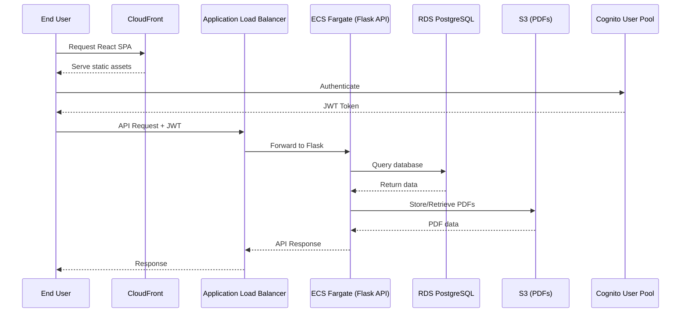

# Design Document: Terraform AWS Infrastructure for SEVA Arogya

## Overview

This design defines a minimal, cost-optimized Terraform infrastructure for deploying SEVA Arogya prototype/dev environment on AWS. The infrastructure provisions a complete end-to-end deployment stack including Flask API on ECS Fargate, RDS PostgreSQL database, S3 storage, CloudFront CDN, and Cognito authentication, all following AWS security best practices with private subnets, encrypted storage, and least-privilege IAM policies.

## Main Architecture Workflow



## Core Infrastructure Modules


### VPC Module

```hcl
module "vpc" {
  source = "./modules/vpc"
  
  vpc_cidr             = string
  availability_zones   = list(string)
  public_subnet_cidrs  = list(string)
  private_subnet_cidrs = list(string)
  enable_nat_gateway   = bool
  single_nat_gateway   = bool
  project_name         = string
  env_name             = string
}

output "vpc_id" {
  value = aws_vpc.main.id
}

output "public_subnet_ids" {
  value = aws_subnet.public[*].id
}

output "private_subnet_ids" {
  value = aws_subnet.private[*].id
}
```

### ALB Module

```hcl
module "alb" {
  source = "./modules/alb"
  
  vpc_id              = string
  public_subnet_ids   = list(string)
  enable_https        = bool
  certificate_arn     = string
  health_check_path   = string
  target_port         = number
  project_name        = string
  env_name            = string
}

output "alb_arn" {
  value = aws_lb.main.arn
}

output "alb_dns_name" {
  value = aws_lb.main.dns_name
}

output "target_group_arn" {
  value = aws_lb_target_group.ecs.arn
}
```


### ECS Module

```hcl
module "ecs" {
  source = "./modules/ecs"
  
  cluster_name         = string
  service_name         = string
  task_family          = string
  container_image      = string
  container_port       = number
  cpu                  = string
  memory               = string
  desired_count        = number
  vpc_id               = string
  private_subnet_ids   = list(string)
  target_group_arn     = string
  execution_role_arn   = string
  task_role_arn        = string
  environment_variables = map(string)
  secrets              = list(object({
    name      = string
    valueFrom = string
  }))
  log_retention_days   = number
  project_name         = string
  env_name             = string
}

output "cluster_id" {
  value = aws_ecs_cluster.main.id
}

output "service_name" {
  value = aws_ecs_service.main.name
}

output "ecr_repository_url" {
  value = aws_ecr_repository.backend.repository_url
}
```

### RDS Module

```hcl
module "rds" {
  source = "./modules/rds"
  
  identifier              = string
  engine_version          = string
  instance_class          = string
  allocated_storage       = number
  db_name                 = string
  master_username         = string
  master_password         = string
  vpc_id                  = string
  private_subnet_ids      = list(string)
  allowed_security_groups = list(string)
  backup_retention_period = number
  multi_az                = bool
  skip_final_snapshot     = bool
  project_name            = string
  env_name                = string
}

output "endpoint" {
  value = aws_db_instance.main.endpoint
}

output "db_name" {
  value = aws_db_instance.main.db_name
}

output "security_group_id" {
  value = aws_security_group.rds.id
}
```


### S3 Module

```hcl
module "s3" {
  source = "./modules/s3"
  
  bucket_name          = string
  enable_versioning    = bool
  enable_encryption    = bool
  block_public_access  = bool
  cors_allowed_origins = list(string)
  cors_allowed_methods = list(string)
  project_name         = string
  env_name             = string
}

output "bucket_id" {
  value = aws_s3_bucket.main.id
}

output "bucket_arn" {
  value = aws_s3_bucket.main.arn
}

output "bucket_domain_name" {
  value = aws_s3_bucket.main.bucket_domain_name
}
```

### CloudFront Module

```hcl
module "cloudfront" {
  source = "./modules/cloudfront"
  
  enabled                = bool
  origin_bucket_id       = string
  origin_bucket_domain   = string
  origin_access_control_id = string
  default_root_object    = string
  custom_error_responses = list(object({
    error_code         = number
    response_code      = number
    response_page_path = string
  }))
  price_class            = string
  project_name           = string
  env_name               = string
}

output "distribution_id" {
  value = aws_cloudfront_distribution.main.id
}

output "domain_name" {
  value = aws_cloudfront_distribution.main.domain_name
}
```


### Cognito Module

```hcl
module "cognito" {
  source = "./modules/cognito"
  
  user_pool_name       = string
  app_client_name      = string
  password_minimum_length = number
  password_require_lowercase = bool
  password_require_uppercase = bool
  password_require_numbers   = bool
  password_require_symbols   = bool
  mfa_configuration    = string
  email_verification_message = string
  email_verification_subject = string
  project_name         = string
  env_name             = string
}

output "user_pool_id" {
  value = aws_cognito_user_pool.main.id
}

output "user_pool_arn" {
  value = aws_cognito_user_pool.main.arn
}

output "app_client_id" {
  value = aws_cognito_user_pool_client.main.id
}
```

### IAM Module

```hcl
module "iam" {
  source = "./modules/iam"
  
  project_name         = string
  env_name             = string
  ecr_repository_arn   = string
  s3_pdf_bucket_arn    = string
  log_group_arn        = string
  secrets_arns         = list(string)
}

output "ecs_execution_role_arn" {
  value = aws_iam_role.ecs_execution.arn
}

output "ecs_task_role_arn" {
  value = aws_iam_role.ecs_task.arn
}
```


### Secrets Manager Module

```hcl
module "secrets" {
  source = "./modules/secrets"
  
  db_credentials = object({
    username = string
    password = string
    host     = string
    port     = number
    dbname   = string
  })
  flask_secret_key = string
  jwt_secret       = string
  project_name     = string
  env_name         = string
}

output "db_secret_arn" {
  value = aws_secretsmanager_secret.db_credentials.arn
}

output "flask_secret_arn" {
  value = aws_secretsmanager_secret.flask_secret.arn
}

output "jwt_secret_arn" {
  value = aws_secretsmanager_secret.jwt_secret.arn
}
```

## Key Infrastructure Patterns with Formal Specifications

### Pattern 1: VPC Network Isolation

```hcl
resource "aws_vpc" "main" {
  cidr_block           = var.vpc_cidr
  enable_dns_hostnames = true
  enable_dns_support   = true
  
  tags = {
    Name = "${var.project_name}-${var.env_name}-vpc"
  }
}

resource "aws_subnet" "public" {
  count                   = length(var.availability_zones)
  vpc_id                  = aws_vpc.main.id
  cidr_block              = var.public_subnet_cidrs[count.index]
  availability_zone       = var.availability_zones[count.index]
  map_public_ip_on_launch = true
  
  tags = {
    Name = "${var.project_name}-${var.env_name}-public-${count.index + 1}"
    Type = "public"
  }
}

resource "aws_subnet" "private" {
  count             = length(var.availability_zones)
  vpc_id            = aws_vpc.main.id
  cidr_block        = var.private_subnet_cidrs[count.index]
  availability_zone = var.availability_zones[count.index]
  
  tags = {
    Name = "${var.project_name}-${var.env_name}-private-${count.index + 1}"
    Type = "private"
  }
}
```

**Preconditions:**
- `var.vpc_cidr` is valid CIDR block (e.g., "10.0.0.0/16")
- `var.availability_zones` contains at least 2 AZs
- `var.public_subnet_cidrs` and `var.private_subnet_cidrs` are non-overlapping subnets within VPC CIDR
- Length of subnet CIDR lists matches length of AZ list

**Postconditions:**
- VPC created with DNS support enabled
- Public subnets have auto-assign public IP enabled
- Private subnets do not auto-assign public IPs
- All subnets properly tagged with Name and Type
- Subnets distributed across multiple AZs for high availability

**Loop Invariants:**
- For each iteration: `count.index < length(var.availability_zones)`
- Each subnet CIDR is unique and within VPC CIDR range
- Subnet-to-AZ mapping is consistent across public and private subnets


### Pattern 2: Security Group Layering

```hcl
resource "aws_security_group" "alb" {
  name        = "${var.project_name}-${var.env_name}-alb-sg"
  description = "Security group for Application Load Balancer"
  vpc_id      = var.vpc_id
  
  ingress {
    from_port   = 80
    to_port     = 80
    protocol    = "tcp"
    cidr_blocks = ["0.0.0.0/0"]
    description = "Allow HTTP from internet"
  }
  
  ingress {
    from_port   = 443
    to_port     = 443
    protocol    = "tcp"
    cidr_blocks = ["0.0.0.0/0"]
    description = "Allow HTTPS from internet"
  }
  
  egress {
    from_port   = 0
    to_port     = 0
    protocol    = "-1"
    cidr_blocks = ["0.0.0.0/0"]
    description = "Allow all outbound"
  }
}

resource "aws_security_group" "ecs" {
  name        = "${var.project_name}-${var.env_name}-ecs-sg"
  description = "Security group for ECS tasks"
  vpc_id      = var.vpc_id
  
  ingress {
    from_port       = var.container_port
    to_port         = var.container_port
    protocol        = "tcp"
    security_groups = [aws_security_group.alb.id]
    description     = "Allow traffic from ALB only"
  }
  
  egress {
    from_port   = 0
    to_port     = 0
    protocol    = "-1"
    cidr_blocks = ["0.0.0.0/0"]
    description = "Allow all outbound for AWS API calls"
  }
}

resource "aws_security_group" "rds" {
  name        = "${var.project_name}-${var.env_name}-rds-sg"
  description = "Security group for RDS database"
  vpc_id      = var.vpc_id
  
  ingress {
    from_port       = 5432
    to_port         = 5432
    protocol        = "tcp"
    security_groups = [aws_security_group.ecs.id]
    description     = "Allow PostgreSQL from ECS only"
  }
  
  egress {
    from_port   = 0
    to_port     = 0
    protocol    = "-1"
    cidr_blocks = ["0.0.0.0/0"]
    description = "Allow all outbound"
  }
}
```

**Preconditions:**
- `var.vpc_id` is valid VPC ID
- `var.container_port` is valid port number (1-65535)
- Security groups created in correct dependency order (ALB → ECS → RDS)

**Postconditions:**
- ALB security group allows HTTP/HTTPS from internet
- ECS security group only allows traffic from ALB on container port
- RDS security group only allows PostgreSQL traffic from ECS
- No direct internet access to ECS or RDS
- All security groups have descriptive names and descriptions

**Security Invariants:**
- RDS never directly accessible from internet
- ECS only accessible through ALB
- Principle of least privilege maintained throughout chain


### Pattern 3: ECS Task Definition with Secrets

```hcl
resource "aws_ecs_task_definition" "main" {
  family                   = var.task_family
  network_mode             = "awsvpc"
  requires_compatibilities = ["FARGATE"]
  cpu                      = var.cpu
  memory                   = var.memory
  execution_role_arn       = var.execution_role_arn
  task_role_arn            = var.task_role_arn
  
  container_definitions = jsonencode([
    {
      name      = var.service_name
      image     = var.container_image
      essential = true
      
      portMappings = [
        {
          containerPort = var.container_port
          protocol      = "tcp"
        }
      ]
      
      environment = [
        for key, value in var.environment_variables : {
          name  = key
          value = value
        }
      ]
      
      secrets = var.secrets
      
      logConfiguration = {
        logDriver = "awslogs"
        options = {
          "awslogs-group"         = aws_cloudwatch_log_group.ecs.name
          "awslogs-region"        = data.aws_region.current.name
          "awslogs-stream-prefix" = "ecs"
        }
      }
      
      healthCheck = {
        command     = ["CMD-SHELL", "curl -f http://localhost:${var.container_port}/health || exit 1"]
        interval    = 30
        timeout     = 5
        retries     = 3
        startPeriod = 60
      }
    }
  ])
}
```

**Preconditions:**
- `var.container_image` is valid ECR image URI or Docker Hub image
- `var.cpu` and `var.memory` are valid Fargate combinations (e.g., "512" CPU with "1024" memory)
- `var.execution_role_arn` has permissions to pull ECR images and read secrets
- `var.task_role_arn` has permissions for application AWS API calls
- `var.secrets` list contains valid Secrets Manager ARNs
- CloudWatch log group exists before task definition creation

**Postconditions:**
- Task definition created with Fargate compatibility
- Container configured with proper port mappings
- Environment variables injected from var.environment_variables
- Secrets securely injected from Secrets Manager
- CloudWatch logging enabled with 7-day retention
- Health check configured on /health endpoint
- Task and execution roles properly attached

**Invariants:**
- Secrets never exposed in plain text in task definition
- All sensitive data retrieved from Secrets Manager at runtime
- Container logs streamed to CloudWatch for observability


### Pattern 4: IAM Role for ECS Task

```hcl
resource "aws_iam_role" "ecs_task" {
  name = "${var.project_name}-${var.env_name}-ecs-task-role"
  
  assume_role_policy = jsonencode({
    Version = "2012-10-17"
    Statement = [
      {
        Effect = "Allow"
        Principal = {
          Service = "ecs-tasks.amazonaws.com"
        }
        Action = "sts:AssumeRole"
      }
    ]
  })
}

resource "aws_iam_role_policy" "ecs_task_s3" {
  name = "s3-access"
  role = aws_iam_role.ecs_task.id
  
  policy = jsonencode({
    Version = "2012-10-17"
    Statement = [
      {
        Effect = "Allow"
        Action = [
          "s3:GetObject",
          "s3:PutObject",
          "s3:DeleteObject",
          "s3:ListBucket"
        ]
        Resource = [
          var.s3_pdf_bucket_arn,
          "${var.s3_pdf_bucket_arn}/*"
        ]
      }
    ]
  })
}

resource "aws_iam_role_policy" "ecs_task_medical_ai" {
  name = "medical-ai-access"
  role = aws_iam_role.ecs_task.id
  
  policy = jsonencode({
    Version = "2012-10-17"
    Statement = [
      {
        Effect = "Allow"
        Action = [
          "transcribe:StartMedicalTranscriptionJob",
          "transcribe:GetMedicalTranscriptionJob",
          "comprehendmedical:DetectEntitiesV2",
          "comprehendmedical:InferICD10CM",
          "translate:TranslateText"
        ]
        Resource = "*"
      }
    ]
  })
}
```

**Preconditions:**
- `var.project_name` and `var.env_name` are non-empty strings
- `var.s3_pdf_bucket_arn` is valid S3 bucket ARN
- IAM service is available and accessible

**Postconditions:**
- ECS task role created with proper trust policy for ecs-tasks.amazonaws.com
- S3 policy grants read/write/delete access to PDF bucket only
- Medical AI policy grants access to Transcribe Medical, Comprehend Medical, and Translate
- Principle of least privilege maintained (no wildcard permissions except for regional services)
- Role can be assumed by ECS tasks only

**Security Invariants:**
- Task role has no permissions to modify IAM, EC2, or other infrastructure
- S3 access scoped to specific PDF bucket only
- Medical AI services have no resource-level restrictions (AWS limitation)
- No overly permissive wildcard actions


### Pattern 5: RDS with Secrets Manager Integration

```hcl
resource "random_password" "db_password" {
  length  = 32
  special = true
}

resource "aws_secretsmanager_secret" "db_credentials" {
  name        = "${var.project_name}-${var.env_name}-db-credentials"
  description = "RDS database credentials"
}

resource "aws_secretsmanager_secret_version" "db_credentials" {
  secret_id = aws_secretsmanager_secret.db_credentials.id
  
  secret_string = jsonencode({
    username = var.master_username
    password = random_password.db_password.result
    host     = aws_db_instance.main.address
    port     = aws_db_instance.main.port
    dbname   = aws_db_instance.main.db_name
    engine   = "postgres"
  })
}

resource "aws_db_instance" "main" {
  identifier              = var.identifier
  engine                  = "postgres"
  engine_version          = var.engine_version
  instance_class          = var.instance_class
  allocated_storage       = var.allocated_storage
  storage_encrypted       = true
  
  db_name  = var.db_name
  username = var.master_username
  password = random_password.db_password.result
  
  vpc_security_group_ids = [aws_security_group.rds.id]
  db_subnet_group_name   = aws_db_subnet_group.main.name
  
  backup_retention_period = var.backup_retention_period
  backup_window           = "03:00-04:00"
  maintenance_window      = "mon:04:00-mon:05:00"
  
  multi_az               = var.multi_az
  publicly_accessible    = false
  skip_final_snapshot    = var.skip_final_snapshot
  final_snapshot_identifier = var.skip_final_snapshot ? null : "${var.identifier}-final-snapshot"
  
  enabled_cloudwatch_logs_exports = ["postgresql", "upgrade"]
  
  tags = {
    Name = "${var.project_name}-${var.env_name}-rds"
  }
}
```

**Preconditions:**
- `var.identifier` is unique within AWS region
- `var.engine_version` is valid PostgreSQL version (e.g., "15.3")
- `var.instance_class` is valid RDS instance type (e.g., "db.t4g.micro")
- `var.allocated_storage` is at least 20 GB
- `var.master_username` is valid PostgreSQL username (alphanumeric, starts with letter)
- `var.db_name` is valid PostgreSQL database name
- DB subnet group contains at least 2 subnets in different AZs
- Security group allows PostgreSQL traffic from ECS

**Postconditions:**
- RDS instance created with PostgreSQL engine
- Storage encryption enabled using AWS managed keys
- Random 32-character password generated securely
- Database credentials stored in Secrets Manager
- Secret contains all connection parameters (host, port, username, password, dbname)
- Instance placed in private subnets (not publicly accessible)
- Automated backups configured with 1-day retention
- CloudWatch logs enabled for PostgreSQL and upgrade events
- Final snapshot created on deletion (unless skip_final_snapshot = true)

**Security Invariants:**
- Database never publicly accessible
- Password never stored in Terraform state (uses random_password)
- Credentials retrievable only from Secrets Manager
- Storage encrypted at rest
- Backups encrypted automatically


### Pattern 6: CloudFront with S3 Origin Access Control

```hcl
resource "aws_cloudfront_origin_access_control" "main" {
  name                              = "${var.project_name}-${var.env_name}-oac"
  description                       = "OAC for S3 frontend bucket"
  origin_access_control_origin_type = "s3"
  signing_behavior                  = "always"
  signing_protocol                  = "sigv4"
}

resource "aws_cloudfront_distribution" "main" {
  enabled             = var.enabled
  is_ipv6_enabled     = true
  default_root_object = var.default_root_object
  price_class         = var.price_class
  
  origin {
    domain_name              = var.origin_bucket_domain
    origin_id                = "S3-${var.origin_bucket_id}"
    origin_access_control_id = aws_cloudfront_origin_access_control.main.id
  }
  
  default_cache_behavior {
    allowed_methods        = ["GET", "HEAD", "OPTIONS"]
    cached_methods         = ["GET", "HEAD"]
    target_origin_id       = "S3-${var.origin_bucket_id}"
    viewer_protocol_policy = "redirect-to-https"
    compress               = true
    
    forwarded_values {
      query_string = false
      cookies {
        forward = "none"
      }
    }
    
    min_ttl     = 0
    default_ttl = 3600
    max_ttl     = 86400
  }
  
  custom_error_response {
    error_code         = 403
    response_code      = 200
    response_page_path = "/index.html"
  }
  
  custom_error_response {
    error_code         = 404
    response_code      = 200
    response_page_path = "/index.html"
  }
  
  restrictions {
    geo_restriction {
      restriction_type = "none"
    }
  }
  
  viewer_certificate {
    cloudfront_default_certificate = true
  }
}

resource "aws_s3_bucket_policy" "frontend" {
  bucket = var.origin_bucket_id
  
  policy = jsonencode({
    Version = "2012-10-17"
    Statement = [
      {
        Sid    = "AllowCloudFrontServicePrincipal"
        Effect = "Allow"
        Principal = {
          Service = "cloudfront.amazonaws.com"
        }
        Action   = "s3:GetObject"
        Resource = "${var.origin_bucket_arn}/*"
        Condition = {
          StringEquals = {
            "AWS:SourceArn" = aws_cloudfront_distribution.main.arn
          }
        }
      }
    ]
  })
}
```

**Preconditions:**
- `var.origin_bucket_id` is valid S3 bucket name
- `var.origin_bucket_domain` is valid S3 bucket domain name
- `var.origin_bucket_arn` is valid S3 bucket ARN
- S3 bucket has public access blocked
- `var.default_root_object` is valid file name (e.g., "index.html")
- `var.price_class` is valid CloudFront price class

**Postconditions:**
- CloudFront distribution created with S3 origin
- Origin Access Control (OAC) configured for secure S3 access
- S3 bucket policy allows CloudFront service principal only
- HTTPS enforced (redirect HTTP to HTTPS)
- Compression enabled for faster delivery
- SPA routing configured (403/404 → /index.html with 200 status)
- IPv6 enabled for broader accessibility
- Default TTL set to 1 hour for static assets
- No geographic restrictions applied

**Security Invariants:**
- S3 bucket not publicly accessible
- CloudFront is only entity that can access S3 bucket
- OAC uses SigV4 signing for authentication
- All traffic served over HTTPS
- Bucket policy scoped to specific CloudFront distribution ARN


## Algorithmic Pseudocode

### Main Infrastructure Provisioning Algorithm

```hcl
# Root main.tf orchestration
terraform {
  required_version = ">= 1.6"
  
  required_providers {
    aws = {
      source  = "hashicorp/aws"
      version = "~> 5.0"
    }
    random = {
      source  = "hashicorp/random"
      version = "~> 3.5"
    }
  }
}

provider "aws" {
  region = var.aws_region
  
  default_tags {
    tags = {
      Project     = var.project_name
      Environment = var.env_name
      ManagedBy   = "Terraform"
    }
  }
}

# Step 1: Create VPC and networking foundation
module "vpc" {
  source = "./modules/vpc"
  
  vpc_cidr             = "10.0.0.0/16"
  availability_zones   = ["${var.aws_region}a", "${var.aws_region}b"]
  public_subnet_cidrs  = ["10.0.1.0/24", "10.0.2.0/24"]
  private_subnet_cidrs = ["10.0.11.0/24", "10.0.12.0/24"]
  enable_nat_gateway   = true
  single_nat_gateway   = true
  project_name         = var.project_name
  env_name             = var.env_name
}

# Step 2: Create S3 buckets for PDFs and frontend
module "s3_pdf" {
  source = "./modules/s3"
  
  bucket_name          = "${var.project_name}-${var.env_name}-pdf"
  enable_versioning    = false
  enable_encryption    = true
  block_public_access  = true
  cors_allowed_origins = var.cors_origins
  cors_allowed_methods = ["GET", "PUT", "POST", "DELETE"]
  project_name         = var.project_name
  env_name             = var.env_name
}

module "s3_frontend" {
  source = "./modules/s3"
  
  bucket_name          = "${var.project_name}-${var.env_name}-frontend"
  enable_versioning    = false
  enable_encryption    = true
  block_public_access  = true
  cors_allowed_origins = []
  cors_allowed_methods = ["GET"]
  project_name         = var.project_name
  env_name             = var.env_name
}

# Step 3: Create RDS database with secrets
module "rds" {
  source = "./modules/rds"
  
  identifier              = "${var.project_name}-${var.env_name}-db"
  engine_version          = "15.3"
  instance_class          = "db.t4g.micro"
  allocated_storage       = 20
  db_name                 = var.db_name
  master_username         = var.db_username
  master_password         = var.db_password
  vpc_id                  = module.vpc.vpc_id
  private_subnet_ids      = module.vpc.private_subnet_ids
  allowed_security_groups = [module.ecs.security_group_id]
  backup_retention_period = 1
  multi_az                = false
  skip_final_snapshot     = true
  project_name            = var.project_name
  env_name                = var.env_name
}

# Step 4: Create Cognito user pool
module "cognito" {
  source = "./modules/cognito"
  
  user_pool_name             = "${var.project_name}-${var.env_name}-users"
  app_client_name            = "${var.project_name}-${var.env_name}-client"
  password_minimum_length    = 8
  password_require_lowercase = true
  password_require_uppercase = true
  password_require_numbers   = true
  password_require_symbols   = true
  mfa_configuration          = "OFF"
  email_verification_message = "Your verification code is {####}"
  email_verification_subject = "SEVA Arogya Verification Code"
  project_name               = var.project_name
  env_name                   = var.env_name
}

# Step 5: Create secrets in Secrets Manager
module "secrets" {
  source = "./modules/secrets"
  
  db_credentials = {
    username = var.db_username
    password = var.db_password
    host     = module.rds.endpoint
    port     = 5432
    dbname   = var.db_name
  }
  flask_secret_key = var.flask_secret_key
  jwt_secret       = var.jwt_secret
  project_name     = var.project_name
  env_name         = var.env_name
}

# Step 6: Create IAM roles for ECS
module "iam" {
  source = "./modules/iam"
  
  project_name       = var.project_name
  env_name           = var.env_name
  ecr_repository_arn = module.ecs.ecr_repository_arn
  s3_pdf_bucket_arn  = module.s3_pdf.bucket_arn
  log_group_arn      = module.ecs.log_group_arn
  secrets_arns = [
    module.secrets.db_secret_arn,
    module.secrets.flask_secret_arn,
    module.secrets.jwt_secret_arn
  ]
}

# Step 7: Create ALB
module "alb" {
  source = "./modules/alb"
  
  vpc_id            = module.vpc.vpc_id
  public_subnet_ids = module.vpc.public_subnet_ids
  enable_https      = var.enable_https
  certificate_arn   = var.certificate_arn
  health_check_path = "/health"
  target_port       = 5000
  project_name      = var.project_name
  env_name          = var.env_name
}

# Step 8: Create ECS cluster and service
module "ecs" {
  source = "./modules/ecs"
  
  cluster_name       = "${var.project_name}-${var.env_name}-cluster"
  service_name       = "${var.project_name}-${var.env_name}-api"
  task_family        = "${var.project_name}-${var.env_name}-task"
  container_image    = var.container_image
  container_port     = 5000
  cpu                = "512"
  memory             = "1024"
  desired_count      = 1
  vpc_id             = module.vpc.vpc_id
  private_subnet_ids = module.vpc.private_subnet_ids
  target_group_arn   = module.alb.target_group_arn
  execution_role_arn = module.iam.ecs_execution_role_arn
  task_role_arn      = module.iam.ecs_task_role_arn
  
  environment_variables = {
    FLASK_ENV           = var.env_name
    AWS_DEFAULT_REGION  = var.aws_region
    COGNITO_USER_POOL_ID = module.cognito.user_pool_id
    COGNITO_CLIENT_ID   = module.cognito.app_client_id
    S3_PDF_BUCKET       = module.s3_pdf.bucket_id
    CORS_ORIGINS        = join(",", var.cors_origins)
  }
  
  secrets = [
    {
      name      = "DATABASE_URL"
      valueFrom = "${module.secrets.db_secret_arn}:host::"
    },
    {
      name      = "DB_USERNAME"
      valueFrom = "${module.secrets.db_secret_arn}:username::"
    },
    {
      name      = "DB_PASSWORD"
      valueFrom = "${module.secrets.db_secret_arn}:password::"
    },
    {
      name      = "DB_NAME"
      valueFrom = "${module.secrets.db_secret_arn}:dbname::"
    },
    {
      name      = "FLASK_SECRET_KEY"
      valueFrom = module.secrets.flask_secret_arn
    },
    {
      name      = "JWT_SECRET"
      valueFrom = module.secrets.jwt_secret_arn
    }
  ]
  
  log_retention_days = 7
  project_name       = var.project_name
  env_name           = var.env_name
}

# Step 9: Create CloudFront distribution (optional)
module "cloudfront" {
  count  = var.enable_cloudfront ? 1 : 0
  source = "./modules/cloudfront"
  
  enabled                  = true
  origin_bucket_id         = module.s3_frontend.bucket_id
  origin_bucket_domain     = module.s3_frontend.bucket_domain_name
  origin_access_control_id = aws_cloudfront_origin_access_control.main.id
  default_root_object      = "index.html"
  
  custom_error_responses = [
    {
      error_code         = 403
      response_code      = 200
      response_page_path = "/index.html"
    },
    {
      error_code         = 404
      response_code      = 200
      response_page_path = "/index.html"
    }
  ]
  
  price_class  = "PriceClass_100"
  project_name = var.project_name
  env_name     = var.env_name
}
```

**Preconditions:**
- AWS credentials configured with sufficient permissions
- Terraform >= 1.6 installed
- All required variables provided in terraform.tfvars or via CLI
- AWS region is valid and accessible
- No naming conflicts with existing resources

**Postconditions:**
- Complete infrastructure provisioned in correct dependency order
- VPC with public and private subnets across 2 AZs
- RDS PostgreSQL database in private subnets
- ECS Fargate service running Flask API
- ALB routing traffic to ECS
- S3 buckets for PDFs and frontend
- CloudFront distribution (if enabled)
- Cognito user pool for authentication
- All secrets stored in Secrets Manager
- IAM roles with least-privilege permissions
- Security groups properly configured
- All resources tagged with Project, Environment, ManagedBy

**Dependency Invariants:**
- VPC created before all other resources
- Security groups created before resources that reference them
- RDS and Secrets Manager created before ECS task definition
- IAM roles created before ECS service
- ALB target group created before ECS service
- S3 buckets created before CloudFront distribution


## Example Usage

### Complete Deployment Workflow

```bash
# 1. Clone repository and navigate to directory
git clone <repository-url> seva-arogya-infra
cd seva-arogya-infra

# 2. Copy and configure environment variables
cp .env.example .env
# Edit .env with your values

# 3. Initialize Terraform
terraform init

# 4. Review planned changes
terraform plan -out=tfplan

# 5. Apply infrastructure
terraform apply tfplan

# 6. Build and push Docker image to ECR
aws ecr get-login-password --region us-east-1 | docker login --username AWS --password-stdin <account-id>.dkr.ecr.us-east-1.amazonaws.com
docker build -t seva-arogya-backend ../seva-arogya-backend
docker tag seva-arogya-backend:latest <ecr-repository-url>:latest
docker push <ecr-repository-url>:latest

# 7. Update ECS service to use new image
aws ecs update-service \
  --cluster seva-arogya-dev-cluster \
  --service seva-arogya-dev-api \
  --force-new-deployment \
  --region us-east-1

# 8. Upload frontend build to S3
cd ../seva-arogya-frontend
npm run build
aws s3 sync build/ s3://seva-arogya-dev-frontend/ --delete

# 9. Invalidate CloudFront cache (if enabled)
aws cloudfront create-invalidation \
  --distribution-id <distribution-id> \
  --paths "/*"
```

### Variable Configuration Example

```hcl
# terraform.tfvars
aws_region   = "us-east-1"
project_name = "seva-arogya"
env_name     = "dev"

enable_cloudfront = true
enable_https      = false

container_image = "<account-id>.dkr.ecr.us-east-1.amazonaws.com/seva-arogya-dev-backend:latest"

db_name     = "sevaarogya"
db_username = "sevaadmin"
db_password = "CHANGE_ME_SECURE_PASSWORD"

flask_secret_key = "CHANGE_ME_FLASK_SECRET"
jwt_secret       = "CHANGE_ME_JWT_SECRET"

cors_origins = [
  "http://localhost:3000",
  "https://d1234567890.cloudfront.net"
]

frontend_build_path = "../seva-arogya-frontend/build"
```

### Backend Configuration Example

```hcl
# backend.tf (after creating S3 bucket and DynamoDB table manually)
terraform {
  backend "s3" {
    bucket         = "seva-arogya-terraform-state"
    key            = "dev/terraform.tfstate"
    region         = "us-east-1"
    encrypt        = true
    dynamodb_table = "seva-arogya-terraform-locks"
  }
}
```

### Module Usage Example

```hcl
# Using VPC module standalone
module "custom_vpc" {
  source = "./modules/vpc"
  
  vpc_cidr             = "10.1.0.0/16"
  availability_zones   = ["us-west-2a", "us-west-2b"]
  public_subnet_cidrs  = ["10.1.1.0/24", "10.1.2.0/24"]
  private_subnet_cidrs = ["10.1.11.0/24", "10.1.12.0/24"]
  enable_nat_gateway   = true
  single_nat_gateway   = false  # Use 2 NAT gateways for HA
  project_name         = "my-project"
  env_name             = "prod"
}

output "vpc_id" {
  value = module.custom_vpc.vpc_id
}
```


## Correctness Properties

### Property 1: Network Isolation

```hcl
# Universal quantification: All RDS instances must be in private subnets
∀ rds_instance ∈ aws_db_instance : 
  rds_instance.publicly_accessible = false ∧
  rds_instance.db_subnet_group ⊆ private_subnets

# Universal quantification: All ECS tasks must be in private subnets
∀ ecs_service ∈ aws_ecs_service :
  ecs_service.network_configuration.subnets ⊆ private_subnets

# Universal quantification: Only ALB can be in public subnets
∀ alb ∈ aws_lb :
  alb.subnets ⊆ public_subnets ∧
  alb.internal = false
```

### Property 2: Security Group Chain

```hcl
# Security group dependency chain must be enforced
∀ ecs_task ∈ aws_ecs_service :
  ecs_task.security_groups → allows_traffic_from(alb.security_group) ∧
  ¬allows_traffic_from(internet)

∀ rds_instance ∈ aws_db_instance :
  rds_instance.security_groups → allows_traffic_from(ecs.security_group) ∧
  ¬allows_traffic_from(alb.security_group) ∧
  ¬allows_traffic_from(internet)

# Transitive property: Internet → ALB → ECS → RDS (no shortcuts)
internet ↛ ecs_task ∧ internet ↛ rds_instance
```

### Property 3: Encryption at Rest

```hcl
# Universal quantification: All storage must be encrypted
∀ s3_bucket ∈ aws_s3_bucket :
  s3_bucket.server_side_encryption_configuration.rule.apply_server_side_encryption_by_default.sse_algorithm ∈ {"AES256", "aws:kms"}

∀ rds_instance ∈ aws_db_instance :
  rds_instance.storage_encrypted = true

∀ secret ∈ aws_secretsmanager_secret :
  secret.kms_key_id ≠ null ∨ uses_default_aws_managed_key(secret)
```

### Property 4: IAM Least Privilege

```hcl
# ECS task role must have minimal permissions
∀ policy ∈ ecs_task_role.policies :
  policy.actions ⊆ {required_actions} ∧
  policy.resources ≠ "*" (except for regional services)

# Execution role must only access ECR, logs, and secrets
∀ policy ∈ ecs_execution_role.policies :
  policy.actions ⊆ {
    "ecr:GetAuthorizationToken",
    "ecr:BatchCheckLayerAvailability",
    "ecr:GetDownloadUrlForLayer",
    "ecr:BatchGetImage",
    "logs:CreateLogStream",
    "logs:PutLogEvents",
    "secretsmanager:GetSecretValue"
  }

# No wildcard resource permissions except where AWS requires it
∀ policy_statement ∈ all_iam_policies :
  policy_statement.Resource = "*" ⟹ 
    policy_statement.Action ∈ {regional_services_without_resource_level_permissions}
```

### Property 5: Secrets Management

```hcl
# No secrets in plain text
∀ resource ∈ terraform_resources :
  ¬contains_plain_text_secret(resource.configuration)

# All sensitive values must come from Secrets Manager or random generation
∀ db_password ∈ {rds_passwords} :
  db_password.source ∈ {random_password, secretsmanager_secret_version}

# ECS task definition must use secrets, not environment variables for sensitive data
∀ container_def ∈ aws_ecs_task_definition.container_definitions :
  sensitive_keys ⊆ container_def.secrets.keys ∧
  sensitive_keys ∩ container_def.environment.keys = ∅
```

### Property 6: High Availability Foundation

```hcl
# Multi-AZ distribution for critical components
∀ subnet_group ∈ {public_subnets, private_subnets} :
  |unique_azs(subnet_group)| ≥ 2

# ALB must span multiple AZs
∀ alb ∈ aws_lb :
  |alb.subnets| ≥ 2 ∧
  |unique_azs(alb.subnets)| ≥ 2

# ECS service can scale across AZs
∀ ecs_service ∈ aws_ecs_service :
  |ecs_service.network_configuration.subnets| ≥ 2 ∧
  |unique_azs(ecs_service.network_configuration.subnets)| ≥ 2
```

### Property 7: Cost Optimization

```hcl
# Dev environment uses minimal resources
env_name = "dev" ⟹
  rds_instance.instance_class ∈ {"db.t4g.micro", "db.t3.micro"} ∧
  rds_instance.multi_az = false ∧
  ecs_task.cpu = "512" ∧
  ecs_task.memory = "1024" ∧
  ecs_service.desired_count = 1 ∧
  nat_gateway_count = 1

# Backup retention minimal for dev
env_name = "dev" ⟹
  rds_instance.backup_retention_period = 1 ∧
  cloudwatch_log_group.retention_in_days = 7
```

### Property 8: CloudFront Security

```hcl
# CloudFront must enforce HTTPS
∀ cf_distribution ∈ aws_cloudfront_distribution :
  cf_distribution.default_cache_behavior.viewer_protocol_policy ∈ {"redirect-to-https", "https-only"}

# S3 bucket must not be publicly accessible when using CloudFront
∀ s3_bucket ∈ cloudfront_origin_buckets :
  s3_bucket.block_public_acls = true ∧
  s3_bucket.block_public_policy = true ∧
  s3_bucket.ignore_public_acls = true ∧
  s3_bucket.restrict_public_buckets = true

# Only CloudFront can access origin bucket
∀ bucket_policy ∈ cloudfront_origin_bucket_policies :
  bucket_policy.Principal.Service = "cloudfront.amazonaws.com" ∧
  bucket_policy.Condition.StringEquals["AWS:SourceArn"] = cloudfront_distribution.arn
```

### Property 9: Resource Tagging

```hcl
# All resources must have required tags
∀ resource ∈ terraform_managed_resources :
  resource.tags.Project ≠ null ∧
  resource.tags.Environment ≠ null ∧
  resource.tags.ManagedBy = "Terraform"

# Consistent naming convention
∀ resource ∈ terraform_managed_resources :
  resource.name matches pattern "${project_name}-${env_name}-${resource_type}"
```

### Property 10: Dependency Ordering

```hcl
# Resource creation must follow dependency graph
creation_order = [
  vpc,
  subnets,
  internet_gateway,
  nat_gateway,
  route_tables,
  security_groups,
  s3_buckets,
  rds_instance,
  secrets_manager,
  iam_roles,
  ecr_repository,
  alb,
  ecs_cluster,
  ecs_task_definition,
  ecs_service,
  cloudfront_distribution
]

# No circular dependencies
∀ resource_a, resource_b ∈ terraform_resources :
  depends_on(resource_a, resource_b) ⟹ ¬depends_on(resource_b, resource_a)
```

