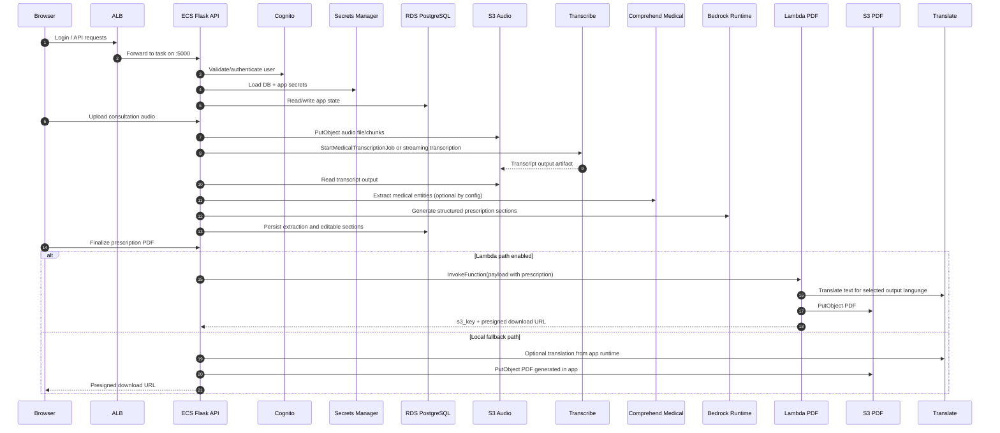
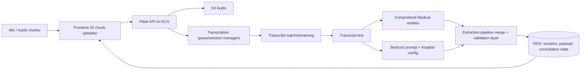

# SEVA Arogya Architecture (AWS + Application)

This document describes the **currently implemented** architecture from:
- Terraform in `seva-arogya-infra/`
- Backend runtime integrations in `app.py`, `aws_services/`, `services/`, `routes/`, and `lambda/prescription_pdf_generator/`

## 1) Full Infrastructure Topology

```mermaid
flowchart TB
  user[Doctor / Admin / Staff Browser]
  dns[Route53 Public Hosted Zone\noptional]
  cert[ACM Certificate\noptional]
  alb[Application Load Balancer\nHTTP/HTTPS + health checks]

  subgraph aws[AWS Account]
    subgraph vpc[VPC 10.0.0.0/16]
      direction TB

      subgraph public[Public Subnets 10.0.1.0/24, 10.0.2.0/24]
        igw[Internet Gateway]
        nat[NAT Gateway\nsingle-AZ]
        alb
      end

      subgraph private[Private Subnets 10.0.11.0/24, 10.0.12.0/24]
        ecs[ECS Fargate Service\nFlask app container :5000]
        rds[RDS PostgreSQL\nSingle-AZ, encrypted]
        vpce_s3[S3 Gateway Endpoint]
        vpce_sm[Interface VPCE\nSecrets Manager]
        vpce_cognito[Interface VPCE\nCognito IDP]
        vpce_transcribe[Interface VPCE\nTranscribe]
        vpce_cm[Interface VPCE\nComprehend Medical\nonly if same region]
      end
    end

    ecr[ECR Repository\nbackend image]
    cw[CloudWatch Logs\n/ecs/project-env]

    s3audio[S3 Audio Bucket\nprivate, SSE-S3, CORS]
    s3pdf[S3 PDF Bucket\nprivate, SSE-S3, CORS]

    cognito[Cognito User Pool + App Client]
    secrets[Secrets Manager\nDB creds + Flask/JWT secrets]

    transcribe[Amazon Transcribe\nbatch + streaming]
    comprehend[Comprehend Medical]
    bedrock[Bedrock Runtime\nmodel invoke]
    translate[Amazon Translate]

    lambda_pdf[Lambda\nprescription PDF generator]
  end

  user -->|HTTPS| dns
  dns -->|Alias A/AAAA| alb
  cert -.TLS cert for 443 listener.-> alb
  user -->|if no custom domain| alb

  alb -->|Target Group :5000| ecs

  ecr -->|Image pull via ECS execution role| ecs
  ecs -->|Application logs| cw

  ecs -->|SQL 5432| rds
  ecs -->|GetSecretValue| secrets
  ecs -->|Cognito auth/profile checks| cognito

  ecs -->|Upload audio + read transcription outputs| s3audio
  ecs -->|Store/fetch prescription PDFs| s3pdf

  ecs -->|Start/Get transcription jobs\nStart stream transcription| transcribe
  ecs -->|DetectEntitiesV2 / InferICD10CM| comprehend
  ecs -->|InvokeModel / converse| bedrock
  ecs -->|TranslateText| translate
  ecs -->|InvokeFunction| lambda_pdf
  lambda_pdf -->|Put/Get PDF object + presigned URL| s3pdf
  lambda_pdf -->|Translate multilingual fields| translate
  lambda_pdf -->|Function logs| cw

  ecs --> vpce_s3
  ecs --> vpce_sm
  ecs --> vpce_cognito
  ecs --> vpce_transcribe
  ecs --> vpce_cm

  ecs -->|services without VPCE\n(Bedrock/Translate/Lambda,\nor cross-region Comprehend)| nat
  nat --> igw
```

## 2) AWS Service Inventory and Responsibilities

| Service | Provisioned By Terraform | Runtime Usage |
|---|---|---|
| VPC, Subnets, Route Tables, IGW, NAT | Yes (`modules/vpc`) | Network isolation and controlled egress from private ECS tasks |
| ALB + Target Group + Listeners | Yes (`modules/alb`) | Internet entry point, health checks (`/health/live`), HTTP->HTTPS redirect when enabled |
| ECS Cluster/Service/TaskDefinition (Fargate) | Yes (`modules/ecs`) | Runs Flask API and Socket.IO transcription backend |
| ECR | Yes (`modules/ecs`) | Stores backend container image pulled by ECS execution role |
| CloudWatch Logs | Yes (`modules/ecs`) | ECS container logs and Lambda logs; app log viewer can query CW Logs |
| RDS PostgreSQL | Yes (`modules/rds`) | Persists users/roles, consultations, transcription state, prescriptions |
| S3 Audio Bucket | Yes (`modules/s3`) | Audio uploads and transcription artifacts |
| S3 PDF Bucket | Yes (`modules/s3`) | Generated prescription PDFs, download via presigned URLs |
| Cognito User Pool + App Client | Yes (`modules/cognito`) | User authentication, profile attributes (`custom:role`, `custom:hospital_id`) |
| Secrets Manager | Yes (`modules/secrets`) | DB credentials and app secrets fetched by ECS at runtime |
| IAM Roles/Policies | Yes (`modules/iam`) | Least-privilege access for ECS execution role + ECS task role |
| Lambda (PDF generator) | Yes (root `main.tf`) | Optional offloaded PDF generation and caching in S3 |
| Route53 + ACM | Optional (root `main.tf`) | Custom domain routing and TLS cert validation/attachment |
| VPC Endpoints | Yes (root `main.tf`) | Private service access to S3, Secrets Manager, Cognito, Transcribe, optional Comprehend |
| Transcribe / Comprehend / Bedrock / Translate | AWS managed services (not provisioned as resources) | Invoked by backend/Lambda through SDK APIs |

## 3) End-to-End Runtime Interaction



## 4) Transcription + AI Extraction Data Path (Detailed)



## 5) Security and Network Boundaries

- Public ingress is through ALB listeners only (`80`, optional `443`).
- ECS tasks are in private subnets (`assign_public_ip = false`) and accept only ALB traffic on container port `5000`.
- RDS is private-only (`publicly_accessible = false`) and limited to private subnet CIDR ingress on `5432`.
- Secrets and credentials are retrieved at runtime from Secrets Manager and injected into ECS task env/secrets.
- S3 buckets are private with public access blocks and server-side encryption (AES256).
- VPC endpoints keep S3/Secrets/Cognito/Transcribe (and same-region Comprehend) traffic private.
- NAT egress is used for services without endpoints in this stack (notably Bedrock Runtime, Translate, Lambda invoke, and cross-region Comprehend calls).

## 6) IAM Permission Model (Practical View)

- **ECS Execution Role**
  - Pull image from ECR.
  - Write container logs to CloudWatch Logs.
  - Fetch ECS-injected secrets.

- **ECS Task Role**
  - S3 read/write for audio and PDF buckets.
  - Transcribe, Comprehend Medical, Bedrock Runtime, Translate API calls.
  - Secrets Manager read at runtime.
  - Cognito describe/read operations for auth checks.
  - CloudWatch Logs read APIs (in-app log viewer).
  - Lambda invoke permission for prescription PDF function (when enabled).
  - ECS Exec SSM message channel permissions.

- **Lambda Role (PDF generator)**
  - CloudWatch log write.
  - S3 PDF bucket read/write/delete.
  - Translate API calls.

## 7) Environment/Feature Toggles That Change Architecture

- `enable_https`
  - `false`: HTTP listener forwards directly to target group.
  - `true`: HTTP listener redirects to HTTPS; ALB uses ACM certificate.

- `enable_prescription_pdf_lambda`
  - `true`: PDF generation can be offloaded to Lambda with S3 caching.
  - `false`: API falls back to in-process PDF generation path.

- `enable_comprehend_medical` and `comprehend_region`
  - Controls whether medical entity extraction is called.
  - If region differs from primary VPC region, traffic exits through NAT (no interface endpoint).

- `bedrock_region` / `bedrock_model_id`
  - Determines runtime model endpoint and model family for prescription extraction.

## 8) Notable Implementation Reality

- A reusable CloudFront module exists in `seva-arogya-infra/modules/cloudfront`, but it is **not instantiated** in the current root `main.tf`.  
  Current deployed entrypoint for backend traffic is ALB (optionally fronted by Route53 + ACM custom domain).
