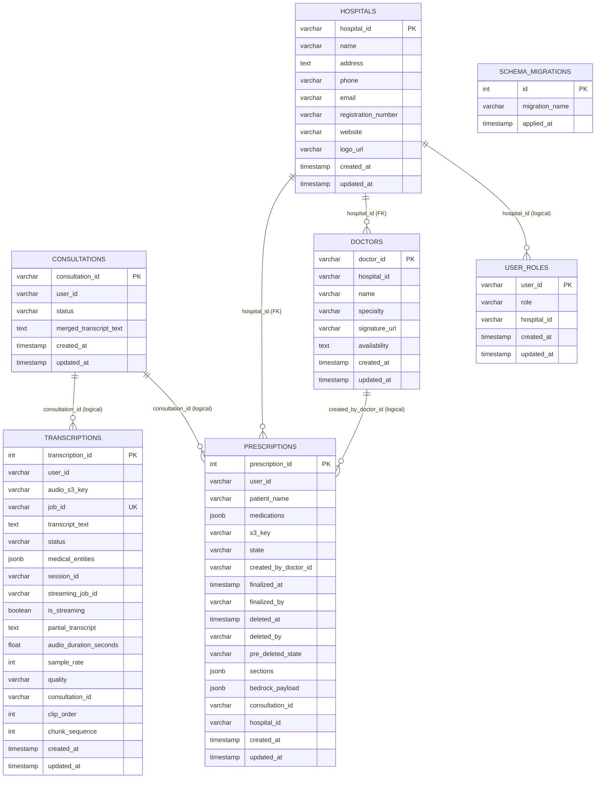

# SEVA Arogya ER Diagram

## Notes
- Explicit foreign keys in migrations:
  - `prescriptions.hospital_id -> hospitals.hospital_id`
  - `doctors.hospital_id -> hospitals.hospital_id`
- Important logical links (used in application queries/workflow):
  - `transcriptions.consultation_id -> consultations.consultation_id`
  - `prescriptions.consultation_id -> consultations.consultation_id`
  - `prescriptions.created_by_doctor_id -> doctors.doctor_id`
  - `user_roles.hospital_id -> hospitals.hospital_id` (not enforced by FK)
- Key check constraints:
  - `prescriptions.state IN ('Draft', 'InProgress', 'Finalized', 'Deleted')`
  - `user_roles.role IN ('Doctor', 'HospitalAdmin', 'DeveloperAdmin')`
- Notable defaults:
  - `transcriptions.is_streaming = false`, `sample_rate = 16000`, `quality = 'medium'`
  - `prescriptions.hospital_id = 'default'` (then constrained by FK)
